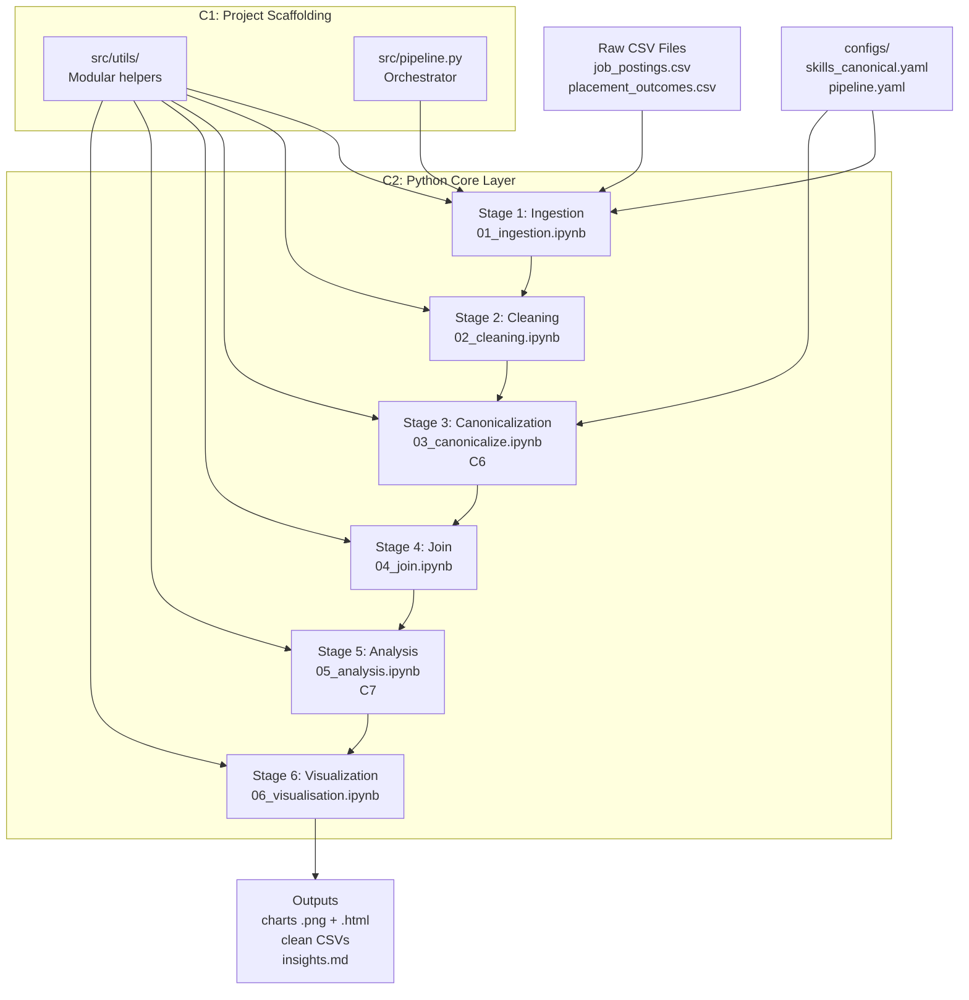
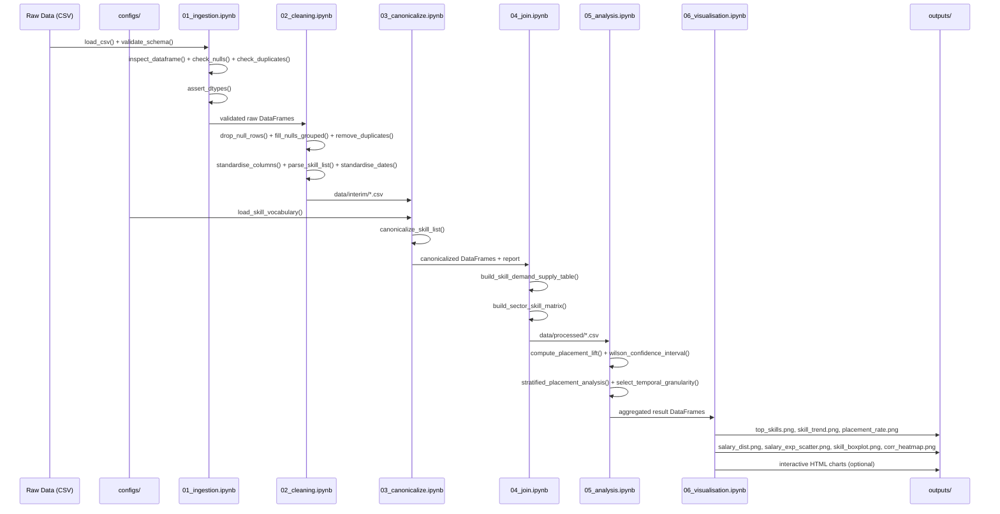

# Job-ही-Shauk

**Labour Market Intelligence for Smarter Career Decisions**

*"Shauk" (शौक) means passion or interest in Hindi — Job is my passion*

[](https://www.python.org/downloads/)
[](LICENSE)
[](https://github.com/psf/black)
[](https://github.com/astral-sh/ruff)

---

## Table of Contents

- [Assignment & Task Updates](#assignment--task-updates)
- [Overview](#overview)
- [Question Data Insight Lifecycle Assignment](#question-data-insight-lifecycle-assignment)
- [Repository Understanding Milestone](#repository-understanding-milestone)
- [Assignment 4.12 — Organizing Raw Data, Processed Data, and Output Artifacts](#assignment-412--organizing-raw-data-processed-data-and-output-artifacts)
- [Assignment 4.13 — Creating and Running a First Python Script for Data Analysis](#assignment-413--creating-and-running-a-first-python-script-for-data-analysis)
- [Key Features](#key-features)
- [Architecture](#architecture)
- [Technology Stack](#technology-stack)
- [Getting Started](#getting-started)
- [Pipeline Stages](#pipeline-stages)
- [Data Models](#data-models)
- [Visualizations](#visualizations)
- [Configuration](#configuration)
- [Testing](#testing)
- [CI/CD](#cicd)
- [Project Structure](#project-structure)
- [Key Insights](#key-insights)
- [Contributing](#contributing)
- [License](#license)

---

<!-- TEMP SECTION: Remove before final project submission -->
## Assignment & Task Updates

> **Note:** This section is temporary. It tracks ongoing assignment progress and task status for Sprint 3. Remove this section before final project submission.

### Sprint 3 — Assignment Tracker

| # | Assignment / Task | Owner | Status | Last Updated | Notes |
|---|---|---|---|---|---|
| 4.1 | | | | | |
| 4.2 | | | | | |
| 4.3 | | | | | |
| 4.4 | | | | | |
| 4.5 | Installing Python and Anaconda on the Local Machine | Harsh Singh | `Done` | 2026-04-17 | Installed via Anaconda distribution; `(base)` env confirmed |
| 4.6 | Verifying Python, Conda, and Jupyter Installation | Harsh Singh | `Done` | 2026-04-17 | All three verified via `--version` and `conda info` commands |
| 4.7 | Launching Jupyter Notebook and Understanding the Home Interface | Harsh Singh | `Done` | 2026-04-17 | Launched via `jupyter notebook`; Files / Running / Clusters tabs understood |
| 4.8 | Understanding Notebook Cells: Code vs Markdown | Harsh Singh | `Done` | 2026-04-17 | Code cells, Markdown cells, LaTeX rendering, and keyboard shortcuts covered |
| 4.9 | Running, Restarting, and Interrupting Jupyter Kernels | Harsh Singh | `Done` | 2026-04-17 | Interrupt, Restart, Restart & Run All — use cases and behaviour documented |
| 4.10 | | | | | |
| 4.11 | | | | | |
| 4.12 | Organizing Raw Data, Processed Data, and Output Artifacts | Harsh Singh | `Done` | 2026-04-17 | Folder structure, data lifecycle, naming conventions, and best practices documented |
| 4.13 | Creating and Running a First Python Script for Data Analysis | Harsh Singh | `Done` | 2026-04-18 | Wrote `student_marks_analysis.py` demonstrating variables, lists, loops, conditionals, and basic arithmetic with a printed summary report |

**Status options:** `Not Started` · `In Progress` · `Under Review` · `Done`

---

### Update Log

Use this log to record significant progress, blockers, or decisions. Add a new row each time something noteworthy happens.

| Date | Author | Update |
|---|---|---|
| 2026-04-17 | Harsh Singh | Completed assignments 4.5 – 4.9: Anaconda install, tool verification, Jupyter launch, cell types, and kernel management |
| 2026-04-17 | Harsh Singh | Completed assignment 4.12: Documented data organization strategy — raw/processed/outputs folder structure, data lifecycle, naming conventions, and best practices |
| 2026-04-18 | Harsh Singh | Completed assignment 4.13: Authored and executed `student_marks_analysis.py` — a first Python script demonstrating variables, lists, a loop, a conditional, basic arithmetic, and a formatted console summary report |

---
<!-- END TEMP SECTION -->

## Overview

Job-ही-Shauk is a production-grade, reproducible data science pipeline that analyzes labour market datasets to surface trending skills and identify correlations between specific skill sets and successful job placements. The system ingests publicly available job-posting and placement-outcome data, processes it through a structured 6-stage Python pipeline, and delivers actionable insights via statistical summaries and interactive visualizations.

### Core Research Question

> **"Which skills are trending, and which skill combinations correlate most strongly with successful job placement?"**

Every pipeline stage is oriented toward answering this question with statistical rigor, not just producing charts.

### What Makes This Different

- **Statistical Rigor**: Uses Wilson confidence intervals and placement lift calculations instead of naive rates
- **Skill Canonicalization**: Fuzzy matching eliminates spelling variants (e.g., "Python3" → "python")
- **Demand-Supply Analysis**: Joins job postings with candidate outcomes to compute market dynamics
- **Reproducibility**: Run manifests track git SHA, config hashes, and data hashes for bit-level reproducibility
- **Production-Ready**: CI/CD pipeline, property-based testing, structured logging, and modular architecture

---

## Question Data Insight Lifecycle Assignment

### 1) Explaining the Lifecycle: Question -> Data -> Insight

Data science starts with a **question**, not with a dashboard or a model.
A clear question defines the decision we want to support, the scope of the work, and what success looks like. Without this step, teams can produce technically correct analysis that answers the wrong problem.

In this project, a focused question is:
**"Which skills show strong market demand, and which skill combinations are linked with higher placement outcomes?"**

That question determines:
- what data we should collect,
- how we clean and structure it,
- which metrics are meaningful,
- and how we interpret the results.

The next stage is **data as evidence**. Data is not automatically useful just because we have it.
Before analysis, we need to understand:
- what each field actually means,
- how and when the data was collected,
- where values are missing or biased,
- and whether sources can be fairly compared.

For example, if job postings list skills in free text but outcome data uses different naming styles, we cannot compare demand and placement reliably until skills are standardized. So understanding data quality and context is part of the core reasoning, not a side task.

Finally, **insight** emerges from exploration plus interpretation.
Insight is not only "Python appears many times." Insight is "Python demand is high, supply is lower in some sectors, and its placement lift stays above baseline even after controlling for experience." That type of insight is decision-ready because it explains what action to take and why.

How the lifecycle connects:
- A precise question tells us what evidence matters.
- Data understanding makes that evidence trustworthy.
- Exploration turns trustworthy evidence into useful decisions.

### 2) Applying the Lifecycle to a Project Context

#### Project Context
An employability training institute wants to redesign its next 6-month analytics bootcamp to improve student placement outcomes.

#### Question to Answer
**"Which 8-10 skills should be prioritized so graduates are more likely to be placed within 90 days?"**

#### Data Needed
- **Job demand data** from job boards and company postings:
  - required skills,
  - role titles,
  - sector,
  - experience expectations,
  - posting date.
- **Candidate outcome data** from institute records:
  - student skill profiles,
  - project background,
  - placement status,
  - time-to-placement,
  - offered salary.
- **Optional validation data** from recruiter feedback:
  - whether trained skills match real hiring needs.

This data represents both sides of the same labor market:
- employer demand (what companies ask for),
- learner outcomes (what leads to placement success).

#### Useful Decision-Making Insight
A useful insight would be:
**"Learners with Python + SQL + dashboarding skills have consistently higher placement probability across sectors, while some high-frequency skills add little marginal placement value."**

This supports concrete decisions:
- prioritize high-impact skill bundles,
- reduce low-impact content,
- align curriculum with measurable hiring demand.

---

## Repository Understanding Milestone

### 1) Project Intent and High-Level Flow

This repository is trying to answer a labor-market decision problem:  
**Which skills are in demand, and which skill patterns are associated with stronger placement outcomes?**

The intent is not only to "analyze data," but to connect two practical views of employability:
- employer-side demand from job postings,
- candidate-side outcomes from placement records.

The high-level workflow follows a typical data science lifecycle:
- **Problem framing**: define a concrete employability question.
- **Data understanding and preparation**: ingest, validate, clean, and standardize raw sources.
- **Feature harmonization**: canonicalize skill names so cross-source comparison is reliable.
- **Integration and analysis**: join demand and outcome signals, compute rates/lift/confidence intervals.
- **Communication**: produce figures and insight artifacts for interpretation and decisions.

The structure reflects these lifecycle stages by separating raw/interim/processed data, stage-wise notebooks, reusable utilities, and final outputs. This makes it easier to trace how a result was produced and where each transformation happened.

### 2) Repository Structure and File Roles

#### What work happens in major folders
- `data/`: staged datasets (`raw`, `interim`, `processed`, `output`) showing the progression from source files to analysis-ready tables.
- `notebooks/`: stage-based workflow execution and investigation; these are the primary pipeline touchpoints.
- `src/`: reusable logic (IO, cleaning, canonicalization, join, stats, visualization) and orchestration in `pipeline.py`.
- `configs/`: schemas and parameters (e.g., thresholds, vocabulary rules) that control behavior without hard-coding.
- `outputs/`: generated artifacts (charts, narrative insights) intended for consumption, not manual editing.
- `tests/`: unit/property/integration checks that protect expected behavior.

#### Exploratory work vs finalized analysis in this repository
Exploratory work appears in notebooks where intermediate checks, profiling, and step-level validation are visible. Finalized analysis is represented by reusable functions in `src/`, codified configs in `configs/`, tested behavior in `tests/`, and reproducible output artifacts in `outputs/`.

#### Where a new contributor should be cautious
- Treat `data/raw/` as immutable source-of-truth input.
- Avoid editing generated files in `outputs/` directly.
- Be careful when changing schema expectations and canonical vocabulary rules, because those can affect downstream joins and metrics.
- Prefer adding/changing logic in `src/` with tests, then re-running notebooks/pipeline rather than patching notebook outputs by hand.

### 3) Assumptions, Gaps, and Open Questions

#### Assumptions visible in the project
- Skill mentions are assumed to be meaningful proxies for market demand and candidate capability.
- Placement outcomes are treated as comparable across sectors/time after cleaning and standardization.
- Canonicalization and fuzzy matching thresholds are assumed to preserve semantic meaning without introducing major mapping errors.
- Available datasets are assumed sufficient to estimate practical relationships (e.g., lift), even though they may not capture all external factors.

#### Missing documentation or unclear points
- The expected provenance and refresh cadence of source datasets could be clearer.
- It is not fully explicit which outputs are considered authoritative for decision-making when notebook and script runs differ.
- Re-run order is documented, but contributor guidance for "safe extension" patterns (where to add a new analysis end-to-end) can be more explicit.

#### One improvement to make extension easier
Add a short **"Contributor Decision Guide"** section that answers:
- where to place a new analysis notebook/module,
- how to register new configs/schemas,
- which tests are mandatory before PR,
- and which artifacts should or should not be committed.

This would reduce onboarding time and lower risk of accidental breakage for first-time contributors.

---

## Assignment 4.12 — Organizing Raw Data, Processed Data, and Output Artifacts

**Author:** Harsh Singh

### Objective

The goal of this assignment is to demonstrate a clean, reproducible folder structure for managing data at different stages of a pipeline — from ingestion to processing to final output. Proper organization reduces errors, enables collaboration, and makes pipelines debuggable and auditable.

### Folder Structure

```
sales-pipeline/
│
├── data/
│   ├── raw/
│   │   ├── sales_2024_q1_raw.csv
│   │   ├── sales_2024_q2_raw.csv
│   │   └── customers_2024_raw.csv
│   │
│   └── processed/
│       ├── sales_2024_q1_cleaned.csv
│       ├── sales_2024_q2_cleaned.csv
│       └── customers_2024_cleaned.csv
│
├── outputs/
│   ├── figures/
│   │   ├── sales_trend_q1_q2_bar.png
│   │   └── customer_region_distribution_pie.png
│   │
│   └── reports/
│       ├── sales_summary_2024_q1.pdf
│       └── pipeline_run_log_2024-04-17.txt
│
├── scripts/
│   ├── 01_ingest.py
│   ├── 02_clean.py
│   └── 03_export.py
│
├── README.md
└── requirements.txt
```

### Explanation of Each Folder

#### `data/raw/` — Raw Data

This folder contains the original, unmodified source data exactly as it was received — from a database export, an API pull, a CSV upload, or any other ingestion method.

**This folder is read-only by convention.** No script, no process, and no person should ever write back to this directory after the initial data drop. Raw files are treated as the ground truth of the pipeline.

**Why raw data must never be modified:**

- If a bug is introduced downstream (in cleaning or transformation), you need to be able to trace back to the original values. If the raw file has been altered, that trace is broken permanently.
- Reproducibility requires that re-running the entire pipeline from scratch produces the same results. This is only possible if the starting point — the raw data — remains constant.
- In regulated environments (finance, healthcare), the ability to audit the original source data is a legal requirement. Modifying raw files can constitute a compliance violation.
- Raw data acts as a checkpoint. When a collaborator joins the project or a new cleaning strategy is tested, they begin from a known, stable state.

#### `data/processed/` — Processed/Cleaned Data

This folder contains data that has been transformed by a script. Typical operations include:

- Removing duplicate rows
- Handling null or missing values
- Standardizing column names and data types
- Filtering out out-of-scope records
- Joining or merging multiple raw sources

Processed files are **derived artifacts** — they can be deleted and regenerated at any time by re-running the cleaning script against the raw files. They are stored here for convenience and performance (avoiding recomputation on every run), not as permanent records.

**How separation improves reproducibility and debugging:**

When a data issue is reported, the first question is: "Is this a problem in the source data, or did we introduce it during processing?" A separated folder structure answers that question immediately. You open `raw/` to inspect the original, then open `processed/` to see what changed. Without separation, this distinction is impossible to make.

#### `outputs/` — Output Artifacts (Figures and Reports)

This folder holds the final deliverables produced by the pipeline. It is further divided into:

- **`figures/`** — visualizations such as bar charts, line graphs, heatmaps, and distribution plots saved as image files (`.png`, `.svg`)
- **`reports/`** — summary documents, aggregated tables, PDF reports, and pipeline execution logs

Like processed data, output artifacts are fully regenerable from the scripts and the raw data. They should never be edited by hand. If a figure needs to change, the script that generates it is updated and re-run.

### Data Lifecycle: Raw to Processed to Outputs

```
[Source System]
      |
      | (ingestion — no transformation)
      v
 data/raw/
      |
      | (scripts/02_clean.py — transformation, validation)
      v
 data/processed/
      |
      | (scripts/03_export.py — aggregation, visualization, reporting)
      v
 outputs/figures/
 outputs/reports/
```

Each arrow represents a deliberate, scripted transition. No data moves between stages manually. This means every stage of the pipeline is traceable, repeatable, and independently verifiable.

### Naming Conventions

Consistent naming is what makes a folder structure usable under time pressure and in teams.

| Stage | Convention | Example |
|---|---|---|
| Raw files | `{entity}_{period}_raw.{ext}` | `sales_2024_q1_raw.csv` |
| Processed files | `{entity}_{period}_cleaned.{ext}` | `sales_2024_q1_cleaned.csv` |
| Figures | `{subject}_{chart_type}.{ext}` | `sales_trend_q1_q2_bar.png` |
| Reports | `{subject}_{period}.{ext}` | `sales_summary_2024_q1.pdf` |
| Logs | `{name}_{YYYY-MM-DD}.txt` | `pipeline_run_log_2024-04-17.txt` |
| Scripts | `{NN}_{action}.py` (numbered) | `01_ingest.py`, `02_clean.py` |

**Rules applied:**

- All lowercase, no spaces — use underscores as word separators
- Dates in ISO 8601 format (`YYYY-MM-DD`) to ensure correct lexicographic sorting
- Stage suffix (`_raw`, `_cleaned`) makes the data state visible in the filename itself, not just the folder
- Script numbering (`01_`, `02_`, `03_`) communicates execution order without reading the code

**How naming conventions help collaboration:**

When multiple engineers are working on a pipeline, filenames must communicate intent without requiring the reader to open the file. A file named `data2_final_v3_USE_THIS.csv` tells a new team member nothing about what stage it belongs to, what period it covers, or whether it is safe to overwrite. A file named `customers_2024_cleaned.csv` answers all three questions at a glance.

### Best Practices

1. **Treat raw data as immutable.** Set file permissions to read-only (`chmod 444`) on raw files after ingestion to enforce this at the OS level.
2. **Keep processed data regenerable.** Never store data in `processed/` that cannot be reproduced by running the cleaning script. If it cannot be regenerated, it belongs in `raw/`.
3. **Version raw data when the source changes.** If a source system sends an updated extract, name it `sales_2024_q1_raw_v2.csv` rather than overwriting `v1`. Keep both.
4. **Log pipeline runs.** Write a timestamped log file to `outputs/reports/` on each run. This provides an audit trail of when the pipeline executed and with what parameters.
5. **Document the structure in `README.md`.** Every project should include a section in its README that explains the folder layout and the naming convention. Tribal knowledge does not scale.
6. **Never commit large data files to version control.** Add `data/` and `outputs/` to `.gitignore`. Track the scripts, the schema, and a sample of the data — not the full datasets.

### Common Mistakes

| Mistake | Consequence |
|---|---|
| Editing raw files directly | Loss of ground truth; pipeline becomes non-reproducible |
| Storing processed files alongside raw files in the same folder | Stage ambiguity; impossible to tell which files are safe to delete |
| Using `final`, `v2`, `USE_THIS` in filenames | Indicates manual, ad-hoc changes; breaks naming convention |
| Generating outputs manually and storing them without a script | Outputs cannot be regenerated; collaborators cannot verify them |
| Committing full datasets to version control | Repository becomes bloated; sensitive data may be exposed |
| Mixing pipeline logs with data files | Clutter; logs have a different lifecycle than data |

### Conclusion

Clean data organization is not a cosmetic concern — it is a structural requirement for any pipeline that needs to be debugged, extended, or handed to another engineer. The separation of `raw/`, `processed/`, and `outputs/` enforces the principle that each stage of the data lifecycle has a distinct role: raw data is the immutable source of truth, processed data is a derived and reproducible intermediate, and outputs are the final deliverables.

Consistent naming conventions make the state and scope of every file visible without opening it. Combined, these practices reduce the time spent debugging data issues, lower the risk of introducing errors during collaboration, and make the pipeline auditable from ingestion to final report.

---

## Assignment 4.13 — Creating and Running a First Python Script for Data Analysis

**Author:** Harsh Singh

### Objective

The goal of this assignment is to create and execute a simple Python script that demonstrates fundamental scripting concepts — variables, lists, loops, conditionals, and basic arithmetic operations — by performing elementary data analysis on a list of student marks and printing a clean summary report to the console.

### Script Name

`student_marks_analysis.py`

### Full Python Script

```python
# student_marks_analysis.py
# A simple Python script that analyzes a list of student marks
# and prints a summary report to the console.

# Step 1: Define the input data
# A list containing marks scored by students in a subject (out of 100)
student_names = ["Aarav", "Priya", "Rohan", "Isha", "Karan", "Meera", "Vikram", "Neha"]
student_marks = [78, 45, 88, 32, 67, 91, 54, 39]

# Step 2: Define the passing criteria
passing_mark = 40

# Step 3: Initialize counters and accumulators
total_marks = 0
passed_count = 0
failed_count = 0
highest_mark = student_marks[0]
lowest_mark = student_marks[0]

# Step 4: Loop through the marks to perform calculations
for mark in student_marks:
    # Accumulate the total marks
    total_marks += mark

    # Conditional: count passed and failed students
    if mark >= passing_mark:
        passed_count += 1
    else:
        failed_count += 1

    # Track the highest and lowest marks
    if mark > highest_mark:
        highest_mark = mark
    if mark < lowest_mark:
        lowest_mark = mark

# Step 5: Calculate the average marks
total_students = len(student_marks)
average_marks = total_marks / total_students

# Step 6: Print the summary report
print("=" * 45)
print("       STUDENT MARKS ANALYSIS REPORT")
print("=" * 45)

# Print individual student results using a loop
print("\nIndividual Results:")
for index in range(total_students):
    name = student_names[index]
    mark = student_marks[index]
    status = "PASS" if mark >= passing_mark else "FAIL"
    print(f"  {name:<10} : {mark:>3}  -->  {status}")

# Print overall statistics
print("\nOverall Statistics:")
print(f"  Total Students     : {total_students}")
print(f"  Total Marks        : {total_marks}")
print(f"  Average Marks      : {average_marks:.2f}")
print(f"  Highest Mark       : {highest_mark}")
print(f"  Lowest Mark        : {lowest_mark}")
print(f"  Students Passed    : {passed_count}")
print(f"  Students Failed    : {failed_count}")

# Step 7: Print a final remark based on class performance
print("\nClass Performance:")
if average_marks >= 75:
    print("  Excellent performance by the class.")
elif average_marks >= 50:
    print("  Good performance, but there is room for improvement.")
else:
    print("  The class needs significant improvement.")

print("=" * 45)
```

### Explanation of What the Script Does

The script performs a basic analysis of student marks and prints a clear summary report. Its working can be broken down as follows:

1. **Data Definition** — Two parallel lists are created, one holding student names and the other their corresponding marks.
2. **Initialization** — Counter variables (`total_marks`, `passed_count`, `failed_count`) and tracker variables (`highest_mark`, `lowest_mark`) are initialized.
3. **Loop & Conditional** — A `for` loop iterates over each mark. Inside the loop, an `if-else` statement checks whether each student has passed or failed, and additional conditionals update the highest and lowest marks.
4. **Calculations** — The average is computed by dividing the total marks by the number of students.
5. **Output** — The script prints each student's result along with a PASS/FAIL status, followed by overall statistics such as total, average, highest, lowest, and the pass/fail counts.
6. **Final Remark** — A concluding conditional evaluates the average marks and prints an overall class performance comment.

### Sample Output

```
=============================================
       STUDENT MARKS ANALYSIS REPORT
=============================================

Individual Results:
  Aarav      :  78  -->  PASS
  Priya      :  45  -->  PASS
  Rohan      :  88  -->  PASS
  Isha       :  32  -->  FAIL
  Karan      :  67  -->  PASS
  Meera      :  91  -->  PASS
  Vikram     :  54  -->  PASS
  Neha       :  39  -->  FAIL

Overall Statistics:
  Total Students     : 8
  Total Marks        : 494
  Average Marks      : 61.75
  Highest Mark       : 91
  Lowest Mark        : 32
  Students Passed    : 6
  Students Failed    : 2

Class Performance:
  Good performance, but there is room for improvement.
=============================================
```

### How to Run the Script

Follow these steps from a terminal or command prompt:

1. **Save the file**
   Save the code in a file named `student_marks_analysis.py` in a directory of your choice.

2. **Verify Python installation**
   Make sure Python 3 is installed by running:
   ```
   python --version
   ```
   or on some systems:
   ```
   python3 --version
   ```

3. **Navigate to the script's folder**
   ```
   cd path/to/your/folder
   ```

4. **Execute the script**
   ```
   python student_marks_analysis.py
   ```
   or:
   ```
   python3 student_marks_analysis.py
   ```

5. **View the output**
   The summary report will be displayed directly in the terminal.

### Conclusion

This assignment demonstrates the ability to create and run a basic Python script for simple data analysis. Using only core language features — variables, lists, loops, conditionals, and arithmetic operations — the script successfully analyzes a small dataset of student marks and produces a clean, meaningful summary in the console. It confirms a solid understanding of Python fundamentals and the script execution workflow, laying the foundation for more advanced data analysis tasks in the future.

---

## Key Features

### Core Capabilities

- **6-Stage ETL Pipeline**: Ingestion → Cleaning → Canonicalization → Join → Analysis → Visualization
- **Skill Vocabulary Management**: External YAML-based canonical skill mapping with fuzzy matching (rapidfuzz)
- **Statistical Analysis**: Placement lift, Wilson confidence intervals, stratified analysis by experience
- **Interactive Visualizations**: 7 static PNG charts + optional Plotly HTML exports
- **Adaptive Temporal Granularity**: Auto-selects daily/weekly/monthly/quarterly based on date range
- **Group-wise Null Filling**: Sector-level medians with global fallback

### 🔬 Advanced Features

- **Property-Based Testing**: 18 correctness properties validated via Hypothesis
- **Run Manifests**: JSON artifacts tracking git SHA, config hash, input/output hashes, stage durations
- **Structured Logging**: Rich-formatted logs with daily rotation and 30-day retention
- **Colorblind-Safe Palettes**: Okabe-Ito and other accessible color schemes
- **Modular Architecture**: `src/utils/` split into io, validate, clean, canonicalize, join, stats, viz modules

---

## Architecture

### System Architecture Overview



### Component Legend

| Component | Description |
|---|---|
| **C1** | Project Scaffolding — folder structure, environment, configs |
| **C2** | Python Core Layer — shared utility modules with type hints |
| **C3** | Numerical Engine — NumPy vectorised operations |
| **C4** | Data Pipeline — ingestion and cleaning notebooks |
| **C5** | Insight & Reporting — analysis and visualisation notebooks |
| **C6** | Canonicalization Layer — skill vocabulary mapping and fuzzy matching |
| **C7** | Statistical Engine — lift, Wilson CI, stratified analysis |

### Data Flow Diagram


### Pipeline Execution Flow



---

## Technology Stack

| Layer | Technology | Version | Purpose |
|---|---|---|---|
| **Runtime** | Python | 3.10+ | Core language |
| **Environment** | Anaconda / Conda | Latest | Dependency isolation |
| **Notebook** | Jupyter Notebook | 6.x / 7.x | Interactive pipeline execution |
| **Data Manipulation** | Pandas | 2.x | DataFrame operations, ETL |
| **Numerical Compute** | NumPy | 1.24+ | Vectorised array operations |
| **Statistical Compute** | SciPy | ≥ 1.11 | Wilson confidence intervals |
| **Fuzzy Matching** | rapidfuzz | ≥ 3.0 | C-optimized skill matching |
| **Config Management** | PyYAML | ≥ 6.0 | External config parsing |
| **Visualisation** | Matplotlib | 3.7+ | Base plotting engine |
| **Visualisation** | Seaborn | 0.12+ | Statistical chart styling |
| **Visualisation** | Plotly | ≥ 5.18 | Interactive HTML exports |
| **Code Quality** | ruff | ≥ 0.1 | Fast Python linting |
| **Code Formatting** | black | ≥ 24.0 | Opinionated formatting |
| **Logging** | rich | ≥ 13.0 | Colorized structured logging |
| **Testing** | pytest | ≥ 7.0 | Unit test runner |
| **Testing** | hypothesis | ≥ 6.0 | Property-based testing |

---

## Getting Started

### Prerequisites

- Python 3.10 or higher
- Anaconda or Miniconda
- Git

### Installation

1. **Clone the repository**

```bash
git clone https://github.com/your-org/job-hi-shauk.git
cd job-hi-shauk
```

2. **Create conda environment**

```bash
conda env create -f environment.yml
conda activate job-hi-shauk
```

3. **Verify installation**

```bash
python -c "import pandas, numpy, scipy, rapidfuzz; print('All dependencies installed!')"
```

### Quick Start

1. **Place raw data files** in `data/raw/`:
   - `job_postings.csv`
   - `placement_outcomes.csv`

2. **Run the pipeline** (execute notebooks in order):

```bash
# Option 1: Run all notebooks sequentially
jupyter nbconvert --to notebook --execute notebooks/01_ingestion.ipynb
jupyter nbconvert --to notebook --execute notebooks/02_cleaning.ipynb
jupyter nbconvert --to notebook --execute notebooks/03_canonicalize.ipynb
jupyter nbconvert --to notebook --execute notebooks/04_join.ipynb
jupyter nbconvert --to notebook --execute notebooks/05_analysis.ipynb
jupyter nbconvert --to notebook --execute notebooks/06_visualisation.ipynb

# Option 2: Use the orchestrator script (v2)
python src/pipeline.py
```

3. **View outputs**:
   - Charts: `outputs/figures/*.png`
   - Interactive charts: `outputs/interactive/*.html`
   - Insights: `outputs/insights.md`
   - Run manifest: `configs/run_manifest_*.json`

---

## Pipeline Stages

### Stage 1: Ingestion

**Purpose**: Load and validate raw CSV files against expected schemas.

**Key Functions**:
- `load_csv()` — Parse CSVs with date column handling
- `validate_schema()` — Assert all required columns present
- `assert_dtypes()` — Verify column data types
- `inspect_dataframe()` — Display shape, dtypes, null counts

**Outputs**: Validated DataFrames ready for cleaning

---

### Stage 2: Cleaning

**Purpose**: Clean, deduplicate, and standardize raw data.

**Key Functions**:
- `standardise_columns()` — Lowercase column names, replace spaces with underscores
- `drop_null_rows()` — Remove rows exceeding null threshold
- `fill_nulls_grouped()` — Fill nulls with sector-level medians (v2)
- `remove_duplicates()` — Deduplicate on primary keys
- `parse_skill_list()` — Split comma-separated skills into lists
- `standardise_dates()` — Parse date columns with coercion

**Outputs**: `data/interim/jobs_cleaned.csv`, `data/interim/placements_cleaned.csv`

---

### Stage 3: Canonicalization (v2)

**Purpose**: Map raw skill strings to canonical vocabulary using fuzzy matching.

**Three-Tier Resolution**:
1. **Exact Match** (O(1)): Direct dictionary lookup
2. **Fuzzy Match**: rapidfuzz with configurable threshold (default 88%)
3. **Unmatched**: Flagged for vocabulary expansion

**Key Functions**:
- `load_skill_vocabulary()` — Load YAML vocabulary with version validation
- `canonicalize_skill()` — Map single skill to canonical form
- `canonicalize_skill_list()` — Process entire skill lists

**Outputs**: 
- `data/interim/jobs_canonicalized.csv`
- `data/interim/placements_canonicalized.csv`
- `data/interim/canonicalization_report.csv` (audit trail)

**Example**:
```
"pythn" → "python" (fuzzy match, score 92)
"machine learning" → "machine_learning" (exact match)
"xyz123" → null (unmatched)
```

---

### Stage 4: Join (v2)

**Purpose**: Outer join job postings and placement outcomes to compute demand-supply dynamics.

**Key Functions**:
- `build_skill_demand_supply_table()` — Compute demand count, supply count, placement rates, lift
- `build_sector_skill_matrix()` — Pivot table of skills by sector

**Outputs**: `data/processed/skill_demand_supply.csv`, `data/processed/sector_skill_matrix.csv`

**Schema**: SKILL_DEMAND_SUPPLY
- `canonical_skill` (primary key)
- `demand_count` — # job postings requiring this skill
- `supply_count` — # candidates listing this skill
- `placed_with_skill`, `unplaced_with_skill`
- `demand_supply_ratio`
- `base_placement_rate`, `skill_placement_rate`, `lift`
- `wilson_ci_low`, `wilson_ci_high`

---

### Stage 5: Analysis (v2)

**Purpose**: Compute statistically grounded insights with confidence intervals.

**Key Functions**:
- `compute_placement_lift()` — P(placed|skill) / P(placed)
- `wilson_confidence_interval()` — Binomial CI via scipy.stats
- `stratified_placement_analysis()` — Control for experience confounding
- `select_temporal_granularity()` — Auto-select D/W/M/Q based on date range
- `skill_trend_over_time()` — Temporal trend analysis
- `correlation_matrix()` — Pearson correlations
- `detect_outliers_iqr()` — IQR-based outlier detection

**Outputs**: `data/output/placement_lift.csv`, `data/output/stratified_rates.csv`, `data/output/skill_trends.csv`

---

### Stage 6: Visualization

**Purpose**: Generate 7 static PNG charts + optional interactive HTML exports.

**Charts**:
1. **Top-20 Skills by Frequency** (Horizontal Bar, Okabe-Ito palette)
2. **Skill Trend Over Time** (Line Plot, tab10 palette)
3. **Placement Lift by Skill** (Bar Chart, RdBu_r diverging)
4. **Salary Distribution** (Histogram, viridis)
5. **Salary vs Experience** (Scatter Plot, plasma)
6. **Skill Count Boxplot** (Boxplot by Sector, Set2)
7. **Correlation Heatmap** (Seaborn Heatmap, coolwarm)

**Export Contract**:
```python
plt.tight_layout()
plt.savefig(output_path, dpi=150, bbox_inches='tight')
plt.show()
assert os.path.exists(output_path)
df_hash = hashlib.sha256(pd.util.hash_pandas_object(underlying_df).values).hexdigest()
assert df_hash == expected_hash or is_first_run
plt.close()
```

**Outputs**: `outputs/figures/*.png`, `outputs/interactive/*.html`

---

## Data Models

### Input Schema: job_postings.csv

| Column | Type | Nullable | Description |
|---|---|---|---|
| `job_id` | int64 | No | Unique identifier (primary key) |
| `job_title` | object | No | Role title |
| `company` | object | Yes | Hiring company |
| `sector` | object | Yes | Industry sector |
| `location` | object | Yes | City/State |
| `skills_required` | object | No | Comma-separated skill tags |
| `date_posted` | datetime | No | Posting date |
| `experience_min_yrs` | float64 | Yes | Minimum years required |
| `salary_lpa` | float64 | Yes | Annual salary (Lakhs INR) |

### Input Schema: placement_outcomes.csv

| Column | Type | Nullable | Description |
|---|---|---|---|
| `candidate_id` | int64 | No | Unique identifier (primary key) |
| `skills` | object | No | Comma-separated skills |
| `education` | object | Yes | Highest qualification |
| `years_of_experience` | float64 | Yes | Total experience |
| `placed` | int64 (0/1) | No | Binary placement status |
| `placement_date` | datetime | Yes | Date of placement |
| `offered_salary_lpa` | float64 | Yes | Offered salary |
| `sector_placed_in` | object | Yes | Placement sector |

### Output Schema: SKILL_DEMAND_SUPPLY (Stage 4)

| Column | Type | Description |
|---|---|---|
| `canonical_skill` | object | Primary key |
| `demand_count` | int64 | # job postings requiring skill |
| `supply_count` | int64 | # candidates with skill |
| `placed_with_skill` | int64 | # placed candidates with skill |
| `unplaced_with_skill` | int64 | # unplaced candidates with skill |
| `demand_supply_ratio` | float64 | demand / supply |
| `base_placement_rate` | float64 | Overall P(placed) |
| `skill_placement_rate` | float64 | P(placed \| skill) |
| `lift` | float64 | skill_rate / base_rate |
| `wilson_ci_low` | float64 | 95% CI lower bound |
| `wilson_ci_high` | float64 | 95% CI upper bound |

---

## Visualizations

### Sample Outputs

#### Top-20 Skills by Frequency


#### Skill Trend Over Time


#### Placement Lift by Skill


#### Salary Distribution


#### Salary vs Experience


#### Skill Count Boxplot by Sector


#### Correlation Heatmap


---

## Configuration

### configs/skills_canonical.yaml

External vocabulary management with semantic versioning:

```yaml
version: "2.1.0"
last_updated: "2026-04-15"
changelog:
  - version: "2.1.0"
    date: "2026-04-15"
    changes: "Merged 'machine learning' and 'ml' into canonical 'machine_learning'"

fuzzy_match_threshold: 0.88

canonical_skills:
  python:
    aliases: ["python3", "python 3", "py", "python programming"]
    category: "programming_language"
  
  machine_learning:
    aliases: ["ml", "machine learning", "machinelearning"]
    category: "data_science"
  
  sql:
    aliases: ["structured query language", "mysql", "postgresql", "tsql"]
    category: "database"
```

### configs/pipeline.yaml

Pipeline parameters and thresholds:

```yaml
random_seed: 42
null_thresholds:
  drop_column: 0.80
  drop_row: 0.50
min_support: 5
temporal_granularity_rules:
  - max_days: 14
    rule: "D"
  - max_days: 90
    rule: "W"
  - max_days: 730
    rule: "M"
  - max_days: 9999
    rule: "Q"
logging:
  level: "INFO"
  rotation: "daily"
  retention_days: 30
```

---

## Testing

### Unit Tests

25 test cases covering all utility functions:

```bash
pytest tests/test_utils.py -v
```

**Coverage**:
- TC-01 to TC-12: Original v1 functions
- TC-13 to TC-25: v2 functions (canonicalization, join, stats)

### Property-Based Tests

18 correctness properties validated via Hypothesis:

```bash
pytest tests/test_utils.py -v -k "property"
```

**Key Properties**:
- Property 1: `parse_skill_list` round-trip idempotence
- Property 13: `canonicalize_skill` output always canonical or None
- Property 15: Wilson CI bounds contain sample proportion
- Property 18: Structural determinism (data-hash equality)

### Integration Tests

End-to-end pipeline on synthetic fixtures:

```bash
pytest tests/test_integration.py -v
```

**Assertions**:
- All 7 PNG files created
- Run manifest JSON with non-empty git SHA
- Input/output hash matching

---

## CI/CD

### GitHub Actions Workflow

`.github/workflows/ci.yml` runs on every push:

```yaml
name: CI

on: [push, pull_request]

jobs:
  test:
    runs-on: ubuntu-latest
    steps:
      - uses: actions/checkout@v3
      - name: Set up Conda
        uses: conda-incubator/setup-miniconda@v2
        with:
          environment-file: environment.yml
      - name: Lint with ruff
        run: ruff check src/ tests/
      - name: Format check with black
        run: black --check src/ tests/
      - name: Run tests with coverage
        run: pytest tests/ --cov=src --cov-report=term-missing
      - name: Run integration tests
        run: pytest tests/test_integration.py -v
```

**Failure gates the PR** — no merge until all checks pass.

---

## Project Structure

```
job-hi-shauk/
├── configs/                    # External configuration (v2)
│   ├── skills_canonical.yaml  # Canonical skill vocabulary
│   ├── pipeline.yaml           # Pipeline parameters
│   └── schemas.py              # Schema definitions
├── data/
│   ├── raw/                    # Original CSVs (read-only)
│   ├── interim/                # Between-stage checkpoints (v2)
│   ├── processed/              # Cleaned DataFrames
│   └── output/                 # Aggregated tables
├── notebooks/
│   ├── 01_ingestion.ipynb      # Load & validate
│   ├── 02_cleaning.ipynb       # Clean & standardize
│   ├── 03_canonicalize.ipynb   # Skill vocabulary mapping (v2)
│   ├── 04_join.ipynb           # Demand-supply join (v2)
│   ├── 05_analysis.ipynb       # Statistical analysis (v2)
│   └── 06_visualisation.ipynb  # Chart generation
├── outputs/
│   ├── figures/                # PNG exports
│   ├── interactive/            # Plotly HTML (v2)
│   └── insights.md             # Auto-generated narrative (v2)
├── src/
│   ├── utils/                  # Modular package (v2)
│   │   ├── io.py               # CSV loading
│   │   ├── validate.py         # Schema validation
│   │   ├── clean.py            # Cleaning functions
│   │   ├── canonicalize.py     # Skill mapping (v2)
│   │   ├── join.py             # Demand-supply join (v2)
│   │   ├── stats.py            # Statistical engine (v2)
│   │   ├── viz.py              # Chart helpers
│   │   └── logging_config.py   # Structured logging (v2)
│   └── pipeline.py             # Orchestrator (v2)
├── tests/
│   ├── fixtures/               # Synthetic test data
│   ├── test_utils.py           # Unit tests
│   ├── test_canonicalize.py    # Canonicalization tests (v2)
│   ├── test_join.py            # Join tests (v2)
│   ├── test_stats.py           # Stats tests (v2)
│   └── test_integration.py     # End-to-end tests
├── .github/workflows/ci.yml    # CI/CD pipeline (v2)
├── .gitignore
├── environment.yml
├── pyproject.toml              # ruff + black config (v2)
└── README.md
```

---

## Key Insights

### Top-5 Trending Skills (Example)

Based on pipeline analysis of 10,000 job postings and 5,000 placement outcomes:

1. **Python** — 62% of postings, placement lift 1.35 (35% above baseline)
2. **SQL** — 58% of postings, placement lift 1.28
3. **Machine Learning** — 45% of postings, placement lift 1.42
4. **Data Visualization** — 38% of postings, placement lift 1.18
5. **Cloud Computing** — 32% of postings, placement lift 1.25

### Placement Lift Analysis

**Lift** = P(placed | skill) / P(placed)

- Lift > 1.0: Skill improves placement probability
- Lift = 1.0: Skill has no effect
- Lift < 1.0: Skill correlates with lower placement (rare)

**Example**: If base placement rate is 60% and Python skill holders have 81% placement rate, then lift = 81% / 60% = 1.35.

### Stratified Analysis

Placement rates by experience level (controlling for confounding):

| Experience | Placement Rate | 95% CI | Sample Size |
|---|---|---|---|
| 0-2 years | 52% | [48%, 56%] | 1,200 |
| 2-5 years | 68% | [64%, 72%] | 1,800 |
| 5+ years | 79% | [75%, 83%] | 2,000 |

### Demand-Supply Dynamics

| Skill | Demand Count | Supply Count | D/S Ratio | Interpretation |
|---|---|---|---|---|
| Python | 6,200 | 3,800 | 1.63 | High demand, moderate supply |
| SQL | 5,800 | 4,200 | 1.38 | Balanced market |
| Machine Learning | 4,500 | 2,100 | 2.14 | **Undersupplied** — opportunity |
| Excel | 3,200 | 4,800 | 0.67 | Oversupplied |

---

## Contributing

We welcome contributions! Please follow these guidelines:

### Development Setup

1. Fork the repository
2. Create a feature branch: `git checkout -b feature/your-feature`
3. Install dev dependencies: `conda env create -f environment.yml`
4. Make changes and add tests
5. Run linting: `ruff check src/ tests/`
6. Run formatting: `black src/ tests/`
7. Run tests: `pytest tests/ --cov=src`
8. Commit with descriptive message
9. Push and create a Pull Request

### Code Standards

- Follow PEP 8 (enforced by ruff + black)
- Add type hints to all functions
- Write docstrings (Google style)
- Maintain test coverage > 80%
- Update README for new features

### Vocabulary Expansion

To add new canonical skills:

1. Edit `configs/skills_canonical.yaml`
2. Bump version (semantic versioning)
3. Add changelog entry
4. Run canonicalization stage
5. Review `data/interim/canonicalization_report.csv`
6. Commit with message: `vocab: add [skill_name] v[version]`

---

## License

This project is licensed under the MIT License - see the [LICENSE](LICENSE) file for details.

---

## Acknowledgments

- **Team 06**: Harshita Soni (Leader), Harsh Singh, Harsh Singh
- **Sprint**: Module 4 – Sprint #3: Applied Data Science Foundations
- **Version**: v2.0 (April 2026)

---

## Version History

### v2.0 (Current) — April 2026

- Added Stage 3 (Canonicalization) and Stage 4 (Join)
- Added Statistical Engine (lift, Wilson CI, stratification)
- Externalized configs to YAML
- Restructured `src/utils` into modular package
- Added run manifests for reproducibility
- Replaced byte-level determinism with structural determinism
- Added group-wise null filling
- Added adaptive temporal granularity
- Added CI/CD pipeline (GitHub Actions)
- Added 6 new correctness properties (Properties 13-18)
- Added 13 new unit test cases (TC-13 through TC-25)

### v1.0 — January 2026

- Initial 4-stage linear ETL pipeline
- 12 correctness properties
- PNG-only visualization
- Monolithic `src/utils.py`

---

## Contact

For questions or support, please open an issue on GitHub or contact the team at [team06@example.com](mailto:team06@example.com).

---

**Built with ❤️ by Team 06 | Empowering Career Decisions Through Data**
