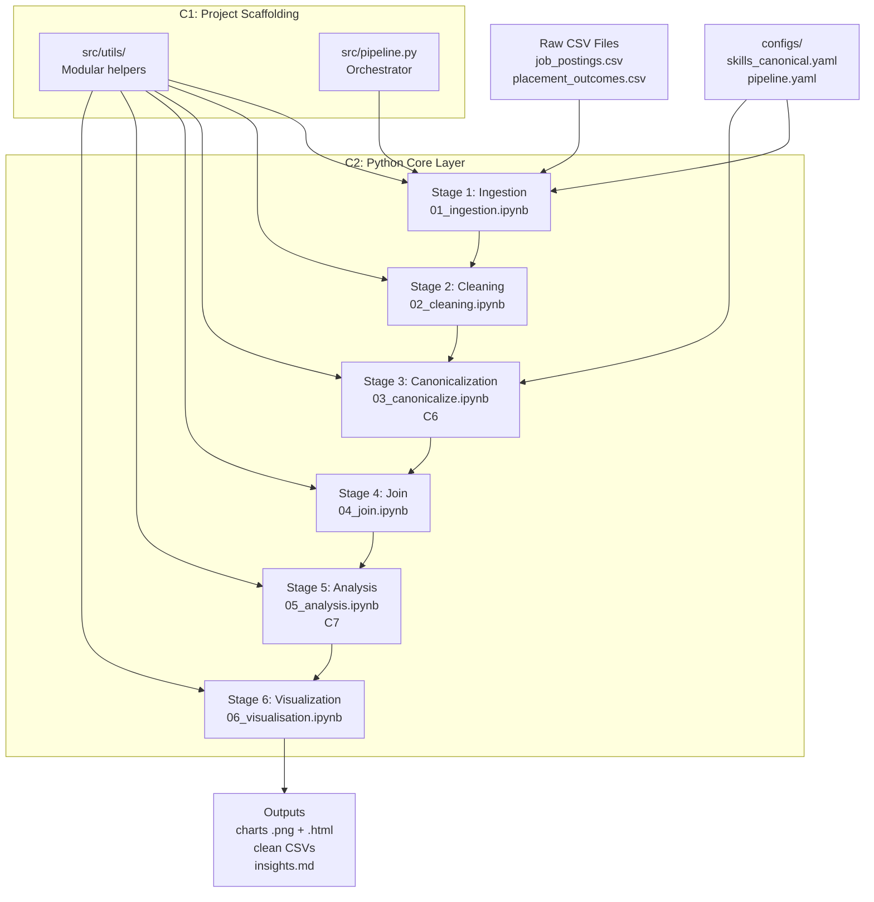
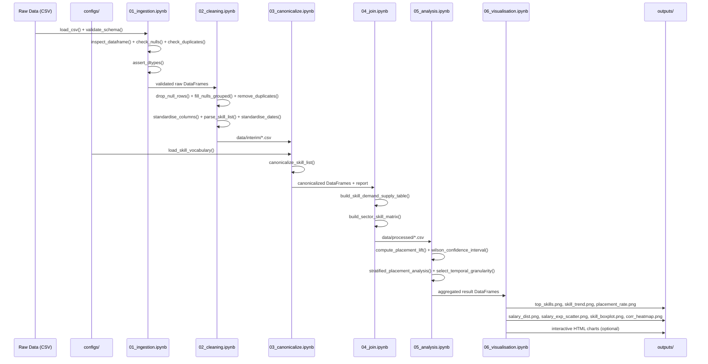

# Job-ही-Shauk

**Labour Market Intelligence for Smarter Career Decisions**

*"Shauk" (शौक) means passion or interest in Hindi — Job is my passion*

[](https://www.python.org/downloads/)
[](LICENSE)
[](https://github.com/psf/black)
[](https://github.com/astral-sh/ruff)

---

## Table of Contents

- [Overview](#overview)
- [Assignment 4.1 — Technology Orientation: What Is Data Science & How Data Projects Work](#assignment-41--technology-orientation-what-is-data-science--how-data-projects-work)
- [Question Data Insight Lifecycle Assignment](#question-data-insight-lifecycle-assignment)
- [Repository Understanding Milestone](#repository-understanding-milestone)
- [Assignment 4.12 — Organizing Raw Data, Processed Data, and Output Artifacts](#assignment-412--organizing-raw-data-processed-data-and-output-artifacts)
- [Assignment 4.13 — Creating and Running a First Python Script for Data Analysis](#assignment-413--creating-and-running-a-first-python-script-for-data-analysis)
- [Assignment 4.14 — Understanding Python Numeric and String Data Types](#assignment-414--understanding-python-numeric-and-string-data-types)
- [Assignment 4.15 — Working with Python Lists, Tuples, and Dictionaries](#assignment-415--working-with-python-lists-tuples-and-dictionaries)
- [Assignment 4.16 — Writing Conditional Statements in Python](#assignment-416--writing-conditional-statements-in-python)
- [Assignment 4.17 — Using for and while Loops for Iterative Processing](#assignment-417--using-for-and-while-loops-for-iterative-processing)
- [Assignment 4.18 — Defining and Calling Python Functions](#assignment-418--defining-and-calling-python-functions)
- [Assignment 4.19 — Passing Data into Functions and Returning Results](#assignment-419--passing-data-into-functions-and-returning-results)
- [Assignment 4.20 — Writing Readable Variable Names and Comments (PEP8 Basics)](#assignment-420--writing-readable-variable-names-and-comments-pep8-basics)
- [Assignment 4.21 — Structuring Python Code for Readability and Reuse](#assignment-421--structuring-python-code-for-readability-and-reuse)
- [Assignment 4.22 — Creating NumPy Arrays from Python Lists](#assignment-422--creating-numpy-arrays-from-python-lists)
- [Assignment 4.23 — Understanding Array Shape, Dimensions, and Index Positions](#assignment-423--understanding-array-shape-dimensions-and-index-positions)
- [Assignment 4.24 — Performing Basic Mathematical Operations on NumPy Arrays](#assignment-424--performing-basic-mathematical-operations-on-numpy-arrays)
- [Assignment 4.25 — Applying Vectorized Operations Instead of Python Loops](#assignment-425--applying-vectorized-operations-instead-of-python-loops)
- [Assignment 4.26 — Understanding NumPy Broadcasting with Simple Examples](#assignment-426--understanding-numpy-broadcasting-with-simple-examples)
- [Assignment 4.27 — Creating Pandas Series from Lists and Arrays](#assignment-427--creating-pandas-series-from-lists-and-arrays)
- [Assignment 4.28 — Creating Pandas DataFrames from Dictionaries and Files](#assignment-428--creating-pandas-dataframes-from-dictionaries-and-files)
- [Assignment 4.29 — Loading CSV Data into Pandas DataFrames](#assignment-429--loading-csv-data-into-pandas-dataframes)
- [Assignment 4.30 — Inspecting DataFrames Using head(), info(), and describe()](#assignment-430--inspecting-dataframes-using-head-info-and-describe)
- [Assignment 4.31 — Understanding Data Shapes and Column Data Types](#assignment-431--understanding-data-shapes-and-column-data-types)
- [Assignment 4.32 — Selecting Rows and Columns Using Indexing and Slicing](#assignment-432--selecting-rows-and-columns-using-indexing-and-slicing)
- [Assignment 4.33 — Detecting Missing Values in DataFrames](#assignment-433--detecting-missing-values-in-dataframes)
- [Assignment 4.34 — Handling Missing Values Using Drop and Fill Strategies](#assignment-434--handling-missing-values-using-drop-and-fill-strategies)
- [Key Features](#key-features)
- [Architecture](#architecture)
- [Technology Stack](#technology-stack)
- [Getting Started](#getting-started)
- [Pipeline Stages](#pipeline-stages)
- [Data Models](#data-models)
- [Visualizations](#visualizations)
- [Configuration](#configuration)
- [Testing](#testing)
- [CI/CD](#cicd)
- [Project Structure](#project-structure)
- [Key Insights](#key-insights)
- [Contributing](#contributing)
- [License](#license)

---

## Overview

Job-ही-Shauk is a production-grade, reproducible data science pipeline that analyzes labour market datasets to surface trending skills and identify correlations between specific skill sets and successful job placements. The system ingests publicly available job-posting and placement-outcome data, processes it through a structured 6-stage Python pipeline, and delivers actionable insights via statistical summaries and interactive visualizations.

### Core Research Question

> **"Which skills are trending, and which skill combinations correlate most strongly with successful job placement?"**

Every pipeline stage is oriented toward answering this question with statistical rigor, not just producing charts.

### What Makes This Different

- **Statistical Rigor**: Uses Wilson confidence intervals and placement lift calculations instead of naive rates
- **Skill Canonicalization**: Fuzzy matching eliminates spelling variants (e.g., "Python3" → "python")
- **Demand-Supply Analysis**: Joins job postings with candidate outcomes to compute market dynamics
- **Reproducibility**: Run manifests track git SHA, config hashes, and data hashes for bit-level reproducibility
- **Production-Ready**: CI/CD pipeline, property-based testing, structured logging, and modular architecture

---

## Assignment 4.1 — Technology Orientation: What Is Data Science & How Data Projects Work

### 1) What Data Science Actually Is

Data science is the discipline of turning raw observations into **decisions that can be acted on with confidence**. It sits at the intersection of three older fields:

- **Statistics** — for reasoning under uncertainty (is this pattern real, or noise?).
- **Computer science** — for handling data at scale (storage, transformation, computation).
- **Domain knowledge** — for asking the right question and interpreting results in context.

A useful way to separate it from neighbouring practices:

| Practice | Primary output | Time horizon |
|---|---|---|
| Business Intelligence (BI) | Dashboards reporting *what happened* | Past |
| Data Analytics | Diagnostic explanations of *why it happened* | Past → Present |
| Data Science | Predictive / inferential answers about *what will happen, or what to do* | Present → Future |
| Machine Learning | Models that automate decisions at scale | Continuous |

Data science is **not** "running queries faster" or "making prettier charts". It is the structured pursuit of an answer to a specific question, where the answer is defensible because the data, methods, and assumptions can all be inspected.

### 2) How a Data Project Actually Works

Real data projects do not follow a straight line. They follow a loop with five recurring stages:

```
        ┌─────────────────────────────────────────────────┐
        ▼                                                 │
   ┌─────────┐    ┌──────────┐    ┌──────────┐    ┌──────────┐    ┌──────────────┐
   │ Question │ → │ Data     │ → │ Cleaning │ → │ Analysis │ → │ Communication │
   │ Framing  │    │ Sourcing │    │ &        │    │ &        │    │ &             │
   │          │    │          │    │ Shaping  │    │ Modelling│    │ Decision      │
   └─────────┘    └──────────┘    └──────────┘    └──────────┘    └──────────────┘
        ▲                                                                  │
        └──────────────── feedback / new questions ◄──────────────────────┘
```

Each stage answers a distinct question:

1. **Question framing** — *What decision are we trying to support?* Ambiguity here invalidates everything downstream. A vague question ("study the job market") produces a vague answer; a specific one ("which 8–10 skills correlate with placement within 90 days?") gives the rest of the pipeline a target.
2. **Data sourcing** — *What evidence would change our mind?* This determines which datasets are actually relevant, which fields matter, and where the data has to come from (internal logs, public datasets, scraped sources, surveys).
3. **Cleaning & shaping** — *Is this evidence trustworthy and comparable?* Most project time is spent here — handling missing values, normalising spelling, reconciling different units, removing duplicates, and converting raw rows into analysis-ready tables.
4. **Analysis & modelling** — *What does the cleaned evidence actually say?* Summary statistics, distributions, correlations, statistical tests, and (sometimes) predictive models. The goal is a result that survives sanity-checking, not a result that looks impressive.
5. **Communication & decision** — *Can a non-technical decision-maker act on this?* A finding that cannot be explained, doubted, or applied is not yet finished work. This stage produces the visualisations, narrative summaries, and recommendations that close the loop.

The loop is iterative because each stage can send you back. Cleaning often reveals that the original question was unanswerable with the available data; analysis often reveals that a new data source is needed; communication often surfaces a sharper question that restarts the cycle.

### 3) Roles on a Data Project

A typical data project is staffed by overlapping but distinct roles:

| Role | Owns | Cares most about |
|---|---|---|
| Data Analyst | Cleaning, exploration, descriptive insight | *Is the data telling the truth?* |
| Data Scientist | Statistical modelling, inference, experiments | *Is the relationship real and how strong?* |
| ML Engineer | Predictive models, productionisation | *Does it generalise to unseen data?* |
| Data Engineer / Backend | Pipelines, storage, reliability | *Will this run reproducibly tomorrow?* |
| Frontend / Visualisation | Dashboards, charts, decision interfaces | *Can a human read this in 30 seconds?* |
| Domain Expert / PM | Question framing, interpretation | *Does this answer the actual decision?* |

On Team 06 these map directly: Harshita (analyst) frames the question and prepares the evidence, Harsh (backend) builds the Python scaffolding the pipeline runs on, and Bhargav (frontend & ML) handles the numerical layer and the visual surface where insights are read.

### 4) How This Orientation Applies to Job-ही-Shauk

The research question — *"Which skills are trending, and which skill combinations correlate most strongly with successful job placement?"* — is a textbook data-science problem rather than a BI or pure-analytics problem, because:

- It requires **inference**, not just reporting (correlations, lift, confidence — not just counts).
- It joins **two independent data surfaces** (employer-side demand, candidate-side outcomes) that must be reconciled before they can be compared.
- The output must be **decision-ready** for an external audience (educators, learners, recruiters) who will not read the code.

Mapping the project to the five-stage loop:

| Stage | Where it lives in this repo | Owner |
|---|---|---|
| Question framing | this README + `audit.md` planning rows (4.1–4.4) | Harshita |
| Data sourcing | `data/raw/` (immutable inputs) | Harsh / Harshita |
| Cleaning & shaping | `notebooks/02_data_cleaning.ipynb`, `data/processed/` | Harshita |
| Analysis & modelling | `notebooks/03_analysis.ipynb`, `src/` modules | Harshita / Bhargav |
| Communication | `notebooks/04_visualisation.ipynb`, `outputs/figures/`, README sections | Bhargav |

This orientation establishes the vocabulary used by every later assignment: **question, evidence, cleaning, analysis, communication**. Subsequent assignments (4.2 lifecycle deep-dive, 4.3 repository walk-through, 4.4 MVP definition) refine each step — but they only make sense once the overall shape of a data project is clear, which is the contribution of this assignment.

---

## Question Data Insight Lifecycle Assignment

### 1) Explaining the Lifecycle: Question -> Data -> Insight

Data science starts with a **question**, not with a dashboard or a model.
A clear question defines the decision we want to support, the scope of the work, and what success looks like. Without this step, teams can produce technically correct analysis that answers the wrong problem.

In this project, a focused question is:
**"Which skills show strong market demand, and which skill combinations are linked with higher placement outcomes?"**

That question determines:
- what data we should collect,
- how we clean and structure it,
- which metrics are meaningful,
- and how we interpret the results.

The next stage is **data as evidence**. Data is not automatically useful just because we have it.
Before analysis, we need to understand:
- what each field actually means,
- how and when the data was collected,
- where values are missing or biased,
- and whether sources can be fairly compared.

For example, if job postings list skills in free text but outcome data uses different naming styles, we cannot compare demand and placement reliably until skills are standardized. So understanding data quality and context is part of the core reasoning, not a side task.

Finally, **insight** emerges from exploration plus interpretation.
Insight is not only "Python appears many times." Insight is "Python demand is high, supply is lower in some sectors, and its placement lift stays above baseline even after controlling for experience." That type of insight is decision-ready because it explains what action to take and why.

How the lifecycle connects:
- A precise question tells us what evidence matters.
- Data understanding makes that evidence trustworthy.
- Exploration turns trustworthy evidence into useful decisions.

### 2) Applying the Lifecycle to a Project Context

#### Project Context
An employability training institute wants to redesign its next 6-month analytics bootcamp to improve student placement outcomes.

#### Question to Answer
**"Which 8-10 skills should be prioritized so graduates are more likely to be placed within 90 days?"**

#### Data Needed
- **Job demand data** from job boards and company postings:
  - required skills,
  - role titles,
  - sector,
  - experience expectations,
  - posting date.
- **Candidate outcome data** from institute records:
  - student skill profiles,
  - project background,
  - placement status,
  - time-to-placement,
  - offered salary.
- **Optional validation data** from recruiter feedback:
  - whether trained skills match real hiring needs.

This data represents both sides of the same labor market:
- employer demand (what companies ask for),
- learner outcomes (what leads to placement success).

#### Useful Decision-Making Insight
A useful insight would be:
**"Learners with Python + SQL + dashboarding skills have consistently higher placement probability across sectors, while some high-frequency skills add little marginal placement value."**

This supports concrete decisions:
- prioritize high-impact skill bundles,
- reduce low-impact content,
- align curriculum with measurable hiring demand.

---

## Repository Understanding Milestone

### 1) Project Intent and High-Level Flow

This repository is trying to answer a labor-market decision problem:  
**Which skills are in demand, and which skill patterns are associated with stronger placement outcomes?**

The intent is not only to "analyze data," but to connect two practical views of employability:
- employer-side demand from job postings,
- candidate-side outcomes from placement records.

The high-level workflow follows a typical data science lifecycle:
- **Problem framing**: define a concrete employability question.
- **Data understanding and preparation**: ingest, validate, clean, and standardize raw sources.
- **Feature harmonization**: canonicalize skill names so cross-source comparison is reliable.
- **Integration and analysis**: join demand and outcome signals, compute rates/lift/confidence intervals.
- **Communication**: produce figures and insight artifacts for interpretation and decisions.

The structure reflects these lifecycle stages by separating raw/interim/processed data, stage-wise notebooks, reusable utilities, and final outputs. This makes it easier to trace how a result was produced and where each transformation happened.

### 2) Repository Structure and File Roles

#### What work happens in major folders
- `data/`: staged datasets (`raw`, `interim`, `processed`, `output`) showing the progression from source files to analysis-ready tables.
- `notebooks/`: stage-based workflow execution and investigation; these are the primary pipeline touchpoints.
- `src/`: reusable logic (IO, cleaning, canonicalization, join, stats, visualization) and orchestration in `pipeline.py`.
- `configs/`: schemas and parameters (e.g., thresholds, vocabulary rules) that control behavior without hard-coding.
- `outputs/`: generated artifacts (charts, narrative insights) intended for consumption, not manual editing.
- `tests/`: unit/property/integration checks that protect expected behavior.

#### Exploratory work vs finalized analysis in this repository
Exploratory work appears in notebooks where intermediate checks, profiling, and step-level validation are visible. Finalized analysis is represented by reusable functions in `src/`, codified configs in `configs/`, tested behavior in `tests/`, and reproducible output artifacts in `outputs/`.

#### Where a new contributor should be cautious
- Treat `data/raw/` as immutable source-of-truth input.
- Avoid editing generated files in `outputs/` directly.
- Be careful when changing schema expectations and canonical vocabulary rules, because those can affect downstream joins and metrics.
- Prefer adding/changing logic in `src/` with tests, then re-running notebooks/pipeline rather than patching notebook outputs by hand.

### 3) Assumptions, Gaps, and Open Questions

#### Assumptions visible in the project
- Skill mentions are assumed to be meaningful proxies for market demand and candidate capability.
- Placement outcomes are treated as comparable across sectors/time after cleaning and standardization.
- Canonicalization and fuzzy matching thresholds are assumed to preserve semantic meaning without introducing major mapping errors.
- Available datasets are assumed sufficient to estimate practical relationships (e.g., lift), even though they may not capture all external factors.

#### Missing documentation or unclear points
- The expected provenance and refresh cadence of source datasets could be clearer.
- It is not fully explicit which outputs are considered authoritative for decision-making when notebook and script runs differ.
- Re-run order is documented, but contributor guidance for "safe extension" patterns (where to add a new analysis end-to-end) can be more explicit.

#### One improvement to make extension easier
Add a short **"Contributor Decision Guide"** section that answers:
- where to place a new analysis notebook/module,
- how to register new configs/schemas,
- which tests are mandatory before PR,
- and which artifacts should or should not be committed.

This would reduce onboarding time and lower risk of accidental breakage for first-time contributors.

---

## Assignment 4.12 — Organizing Raw Data, Processed Data, and Output Artifacts

**Author:** Harsh Singh

### Objective

The goal of this assignment is to demonstrate a clean, reproducible folder structure for managing data at different stages of a pipeline — from ingestion to processing to final output. Proper organization reduces errors, enables collaboration, and makes pipelines debuggable and auditable.

### Folder Structure

```
sales-pipeline/
│
├── data/
│   ├── raw/
│   │   ├── sales_2024_q1_raw.csv
│   │   ├── sales_2024_q2_raw.csv
│   │   └── customers_2024_raw.csv
│   │
│   └── processed/
│       ├── sales_2024_q1_cleaned.csv
│       ├── sales_2024_q2_cleaned.csv
│       └── customers_2024_cleaned.csv
│
├── outputs/
│   ├── figures/
│   │   ├── sales_trend_q1_q2_bar.png
│   │   └── customer_region_distribution_pie.png
│   │
│   └── reports/
│       ├── sales_summary_2024_q1.pdf
│       └── pipeline_run_log_2024-04-17.txt
│
├── scripts/
│   ├── 01_ingest.py
│   ├── 02_clean.py
│   └── 03_export.py
│
├── README.md
└── requirements.txt
```

### Explanation of Each Folder

#### `data/raw/` — Raw Data

This folder contains the original, unmodified source data exactly as it was received — from a database export, an API pull, a CSV upload, or any other ingestion method.

**This folder is read-only by convention.** No script, no process, and no person should ever write back to this directory after the initial data drop. Raw files are treated as the ground truth of the pipeline.

**Why raw data must never be modified:**

- If a bug is introduced downstream (in cleaning or transformation), you need to be able to trace back to the original values. If the raw file has been altered, that trace is broken permanently.
- Reproducibility requires that re-running the entire pipeline from scratch produces the same results. This is only possible if the starting point — the raw data — remains constant.
- In regulated environments (finance, healthcare), the ability to audit the original source data is a legal requirement. Modifying raw files can constitute a compliance violation.
- Raw data acts as a checkpoint. When a collaborator joins the project or a new cleaning strategy is tested, they begin from a known, stable state.

#### `data/processed/` — Processed/Cleaned Data

This folder contains data that has been transformed by a script. Typical operations include:

- Removing duplicate rows
- Handling null or missing values
- Standardizing column names and data types
- Filtering out out-of-scope records
- Joining or merging multiple raw sources

Processed files are **derived artifacts** — they can be deleted and regenerated at any time by re-running the cleaning script against the raw files. They are stored here for convenience and performance (avoiding recomputation on every run), not as permanent records.

**How separation improves reproducibility and debugging:**

When a data issue is reported, the first question is: "Is this a problem in the source data, or did we introduce it during processing?" A separated folder structure answers that question immediately. You open `raw/` to inspect the original, then open `processed/` to see what changed. Without separation, this distinction is impossible to make.

#### `outputs/` — Output Artifacts (Figures and Reports)

This folder holds the final deliverables produced by the pipeline. It is further divided into:

- **`figures/`** — visualizations such as bar charts, line graphs, heatmaps, and distribution plots saved as image files (`.png`, `.svg`)
- **`reports/`** — summary documents, aggregated tables, PDF reports, and pipeline execution logs

Like processed data, output artifacts are fully regenerable from the scripts and the raw data. They should never be edited by hand. If a figure needs to change, the script that generates it is updated and re-run.

### Data Lifecycle: Raw to Processed to Outputs

```
[Source System]
      |
      | (ingestion — no transformation)
      v
 data/raw/
      |
      | (scripts/02_clean.py — transformation, validation)
      v
 data/processed/
      |
      | (scripts/03_export.py — aggregation, visualization, reporting)
      v
 outputs/figures/
 outputs/reports/
```

Each arrow represents a deliberate, scripted transition. No data moves between stages manually. This means every stage of the pipeline is traceable, repeatable, and independently verifiable.

### Naming Conventions

Consistent naming is what makes a folder structure usable under time pressure and in teams.

| Stage | Convention | Example |
|---|---|---|
| Raw files | `{entity}_{period}_raw.{ext}` | `sales_2024_q1_raw.csv` |
| Processed files | `{entity}_{period}_cleaned.{ext}` | `sales_2024_q1_cleaned.csv` |
| Figures | `{subject}_{chart_type}.{ext}` | `sales_trend_q1_q2_bar.png` |
| Reports | `{subject}_{period}.{ext}` | `sales_summary_2024_q1.pdf` |
| Logs | `{name}_{YYYY-MM-DD}.txt` | `pipeline_run_log_2024-04-17.txt` |
| Scripts | `{NN}_{action}.py` (numbered) | `01_ingest.py`, `02_clean.py` |

**Rules applied:**

- All lowercase, no spaces — use underscores as word separators
- Dates in ISO 8601 format (`YYYY-MM-DD`) to ensure correct lexicographic sorting
- Stage suffix (`_raw`, `_cleaned`) makes the data state visible in the filename itself, not just the folder
- Script numbering (`01_`, `02_`, `03_`) communicates execution order without reading the code

**How naming conventions help collaboration:**

When multiple engineers are working on a pipeline, filenames must communicate intent without requiring the reader to open the file. A file named `data2_final_v3_USE_THIS.csv` tells a new team member nothing about what stage it belongs to, what period it covers, or whether it is safe to overwrite. A file named `customers_2024_cleaned.csv` answers all three questions at a glance.

### Best Practices

1. **Treat raw data as immutable.** Set file permissions to read-only (`chmod 444`) on raw files after ingestion to enforce this at the OS level.
2. **Keep processed data regenerable.** Never store data in `processed/` that cannot be reproduced by running the cleaning script. If it cannot be regenerated, it belongs in `raw/`.
3. **Version raw data when the source changes.** If a source system sends an updated extract, name it `sales_2024_q1_raw_v2.csv` rather than overwriting `v1`. Keep both.
4. **Log pipeline runs.** Write a timestamped log file to `outputs/reports/` on each run. This provides an audit trail of when the pipeline executed and with what parameters.
5. **Document the structure in `README.md`.** Every project should include a section in its README that explains the folder layout and the naming convention. Tribal knowledge does not scale.
6. **Never commit large data files to version control.** Add `data/` and `outputs/` to `.gitignore`. Track the scripts, the schema, and a sample of the data — not the full datasets.

### Common Mistakes

| Mistake | Consequence |
|---|---|
| Editing raw files directly | Loss of ground truth; pipeline becomes non-reproducible |
| Storing processed files alongside raw files in the same folder | Stage ambiguity; impossible to tell which files are safe to delete |
| Using `final`, `v2`, `USE_THIS` in filenames | Indicates manual, ad-hoc changes; breaks naming convention |
| Generating outputs manually and storing them without a script | Outputs cannot be regenerated; collaborators cannot verify them |
| Committing full datasets to version control | Repository becomes bloated; sensitive data may be exposed |
| Mixing pipeline logs with data files | Clutter; logs have a different lifecycle than data |

### Conclusion

Clean data organization is not a cosmetic concern — it is a structural requirement for any pipeline that needs to be debugged, extended, or handed to another engineer. The separation of `raw/`, `processed/`, and `outputs/` enforces the principle that each stage of the data lifecycle has a distinct role: raw data is the immutable source of truth, processed data is a derived and reproducible intermediate, and outputs are the final deliverables.

Consistent naming conventions make the state and scope of every file visible without opening it. Combined, these practices reduce the time spent debugging data issues, lower the risk of introducing errors during collaboration, and make the pipeline auditable from ingestion to final report.

---

## Assignment 4.13 — Creating and Running a First Python Script for Data Analysis

**Author:** Harsh Singh

### Objective

The goal of this assignment is to create and execute a simple Python script that demonstrates fundamental scripting concepts — variables, lists, loops, conditionals, and basic arithmetic operations — by performing elementary data analysis on a list of student marks and printing a clean summary report to the console.

### Script Name

`student_marks_analysis.py`

### Full Python Script

```python
# student_marks_analysis.py
# A simple Python script that analyzes a list of student marks
# and prints a summary report to the console.

# Step 1: Define the input data
# A list containing marks scored by students in a subject (out of 100)
student_names = ["Aarav", "Priya", "Rohan", "Isha", "Karan", "Meera", "Vikram", "Neha"]
student_marks = [78, 45, 88, 32, 67, 91, 54, 39]

# Step 2: Define the passing criteria
passing_mark = 40

# Step 3: Initialize counters and accumulators
total_marks = 0
passed_count = 0
failed_count = 0
highest_mark = student_marks[0]
lowest_mark = student_marks[0]

# Step 4: Loop through the marks to perform calculations
for mark in student_marks:
    # Accumulate the total marks
    total_marks += mark

    # Conditional: count passed and failed students
    if mark >= passing_mark:
        passed_count += 1
    else:
        failed_count += 1

    # Track the highest and lowest marks
    if mark > highest_mark:
        highest_mark = mark
    if mark < lowest_mark:
        lowest_mark = mark

# Step 5: Calculate the average marks
total_students = len(student_marks)
average_marks = total_marks / total_students

# Step 6: Print the summary report
print("=" * 45)
print("       STUDENT MARKS ANALYSIS REPORT")
print("=" * 45)

# Print individual student results using a loop
print("\nIndividual Results:")
for index in range(total_students):
    name = student_names[index]
    mark = student_marks[index]
    status = "PASS" if mark >= passing_mark else "FAIL"
    print(f"  {name:<10} : {mark:>3}  -->  {status}")

# Print overall statistics
print("\nOverall Statistics:")
print(f"  Total Students     : {total_students}")
print(f"  Total Marks        : {total_marks}")
print(f"  Average Marks      : {average_marks:.2f}")
print(f"  Highest Mark       : {highest_mark}")
print(f"  Lowest Mark        : {lowest_mark}")
print(f"  Students Passed    : {passed_count}")
print(f"  Students Failed    : {failed_count}")

# Step 7: Print a final remark based on class performance
print("\nClass Performance:")
if average_marks >= 75:
    print("  Excellent performance by the class.")
elif average_marks >= 50:
    print("  Good performance, but there is room for improvement.")
else:
    print("  The class needs significant improvement.")

print("=" * 45)
```

### Explanation of What the Script Does

The script performs a basic analysis of student marks and prints a clear summary report. Its working can be broken down as follows:

1. **Data Definition** — Two parallel lists are created, one holding student names and the other their corresponding marks.
2. **Initialization** — Counter variables (`total_marks`, `passed_count`, `failed_count`) and tracker variables (`highest_mark`, `lowest_mark`) are initialized.
3. **Loop & Conditional** — A `for` loop iterates over each mark. Inside the loop, an `if-else` statement checks whether each student has passed or failed, and additional conditionals update the highest and lowest marks.
4. **Calculations** — The average is computed by dividing the total marks by the number of students.
5. **Output** — The script prints each student's result along with a PASS/FAIL status, followed by overall statistics such as total, average, highest, lowest, and the pass/fail counts.
6. **Final Remark** — A concluding conditional evaluates the average marks and prints an overall class performance comment.

### Sample Output

```
=============================================
       STUDENT MARKS ANALYSIS REPORT
=============================================

Individual Results:
  Aarav      :  78  -->  PASS
  Priya      :  45  -->  PASS
  Rohan      :  88  -->  PASS
  Isha       :  32  -->  FAIL
  Karan      :  67  -->  PASS
  Meera      :  91  -->  PASS
  Vikram     :  54  -->  PASS
  Neha       :  39  -->  FAIL

Overall Statistics:
  Total Students     : 8
  Total Marks        : 494
  Average Marks      : 61.75
  Highest Mark       : 91
  Lowest Mark        : 32
  Students Passed    : 6
  Students Failed    : 2

Class Performance:
  Good performance, but there is room for improvement.
=============================================
```

### How to Run the Script

Follow these steps from a terminal or command prompt:

1. **Save the file**
   Save the code in a file named `student_marks_analysis.py` in a directory of your choice.

2. **Verify Python installation**
   Make sure Python 3 is installed by running:
   ```
   python --version
   ```
   or on some systems:
   ```
   python3 --version
   ```

3. **Navigate to the script's folder**
   ```
   cd path/to/your/folder
   ```

4. **Execute the script**
   ```
   python student_marks_analysis.py
   ```
   or:
   ```
   python3 student_marks_analysis.py
   ```

5. **View the output**
   The summary report will be displayed directly in the terminal.

### Conclusion

This assignment demonstrates the ability to create and run a basic Python script for simple data analysis. Using only core language features — variables, lists, loops, conditionals, and arithmetic operations — the script successfully analyzes a small dataset of student marks and produces a clean, meaningful summary in the console. It confirms a solid understanding of Python fundamentals and the script execution workflow, laying the foundation for more advanced data analysis tasks in the future.

---

## Assignment 4.14 — Understanding Python Numeric and String Data Types

**Author:** Harsh Singh

### Objective

The goal of this assignment is to develop a clear, working understanding of Python's fundamental numeric and string data types by writing a simple script that demonstrates integer and floating-point variables, string variables, arithmetic operations, string concatenation and f-string formatting, and an explicit example of type mismatch resolved through type conversion.

### File Name

`numeric_and_string_types.py`

### Full Python Script

```python
# numeric_and_string_types.py
# A demonstration script that explores Python's basic numeric and string
# data types, arithmetic operations, string formatting, and type conversion.

print("=" * 55)
print("  PYTHON NUMERIC AND STRING DATA TYPES DEMONSTRATION")
print("=" * 55)

# ----------------------------------------------------------
# Section 1: Numeric Data Types (Integer and Float)
# ----------------------------------------------------------

# Integer variable: whole number, no decimal part
age = 21

# Floating-point variable: number with a decimal part
salary = 45000.75

# Another integer for demonstration
experience_years = 2

# Another float for demonstration
tax_rate = 0.18

print("\nSection 1: Numeric Variables")
print(f"  age              = {age}        (type: {type(age).__name__})")
print(f"  salary           = {salary}  (type: {type(salary).__name__})")
print(f"  experience_years = {experience_years}         (type: {type(experience_years).__name__})")
print(f"  tax_rate         = {tax_rate}      (type: {type(tax_rate).__name__})")

# ----------------------------------------------------------
# Section 2: String Data Types
# ----------------------------------------------------------

# String variables holding meaningful text values
first_name = "Harsh"
last_name = "Singh"
job_title = "Data Analyst"
city = "Bengaluru"

print("\nSection 2: String Variables")
print(f"  first_name = '{first_name}'      (type: {type(first_name).__name__})")
print(f"  last_name  = '{last_name}'      (type: {type(last_name).__name__})")
print(f"  job_title  = '{job_title}' (type: {type(job_title).__name__})")
print(f"  city       = '{city}'  (type: {type(city).__name__})")

# ----------------------------------------------------------
# Section 3: Arithmetic Operations on Numeric Types
# ----------------------------------------------------------

# Addition: increasing age by one year
age_next_year = age + 1

# Multiplication: total salary earned over the experience period
total_earnings = salary * experience_years

# Subtraction and multiplication: compute take-home salary after tax
tax_amount = salary * tax_rate
net_salary = salary - tax_amount

# Division: monthly salary
monthly_salary = salary / 12

# Integer division and modulus
full_years_of_experience = experience_years // 1
remaining_months = (experience_years * 12) % 12

print("\nSection 3: Arithmetic Operations")
print(f"  age + 1                  = {age_next_year}")
print(f"  salary * experience_years = {total_earnings}")
print(f"  salary * tax_rate        = {tax_amount}")
print(f"  salary - tax_amount      = {net_salary}")
print(f"  salary / 12              = {monthly_salary:.2f}")
print(f"  full years of experience = {full_years_of_experience}")
print(f"  remaining months         = {remaining_months}")

# ----------------------------------------------------------
# Section 4: String Concatenation and Formatting
# ----------------------------------------------------------

# Concatenation using the + operator
full_name = first_name + " " + last_name

# Concatenation with a greeting message
greeting = "Hello, " + full_name + "!"

# String formatting using f-strings (modern, recommended approach)
profile_summary = f"{full_name} is a {job_title} based in {city}."

# String formatting using the .format() method (alternative approach)
salary_statement = "{} earns a monthly salary of {:.2f}.".format(full_name, monthly_salary)

print("\nSection 4: String Concatenation and Formatting")
print(f"  full_name        = {full_name}")
print(f"  greeting         = {greeting}")
print(f"  profile_summary  = {profile_summary}")
print(f"  salary_statement = {salary_statement}")

# ----------------------------------------------------------
# Section 5: Type Mismatch and Type Conversion
# ----------------------------------------------------------

print("\nSection 5: Type Mismatch and Type Conversion")

# Example of a TYPE MISMATCH:
# The variable `age` is an integer, but we are trying to concatenate it
# with a string using the + operator. Python does not automatically
# convert an integer to a string in this case, so it raises a TypeError.

try:
    # This line intentionally causes a TypeError
    invalid_message = "My age is " + age
    print(invalid_message)
except TypeError as error:
    print(f"  Type mismatch encountered: {error}")

# FIX using type conversion:
# Convert the integer `age` to a string using str() before concatenation.
valid_message = "My age is " + str(age) + " years."
print(f"  Fixed using str(): {valid_message}")

# Another conversion example:
# Convert a numeric-looking string into an integer using int(),
# and into a float using float(), then perform arithmetic on them.
salary_as_text = "50000"
bonus_as_text = "2500.50"

salary_as_int = int(salary_as_text)
bonus_as_float = float(bonus_as_text)
total_compensation = salary_as_int + bonus_as_float

print(f"  '{salary_as_text}' converted to int   = {salary_as_int}")
print(f"  '{bonus_as_text}' converted to float  = {bonus_as_float}")
print(f"  total_compensation (int + float)     = {total_compensation}")

# Converting a float to an integer (truncation of decimal part)
rounded_salary = int(salary)
print(f"  int(salary) truncates decimal part   = {rounded_salary}")

print("\n" + "=" * 55)
print("  DEMONSTRATION COMPLETE")
print("=" * 55)
```

### Explanation of Each Part

#### 1. Numeric Types

Python provides two primary numeric data types:

- **`int`** — represents whole numbers such as `age = 21` and `experience_years = 2`. Integers have unlimited precision in Python.
- **`float`** — represents real numbers with a decimal point, such as `salary = 45000.75` and `tax_rate = 0.18`. Floats are stored using double-precision (64-bit) representation.

The script uses `type(variable).__name__` to display the data type of each variable at runtime, confirming that Python infers the type from the assigned value.

#### 2. String Types

Strings (`str`) represent textual data enclosed in single or double quotes. The script creates four meaningful string variables — `first_name`, `last_name`, `job_title`, and `city` — that together describe a person's profile. Strings are immutable sequences of Unicode characters in Python.

#### 3. Operations

- **Arithmetic operations** on numeric types include addition (`+`), subtraction (`-`), multiplication (`*`), division (`/`), integer division (`//`), and modulus (`%`). The script uses these to calculate the next year's age, total earnings, tax amount, net salary, and monthly salary.
- **String concatenation** uses the `+` operator to join strings (e.g., `first_name + " " + last_name`).
- **String formatting** uses both modern **f-strings** (`f"{full_name} is a {job_title}..."`) and the older **`.format()`** method to insert variable values into strings cleanly. F-strings are preferred for readability and performance.

#### 4. Type Conversion

Python is a **strongly typed** language. It does not automatically convert between unrelated types like `str` and `int`. The script demonstrates this in two ways:

- **Type mismatch example** — attempting `"My age is " + age` where `age` is an integer raises a `TypeError` because Python cannot implicitly concatenate a string with an integer. The script catches this error using a `try/except` block for safe demonstration.
- **Type conversion (type casting)** — the fix uses the built-in function `str(age)` to convert the integer into a string before concatenation. The script also demonstrates `int()` to convert a numeric string into an integer, and `float()` to convert a numeric string into a float, enabling arithmetic between values originally stored as text.

### Sample Output

```
=======================================================
  PYTHON NUMERIC AND STRING DATA TYPES DEMONSTRATION
=======================================================

Section 1: Numeric Variables
  age              = 21        (type: int)
  salary           = 45000.75  (type: float)
  experience_years = 2         (type: int)
  tax_rate         = 0.18      (type: float)

Section 2: String Variables
  first_name = 'Harsh'      (type: str)
  last_name  = 'Singh'      (type: str)
  job_title  = 'Data Analyst' (type: str)
  city       = 'Bengaluru'  (type: str)

Section 3: Arithmetic Operations
  age + 1                  = 22
  salary * experience_years = 90001.5
  salary * tax_rate        = 8100.135
  salary - tax_amount      = 36900.615
  salary / 12              = 3750.06
  full years of experience = 2
  remaining months         = 0

Section 4: String Concatenation and Formatting
  full_name        = Harsh Singh
  greeting         = Hello, Harsh Singh!
  profile_summary  = Harsh Singh is a Data Analyst based in Bengaluru.
  salary_statement = Harsh Singh earns a monthly salary of 3750.06.

Section 5: Type Mismatch and Type Conversion
  Type mismatch encountered: can only concatenate str (not "int") to str
  Fixed using str(): My age is 21 years.
  '50000' converted to int   = 50000
  '2500.50' converted to float  = 2500.5
  total_compensation (int + float)     = 52500.5
  int(salary) truncates decimal part   = 45000

=======================================================
  DEMONSTRATION COMPLETE
=======================================================
```

### How to Run the Script

Follow these steps from a terminal or command prompt:

1. **Save the file**
   Save the code in a file named `numeric_and_string_types.py`.

2. **Verify Python installation**
   ```
   python --version
   ```
   or on some systems:
   ```
   python3 --version
   ```

3. **Navigate to the script's folder**
   ```
   cd path/to/your/folder
   ```

4. **Execute the script**
   ```
   python numeric_and_string_types.py
   ```
   or:
   ```
   python3 numeric_and_string_types.py
   ```

5. **Observe the output**
   The script will print each section's results to the terminal.

### Conclusion

This assignment demonstrates a clear understanding of Python's core numeric and string data types. Integer and floating-point variables were used to perform a full set of arithmetic operations; string variables were combined through concatenation and f-string formatting to produce readable messages. The type-mismatch example highlights that Python does not implicitly mix unrelated types, while the use of `str()`, `int()`, and `float()` shows how explicit type conversion resolves such mismatches cleanly. Together, these exercises confirm a solid grasp of the foundational data types required for any further Python programming and data analysis work.

---

## Assignment 4.15 — Working with Python Lists, Tuples, and Dictionaries

**Author:** Harsh Singh

### Objective

The goal of this assignment is to develop a clear understanding of Python's three core built-in collection data types — **list**, **tuple**, and **dictionary** — by writing a simple script that creates each collection with meaningful values, demonstrates correct element access using indexes and keys, and shows at least one modification performed on a list.

### File Name

`collections_demo.py`

### Full Python Script

```python
# collections_demo.py
# A demonstration script that explores Python's three core built-in
# collection types: list, tuple, and dictionary.
# It shows how each collection is created, accessed, and (where allowed)
# modified, along with clear printed output for each step.

print("=" * 55)
print("  PYTHON COLLECTIONS DEMONSTRATION — LIST, TUPLE, DICT")
print("=" * 55)

# ----------------------------------------------------------
# Section 1: List — an ordered, mutable collection
# ----------------------------------------------------------

# A list of courses a student has enrolled in this semester.
# Lists use square brackets [] and can hold multiple values of any type.
enrolled_courses = ["Python", "Statistics", "SQL", "Communication"]

print("\nSection 1: List")
print(f"  Original list              : {enrolled_courses}")
print(f"  Total number of courses    : {len(enrolled_courses)}")

# Access elements using indexes (indexing starts at 0)
print(f"  First course  (index 0)    : {enrolled_courses[0]}")
print(f"  Third course  (index 2)    : {enrolled_courses[2]}")
print(f"  Last course   (index -1)   : {enrolled_courses[-1]}")

# --- Modification 1: append a new course to the end of the list
enrolled_courses.append("Machine Learning")
print(f"  After append('Machine Learning'): {enrolled_courses}")

# --- Modification 2: update an existing element by index
# Replace "Communication" with "Business Communication"
enrolled_courses[3] = "Business Communication"
print(f"  After updating index 3     : {enrolled_courses}")

# --- Modification 3: remove an element by value
enrolled_courses.remove("SQL")
print(f"  After remove('SQL')        : {enrolled_courses}")

# ----------------------------------------------------------
# Section 2: Tuple — an ordered, immutable collection
# ----------------------------------------------------------

# A tuple storing the geographic coordinates (latitude, longitude)
# of a campus location. Tuples use parentheses () and cannot be modified
# after creation, making them ideal for fixed, logically grouped values.
campus_coordinates = (12.9716, 77.5946)

# A second tuple storing the academic term details that should never change.
academic_term = ("2026", "Spring", "Semester-4")

print("\nSection 2: Tuple")
print(f"  Campus coordinates tuple   : {campus_coordinates}")
print(f"  Latitude  (index 0)        : {campus_coordinates[0]}")
print(f"  Longitude (index 1)        : {campus_coordinates[1]}")

print(f"  Academic term tuple        : {academic_term}")
print(f"  Year     (index 0)         : {academic_term[0]}")
print(f"  Season   (index 1)         : {academic_term[1]}")
print(f"  Semester (index 2)         : {academic_term[2]}")

# Demonstrate immutability of tuples.
# Attempting to change a tuple element raises a TypeError.
try:
    campus_coordinates[0] = 13.0000
except TypeError as error:
    print(f"  Tuple immutability check   : {error}")

# ----------------------------------------------------------
# Section 3: Dictionary — an unordered collection of key-value pairs
# ----------------------------------------------------------

# A dictionary storing a student's profile. Dictionaries use curly braces {}
# with key: value pairs. Keys must be unique and immutable (strings, numbers,
# tuples); values can be any data type.
student_profile = {
    "name": "Harsh Singh",
    "age": 21,
    "course": "Applied Data Science Foundations",
    "semester": 4,
    "city": "Bengaluru",
    "is_active": True,
}

print("\nSection 3: Dictionary")
print(f"  Full student profile       : {student_profile}")

# Access values using keys
print(f"  name       -> {student_profile['name']}")
print(f"  age        -> {student_profile['age']}")
print(f"  course     -> {student_profile['course']}")
print(f"  semester   -> {student_profile['semester']}")
print(f"  city       -> {student_profile['city']}")
print(f"  is_active  -> {student_profile['is_active']}")

# Safe access using the .get() method — returns None (or a default)
# if the key does not exist, instead of raising a KeyError.
email_value = student_profile.get("email", "Not provided")
print(f"  email (via .get)           : {email_value}")

# List all keys and values for completeness
print(f"  All keys   : {list(student_profile.keys())}")
print(f"  All values : {list(student_profile.values())}")

# ----------------------------------------------------------
# Section 4: Consolidated Summary
# ----------------------------------------------------------

print("\nSection 4: Summary")
print(f"  Final list of courses   : {enrolled_courses}")
print(f"  Campus coordinates      : {campus_coordinates}")
print(f"  Student name from dict  : {student_profile['name']}")

print("\n" + "=" * 55)
print("  DEMONSTRATION COMPLETE")
print("=" * 55)
```

### Explanation of Each Part

#### 1. List

A **list** is an ordered, mutable collection defined using square brackets `[]`. Lists can contain elements of any data type, and their contents can be changed after creation.

- `enrolled_courses` is created with four string elements representing a student's enrolled courses.
- Elements are accessed by **zero-based index** — `enrolled_courses[0]` returns the first element, and a negative index such as `-1` returns the last element.
- The script demonstrates three common list modifications:
  - `append("Machine Learning")` adds a new element to the end.
  - `enrolled_courses[3] = "Business Communication"` updates an existing element by index.
  - `remove("SQL")` deletes the first occurrence of the given value.
- `len(enrolled_courses)` returns the number of elements currently in the list.

#### 2. Tuple

A **tuple** is an ordered, **immutable** collection defined using parentheses `()`. Once created, its contents cannot be modified — making tuples ideal for fixed or logically-grouped values such as geographic coordinates or configuration constants.

- `campus_coordinates = (12.9716, 77.5946)` stores a fixed latitude and longitude pair.
- `academic_term = ("2026", "Spring", "Semester-4")` stores a fixed three-part academic term identifier.
- Elements are accessed by index exactly like lists — `campus_coordinates[0]` returns the latitude, and `academic_term[2]` returns the semester.
- The script includes a `try/except` block that attempts to reassign a tuple element. Python raises a `TypeError` because tuples do not support item assignment, which confirms their immutability.

#### 3. Dictionary

A **dictionary** is a collection of **key-value pairs** defined using curly braces `{}`. Keys must be unique and immutable; values can be any data type. Dictionaries are ideal when each value has a descriptive label.

- `student_profile` uses meaningful keys (`name`, `age`, `course`, `semester`, `city`, `is_active`) to describe a student.
- Values are accessed using square-bracket key lookup — `student_profile['name']` returns `"Harsh Singh"`.
- The `.get("email", "Not provided")` method demonstrates safe access: if the key is missing, it returns the provided default instead of raising a `KeyError`.
- `student_profile.keys()` and `student_profile.values()` return views over all keys and all values respectively, which are then converted to lists for clean printing.

### Sample Output

```
=======================================================
  PYTHON COLLECTIONS DEMONSTRATION — LIST, TUPLE, DICT
=======================================================

Section 1: List
  Original list              : ['Python', 'Statistics', 'SQL', 'Communication']
  Total number of courses    : 4
  First course  (index 0)    : Python
  Third course  (index 2)    : SQL
  Last course   (index -1)   : Communication
  After append('Machine Learning'): ['Python', 'Statistics', 'SQL', 'Communication', 'Machine Learning']
  After updating index 3     : ['Python', 'Statistics', 'SQL', 'Business Communication', 'Machine Learning']
  After remove('SQL')        : ['Python', 'Statistics', 'Business Communication', 'Machine Learning']

Section 2: Tuple
  Campus coordinates tuple   : (12.9716, 77.5946)
  Latitude  (index 0)        : 12.9716
  Longitude (index 1)        : 77.5946
  Academic term tuple        : ('2026', 'Spring', 'Semester-4')
  Year     (index 0)         : 2026
  Season   (index 1)         : Spring
  Semester (index 2)         : Semester-4
  Tuple immutability check   : 'tuple' object does not support item assignment

Section 3: Dictionary
  Full student profile       : {'name': 'Harsh Singh', 'age': 21, 'course': 'Applied Data Science Foundations', 'semester': 4, 'city': 'Bengaluru', 'is_active': True}
  name       -> Harsh Singh
  age        -> 21
  course     -> Applied Data Science Foundations
  semester   -> 4
  city       -> Bengaluru
  is_active  -> True
  email (via .get)           : Not provided
  All keys   : ['name', 'age', 'course', 'semester', 'city', 'is_active']
  All values : ['Harsh Singh', 21, 'Applied Data Science Foundations', 4, 'Bengaluru', True]

Section 4: Summary
  Final list of courses   : ['Python', 'Statistics', 'Business Communication', 'Machine Learning']
  Campus coordinates      : (12.9716, 77.5946)
  Student name from dict  : Harsh Singh

=======================================================
  DEMONSTRATION COMPLETE
=======================================================
```

### How to Run the Script

Follow these steps from a terminal or command prompt:

1. **Save the file**
   Save the code in a file named `collections_demo.py`.

2. **Verify Python installation**
   ```
   python --version
   ```
   or on some systems:
   ```
   python3 --version
   ```

3. **Navigate to the script's folder**
   ```
   cd path/to/your/folder
   ```

4. **Execute the script**
   ```
   python collections_demo.py
   ```
   or:
   ```
   python3 collections_demo.py
   ```

5. **Observe the output**
   The script will print each section's results to the terminal in order.

### Conclusion

This assignment demonstrates confident use of Python's three fundamental collection types. The **list** showed how ordered, mutable sequences support indexing and modification through `append`, index assignment, and `remove`. The **tuple** showed how ordered, immutable sequences are used for fixed grouped values with reliable index access, confirmed by the immutability error. The **dictionary** showed how descriptive keys map to values for clear, self-documenting data structures, with both direct-key access and the safer `.get()` method. Together these three collections form the backbone of data handling in Python and are essential building blocks for all further data analysis work.

---

## Assignment 4.16 — Writing Conditional Statements in Python

**Author:** Harsh Singh

### Objective

The goal of this assignment is to develop a clear and correct understanding of Python's conditional statements by writing a simple script that demonstrates a basic `if` check, an `if-else` decision branch, an `if-elif-else` structure with multiple branches, and the use of logical operators (`and`, `or`, `not`) to combine conditions.

### File Name

`conditional_statements.py`

### Full Python Script

```python
# conditional_statements.py
# A demonstration script that explores Python's conditional statements:
# basic if, if-else, if-elif-else, and logical operators (and, or, not).

print("=" * 55)
print("  PYTHON CONDITIONAL STATEMENTS DEMONSTRATION")
print("=" * 55)

# ----------------------------------------------------------
# Section 1: Basic if statement
# ----------------------------------------------------------
# A simple if statement executes a block of code only when
# its condition evaluates to True.

marks = 75
print("\nSection 1: Basic if statement")
print(f"  marks = {marks}")

# Check whether the student has scored above the passing threshold.
if marks >= 40:
    print("  Result: The student has passed the examination.")

# ----------------------------------------------------------
# Section 2: if-else statement
# ----------------------------------------------------------
# An if-else provides two mutually exclusive branches:
# one runs when the condition is True, the other when it is False.

age = 16
print("\nSection 2: if-else statement")
print(f"  age = {age}")

# Check whether the person is eligible to vote in India (age >= 18).
if age >= 18:
    print("  Result: The person is eligible to vote.")
else:
    print("  Result: The person is NOT eligible to vote yet.")

# ----------------------------------------------------------
# Section 3: if-elif-else with multiple conditions
# ----------------------------------------------------------
# An if-elif-else ladder lets the program choose between
# more than two possible outcomes. Conditions are checked
# in order, and only the first matching branch runs.

temperature = 28
print("\nSection 3: if-elif-else statement")
print(f"  temperature = {temperature} degrees Celsius")

# Classify the weather based on the temperature value.
if temperature >= 35:
    weather_status = "Very hot — stay hydrated and avoid direct sun."
elif temperature >= 25:
    weather_status = "Warm — a pleasant day outside."
elif temperature >= 15:
    weather_status = "Cool — a light jacket may be comfortable."
else:
    weather_status = "Cold — wear warm clothing."

print(f"  Result: {weather_status}")

# Another if-elif-else ladder: assign a grade based on marks.
score = 82
print(f"\n  score = {score}")

if score >= 90:
    grade = "A"
elif score >= 75:
    grade = "B"
elif score >= 60:
    grade = "C"
elif score >= 40:
    grade = "D"
else:
    grade = "F"

print(f"  Result: Grade assigned = {grade}")

# ----------------------------------------------------------
# Section 4: Logical operators (and, or, not)
# ----------------------------------------------------------
# Logical operators combine multiple conditions:
#   and -> True only if BOTH conditions are True
#   or  -> True if AT LEAST ONE condition is True
#   not -> Inverts the truth value of a condition

print("\nSection 4: Logical operators")

# Example 1: 'and' operator
# A candidate qualifies for an internship only if they are at least
# 18 years old AND have scored 60 or above.
candidate_age = 20
candidate_score = 72
print(f"  candidate_age = {candidate_age}, candidate_score = {candidate_score}")

if candidate_age >= 18 and candidate_score >= 60:
    print("  Using 'and': Candidate qualifies for the internship.")
else:
    print("  Using 'and': Candidate does NOT qualify for the internship.")

# Example 2: 'or' operator
# A user gets a discount if they are either a student OR a senior citizen.
is_student = True
is_senior_citizen = False
print(f"  is_student = {is_student}, is_senior_citizen = {is_senior_citizen}")

if is_student or is_senior_citizen:
    print("  Using 'or' : Discount applied to the purchase.")
else:
    print("  Using 'or' : No discount available for this user.")

# Example 3: 'not' operator
# Check whether a user is NOT logged in and prompt accordingly.
is_logged_in = False
print(f"  is_logged_in = {is_logged_in}")

if not is_logged_in:
    print("  Using 'not': Please log in to continue.")
else:
    print("  Using 'not': Welcome back, you are already logged in.")

# Example 4: Combining logical operators in one condition
# A person can enter a premium lounge only if they have a valid ticket
# AND (are a member OR have a VIP pass).
has_ticket = True
is_member = False
has_vip_pass = True
print(f"  has_ticket = {has_ticket}, is_member = {is_member}, has_vip_pass = {has_vip_pass}")

if has_ticket and (is_member or has_vip_pass):
    print("  Combined  : Access granted to the premium lounge.")
else:
    print("  Combined  : Access denied to the premium lounge.")

print("\n" + "=" * 55)
print("  DEMONSTRATION COMPLETE")
print("=" * 55)
```

### Explanation of Each Part

#### 1. Basic `if`

A **basic `if`** statement evaluates a single condition and runs the indented block only when that condition is `True`. In the script, `marks = 75` is checked against the passing threshold `marks >= 40`. Because the condition is true, the message confirming a pass is printed. If the condition were false, no output would be produced from this block — there is no alternative branch.

#### 2. `if-else`

An **`if-else`** statement provides two mutually exclusive outcomes: the `if` block runs when the condition is true, and the `else` block runs in every other case. The script sets `age = 16` and checks `age >= 18` to decide voting eligibility. Since 16 is less than 18, the condition is false and the `else` branch is executed, producing the "not eligible" message.

#### 3. `if-elif-else`

An **`if-elif-else`** ladder extends the decision to more than two outcomes. Python evaluates the conditions in order and executes only the first branch whose condition is true; the remaining branches are skipped. The `else` at the end is a catch-all for the case where no prior condition matched.

The script demonstrates this twice:
- **Temperature classification** — `temperature = 28` is classified as *Warm* because the first matching branch is `temperature >= 25`.
- **Grade assignment** — `score = 82` is graded **B** because the first matching branch is `score >= 75`.

#### 4. Logical Operators (`and`, `or`, `not`)

Logical operators combine or invert Boolean expressions so that a single `if` statement can evaluate multiple conditions together:

- **`and`** — returns `True` only if **both** conditions are true. The internship eligibility check `candidate_age >= 18 and candidate_score >= 60` requires both to hold.
- **`or`** — returns `True` if **at least one** condition is true. The discount rule `is_student or is_senior_citizen` triggers as long as either flag is true.
- **`not`** — inverts a Boolean value. `not is_logged_in` is `True` when `is_logged_in` is `False`, prompting the user to log in.
- **Combined** — operators can be chained with parentheses to control precedence, as in `has_ticket and (is_member or has_vip_pass)`. Parentheses make the logic explicit and readable, ensuring the `or` is evaluated before the `and`.

### Sample Output

```
=======================================================
  PYTHON CONDITIONAL STATEMENTS DEMONSTRATION
=======================================================

Section 1: Basic if statement
  marks = 75
  Result: The student has passed the examination.

Section 2: if-else statement
  age = 16
  Result: The person is NOT eligible to vote yet.

Section 3: if-elif-else statement
  temperature = 28 degrees Celsius
  Result: Warm — a pleasant day outside.

  score = 82
  Result: Grade assigned = B

Section 4: Logical operators
  candidate_age = 20, candidate_score = 72
  Using 'and': Candidate qualifies for the internship.
  is_student = True, is_senior_citizen = False
  Using 'or' : Discount applied to the purchase.
  is_logged_in = False
  Using 'not': Please log in to continue.
  has_ticket = True, is_member = False, has_vip_pass = True
  Combined  : Access granted to the premium lounge.

=======================================================
  DEMONSTRATION COMPLETE
=======================================================
```

### How to Run the Script

Follow these steps from a terminal or command prompt:

1. **Save the file**
   Save the code in a file named `conditional_statements.py`.

2. **Verify Python installation**
   ```
   python --version
   ```
   or on some systems:
   ```
   python3 --version
   ```

3. **Navigate to the script's folder**
   ```
   cd path/to/your/folder
   ```

4. **Execute the script**
   ```
   python conditional_statements.py
   ```
   or:
   ```
   python3 conditional_statements.py
   ```

5. **Observe the output**
   The script will print each section's decision outcomes to the terminal in order.

### Conclusion

This assignment demonstrates correct and confident use of Python's conditional constructs. The **basic `if`** handles single-condition checks, the **`if-else`** cleanly separates two mutually exclusive outcomes, and the **`if-elif-else`** ladder selects between multiple branches in a readable, top-down order. The logical operators **`and`**, **`or`**, and **`not`** — along with parenthesized combinations — show how multiple conditions can be expressed in a single, clear decision statement. Together these constructs form the decision-making backbone of any Python program and are essential for controlling program flow in real-world data analysis and application logic.

---

## Assignment 4.17 — Using for and while Loops for Iterative Processing

**Author:** Harsh Singh

### Objective

The goal of this assignment is to develop a clear and correct understanding of Python's iterative constructs by writing a simple script that demonstrates a `for` loop iterating over a sequence, a `while` loop with a well-defined termination condition and a properly updated loop variable, and the use of `break` and `continue` statements to control loop flow safely.

### File Name

`loops_demo.py`

### Full Python Script

```python
# loops_demo.py
# A demonstration script that explores Python's iterative constructs:
# for loops, while loops, and loop-control statements (break, continue).

print("=" * 55)
print("  PYTHON LOOPS DEMONSTRATION — FOR AND WHILE")
print("=" * 55)

# ----------------------------------------------------------
# Section 1: for loop iterating over a list
# ----------------------------------------------------------
# A for loop iterates directly over each element of a sequence.
# It is the preferred choice when the number of items is known
# in advance (e.g., items in a list, characters in a string).

subjects = ["Python", "Statistics", "SQL", "Machine Learning", "Communication"]

print("\nSection 1: for loop over a list")
print(f"  List of subjects: {subjects}")
print("  Iterating through each subject:")

# Iterate through each subject in the list and print it with an index.
# enumerate() provides both the position (starting at 1) and the value.
for position, subject in enumerate(subjects, start=1):
    print(f"    {position}. {subject}")

# ----------------------------------------------------------
# Section 2: for loop over a range of numbers
# ----------------------------------------------------------
# range(start, stop) generates numbers from start up to (but not
# including) stop. It is useful when you need to iterate a fixed
# number of times or generate a sequence of integers.

print("\nSection 2: for loop over a range — compute sum of 1..10")

total_sum = 0
for number in range(1, 11):
    total_sum += number

print(f"  Sum of numbers from 1 to 10 = {total_sum}")

# ----------------------------------------------------------
# Section 3: while loop with a clear termination condition
# ----------------------------------------------------------
# A while loop continues as long as its condition is True.
# The loop variable MUST be updated inside the loop, otherwise
# the condition will never become False and the loop will run
# forever (an infinite loop).

print("\nSection 3: while loop — countdown from 5 to 1")

countdown = 5
while countdown > 0:
    print(f"  Countdown: {countdown}")
    # Update the loop variable so the loop will eventually stop.
    countdown -= 1

print("  Countdown finished. Lift-off!")

# ----------------------------------------------------------
# Section 4: while loop simulating a simple login attempt counter
# ----------------------------------------------------------
# This while loop uses a maximum-attempts guard to ensure it
# cannot run indefinitely, even in the unlikely case of a bug.

print("\nSection 4: while loop — login attempt simulation")

max_attempts = 3
attempts_used = 0
correct_pin = 1234
entered_pins = [1111, 2222, 1234]  # pretend these are user inputs

while attempts_used < max_attempts:
    current_pin = entered_pins[attempts_used]
    attempts_used += 1
    print(f"  Attempt {attempts_used}: entered PIN = {current_pin}")

    if current_pin == correct_pin:
        print("  Access granted. Correct PIN entered.")
        break  # Exit the loop immediately; no further attempts needed.
else:
    # This else block runs only if the while condition becomes False
    # without the loop being exited via break. It is a Pythonic way
    # of handling "loop completed without success".
    print("  Access denied. Maximum attempts reached.")

# ----------------------------------------------------------
# Section 5: Using 'continue' to skip specific iterations
# ----------------------------------------------------------
# 'continue' skips the rest of the current iteration and moves
# on to the next one. 'break' (shown above) exits the loop entirely.

print("\nSection 5: for loop with 'continue' — print only even numbers")

for value in range(1, 11):
    # Skip the current iteration when the number is odd.
    if value % 2 != 0:
        continue
    print(f"  Even number: {value}")

# ----------------------------------------------------------
# Section 6: Using 'break' to exit a for loop early
# ----------------------------------------------------------
# Search a list for a target value and stop as soon as it is found.

print("\nSection 6: for loop with 'break' — search for a target subject")

target_subject = "SQL"
found = False

for subject in subjects:
    if subject == target_subject:
        print(f"  Found '{target_subject}' in the subjects list.")
        found = True
        break  # No need to continue searching once the target is found.

if not found:
    print(f"  '{target_subject}' was not found in the list.")

print("\n" + "=" * 55)
print("  DEMONSTRATION COMPLETE")
print("=" * 55)
```

### Explanation of Each Part

#### 1. `for` Loop

A **`for` loop** iterates over each item of a sequence (list, tuple, string, range, etc.). It is the preferred construct when the number of iterations is known or determined by the length of the sequence.

- **Iterating over a list** — the script loops over the `subjects` list and uses `enumerate(subjects, start=1)` to access both the item and its 1-based position. This is cleaner than manually maintaining an index counter.
- **Iterating over a `range`** — `range(1, 11)` generates integers from 1 to 10 (inclusive of 1, exclusive of 11). The script accumulates these into `total_sum` to compute `1 + 2 + ... + 10 = 55`. Using `range` is the standard way to iterate a fixed number of times in Python.

#### 2. `while` Loop

A **`while` loop** keeps executing as long as its condition is `True`. The critical requirement is that the loop variable is updated inside the body; otherwise the condition never becomes `False` and the program enters an **infinite loop**.

- **Countdown example** — `countdown = 5` is decremented by one on each iteration (`countdown -= 1`). The loop stops naturally when `countdown` reaches `0`, confirming a clear termination condition.
- **Login attempt simulation** — the loop is bounded by `attempts_used < max_attempts`, so it cannot run more than three times. `attempts_used` is incremented on every iteration, guaranteeing forward progress. The loop uses `break` to exit as soon as the correct PIN is found, and a `while...else` clause to handle the "all attempts exhausted" case — a feature unique to Python loops.

#### 3. `break` and `continue` Usage

Python provides two built-in loop-control statements that modify the normal flow of iteration:

- **`continue`** — immediately skips the rest of the current iteration and proceeds to the next. In Section 5, `if value % 2 != 0: continue` skips odd numbers, so only even numbers from the range `1..10` are printed.
- **`break`** — immediately exits the enclosing loop, skipping any remaining iterations and any `else` clause attached to the loop. In Section 4 it exits the login loop on the correct PIN, and in Section 6 it stops a linear search the moment the target subject is found — a common optimization to avoid unnecessary work.

Together, `break` and `continue` provide fine-grained control over loop execution without changing the readable top-down structure of the loop.

### Sample Output

```
=======================================================
  PYTHON LOOPS DEMONSTRATION — FOR AND WHILE
=======================================================

Section 1: for loop over a list
  List of subjects: ['Python', 'Statistics', 'SQL', 'Machine Learning', 'Communication']
  Iterating through each subject:
    1. Python
    2. Statistics
    3. SQL
    4. Machine Learning
    5. Communication

Section 2: for loop over a range — compute sum of 1..10
  Sum of numbers from 1 to 10 = 55

Section 3: while loop — countdown from 5 to 1
  Countdown: 5
  Countdown: 4
  Countdown: 3
  Countdown: 2
  Countdown: 1
  Countdown finished. Lift-off!

Section 4: while loop — login attempt simulation
  Attempt 1: entered PIN = 1111
  Attempt 2: entered PIN = 2222
  Attempt 3: entered PIN = 1234
  Access granted. Correct PIN entered.

Section 5: for loop with 'continue' — print only even numbers
  Even number: 2
  Even number: 4
  Even number: 6
  Even number: 8
  Even number: 10

Section 6: for loop with 'break' — search for a target subject
  Found 'SQL' in the subjects list.

=======================================================
  DEMONSTRATION COMPLETE
=======================================================
```

### How to Run the Script

Follow these steps from a terminal or command prompt:

1. **Save the file**
   Save the code in a file named `loops_demo.py`.

2. **Verify Python installation**
   ```
   python --version
   ```
   or on some systems:
   ```
   python3 --version
   ```

3. **Navigate to the script's folder**
   ```
   cd path/to/your/folder
   ```

4. **Execute the script**
   ```
   python loops_demo.py
   ```
   or:
   ```
   python3 loops_demo.py
   ```

5. **Observe the output**
   The script will print each section's results to the terminal in order.

### Conclusion

This assignment demonstrates safe and correct use of Python's iterative constructs. The **`for` loop** cleanly walks through sequences such as lists and ranges, relying on Python's iterator protocol to avoid manual index management. The **`while` loop** illustrates the importance of a clear termination condition and a properly updated loop variable, which together prevent infinite loops. The **`break`** and **`continue`** statements show how to exit a loop early or skip selected iterations, while the optional **`while…else`** clause offers an elegant way to distinguish "loop completed normally" from "loop exited by `break`". Together these constructs form the foundation of iterative processing in Python and are essential tools for any data analysis or backend engineering task.

---

## Assignment 4.18 — Defining and Calling Python Functions

**Author:** Harsh Singh

### Objective

The goal of this assignment is to develop a clear understanding of how functions work in Python by writing a simple script that defines reusable functions with one or more parameters, calls those functions from outside their definitions with different arguments, and prints the values returned by each call. The assignment focuses on clean function design, parameter passing, and return-value handling.

### File Name

`functions_demo.py`

### Full Python Script

```python
# functions_demo.py
# A demonstration script that explores how to define and call functions
# in Python. It shows functions with single and multiple parameters,
# default arguments, and return values used by the calling code.

print("=" * 55)
print("  PYTHON FUNCTIONS DEMONSTRATION")
print("=" * 55)

# ----------------------------------------------------------
# Function 1: greet_user
# ----------------------------------------------------------
# A simple function that accepts a single parameter (user_name)
# and returns a personalized greeting string.

def greet_user(user_name):
    """Return a personalized greeting message for the given user."""
    message = f"Hello, {user_name}! Welcome to the Python functions demo."
    return message


# ----------------------------------------------------------
# Function 2: calculate_average
# ----------------------------------------------------------
# A function that accepts a list of numeric values and returns
# their average. It uses built-in sum() and len() for clarity.

def calculate_average(numbers):
    """Return the arithmetic mean of a list of numbers.

    If the list is empty, return 0.0 to avoid a division-by-zero error.
    """
    if len(numbers) == 0:
        return 0.0
    total = sum(numbers)
    count = len(numbers)
    average = total / count
    return average


# ----------------------------------------------------------
# Function 3: calculate_rectangle_area
# ----------------------------------------------------------
# A function that accepts two parameters (length and width) and
# returns the area of a rectangle. Demonstrates multi-parameter use.

def calculate_rectangle_area(length, width):
    """Return the area of a rectangle given its length and width."""
    area = length * width
    return area


# ----------------------------------------------------------
# Function 4: compute_final_price
# ----------------------------------------------------------
# A function that accepts a base price and an optional discount
# percentage (default = 0). Demonstrates the use of default
# parameter values so the caller can omit the second argument.

def compute_final_price(base_price, discount_percent=0):
    """Return the final price after applying the given discount percentage."""
    discount_amount = base_price * (discount_percent / 100)
    final_price = base_price - discount_amount
    return final_price


# ----------------------------------------------------------
# Calling the functions (outside their definitions)
# ----------------------------------------------------------
# The function definitions above are just blueprints — they do not
# run until they are explicitly called with appropriate arguments.

print("\nSection 1: greet_user")
greeting_message = greet_user("Harsh")
print(f"  {greeting_message}")

print("\nSection 2: calculate_average")
student_marks = [78, 85, 92, 67, 74]
average_marks = calculate_average(student_marks)
print(f"  Marks list      : {student_marks}")
print(f"  Average marks   : {average_marks:.2f}")

print("\nSection 3: calculate_rectangle_area")
rectangle_length = 12
rectangle_width = 5
rectangle_area = calculate_rectangle_area(rectangle_length, rectangle_width)
print(f"  Length          : {rectangle_length}")
print(f"  Width           : {rectangle_width}")
print(f"  Area            : {rectangle_area}")

print("\nSection 4: compute_final_price")
# Call 1: use the default discount (0%)
price_no_discount = compute_final_price(1500)
print(f"  Base price 1500, no discount       -> Final price: {price_no_discount}")

# Call 2: provide an explicit discount percentage
price_with_discount = compute_final_price(1500, 20)
print(f"  Base price 1500, discount 20%      -> Final price: {price_with_discount}")

# Call 3: use keyword arguments for readability
price_with_keyword = compute_final_price(base_price=2400, discount_percent=15)
print(f"  Base price 2400, discount 15% (kw) -> Final price: {price_with_keyword}")

print("\n" + "=" * 55)
print("  DEMONSTRATION COMPLETE")
print("=" * 55)
```

### Explanation

#### 1. Function Definition

A function in Python is defined using the `def` keyword followed by the function name, a parameter list in parentheses, and a colon. The indented block beneath the header is the function body, which contains the logic to be executed when the function is called.

The script defines four functions:
- `greet_user(user_name)` — returns a personalized greeting string.
- `calculate_average(numbers)` — returns the arithmetic mean of a list of numbers.
- `calculate_rectangle_area(length, width)` — returns the area of a rectangle.
- `compute_final_price(base_price, discount_percent=0)` — returns the final price after an optional discount.

Each function has a **docstring** — a triple-quoted string placed immediately after the `def` line — which documents what the function does. Docstrings are accessible via the built-in `help()` function and make code self-documenting.

#### 2. Parameters

**Parameters** are the named variables listed in the function definition that receive values when the function is called. The script illustrates three common patterns:

- **Single parameter** — `greet_user(user_name)` takes exactly one value.
- **Multiple parameters** — `calculate_rectangle_area(length, width)` takes two positional values.
- **Default parameter** — `compute_final_price(base_price, discount_percent=0)` provides a fallback value for `discount_percent`, so the caller may omit it.

When calling a function, the values passed in are called **arguments**. Arguments can be passed positionally (`compute_final_price(1500, 20)`) or by name using **keyword arguments** (`compute_final_price(base_price=2400, discount_percent=15)`). Keyword arguments improve readability, especially when a function has many parameters.

#### 3. Function Call

A function runs only when it is **called** (also called *invoked*) with appropriate arguments. The call syntax is the function name followed by parentheses containing the arguments. All four function calls in the script are made **outside** their respective function definitions, confirming that the functions are independent, reusable building blocks:

```python
greeting_message = greet_user("Harsh")
average_marks   = calculate_average(student_marks)
rectangle_area  = calculate_rectangle_area(12, 5)
price_with_kw   = compute_final_price(base_price=2400, discount_percent=15)
```

Each call can be repeated any number of times with different arguments — this is exactly what makes functions *reusable*.

#### 4. Output

Each function uses the `return` statement to send a value back to the caller. The returned value is stored in a variable (e.g., `greeting_message`, `average_marks`) and then printed. This separation between **computing a value** and **displaying it** is a good practice: it keeps the function focused on one job and allows the caller to use the result however it wants — print it, pass it to another function, or store it in a data structure.

Formatted string literals (`f"..."`) are used in the calling code to display each result clearly, with appropriate labels and numeric precision (`{average_marks:.2f}` rounds the average to two decimal places).

### Sample Output

```
=======================================================
  PYTHON FUNCTIONS DEMONSTRATION
=======================================================

Section 1: greet_user
  Hello, Harsh! Welcome to the Python functions demo.

Section 2: calculate_average
  Marks list      : [78, 85, 92, 67, 74]
  Average marks   : 79.20

Section 3: calculate_rectangle_area
  Length          : 12
  Width           : 5
  Area            : 60

Section 4: compute_final_price
  Base price 1500, no discount       -> Final price: 1500.0
  Base price 1500, discount 20%      -> Final price: 1200.0
  Base price 2400, discount 15% (kw) -> Final price: 2040.0

=======================================================
  DEMONSTRATION COMPLETE
=======================================================
```

### How to Run the Script

Follow these steps from a terminal or command prompt:

1. **Save the file**
   Save the code in a file named `functions_demo.py`.

2. **Verify Python installation**
   ```
   python --version
   ```
   or on some systems:
   ```
   python3 --version
   ```

3. **Navigate to the script's folder**
   ```
   cd path/to/your/folder
   ```

4. **Execute the script**
   ```
   python functions_demo.py
   ```
   or:
   ```
   python3 functions_demo.py
   ```

5. **Observe the output**
   The script will print each function's result to the terminal in order.

### Conclusion

This assignment demonstrates the fundamentals of defining and calling functions in Python. Four small, focused functions illustrate the core concepts: the `def` keyword for definition, parameters for passing input, `return` for sending output back to the caller, and default values and keyword arguments for flexible invocation. By calling each function outside its definition with different arguments, the script confirms that functions are **reusable units of logic** — the central abstraction that makes Python programs modular, readable, and easy to maintain. Mastery of these basics is the foundation for all further work, from data analysis pipelines to production backend systems.

---

## Assignment 4.19 — Passing Data into Functions and Returning Results

**Author:** Harsh Singh

### Objective

The goal of this assignment is to demonstrate the complete flow of data through a Python function: passing input values via parameters, using those parameters inside the function body to compute a result, returning that result with the `return` statement, storing it in a variable, and then **reusing** that returned value for printing, further calculation, and decision-making in the calling code.

### File Name

`data_flow_functions.py`

### Full Python Script

```python
# data_flow_functions.py
# A demonstration script that shows how data flows INTO functions
# through parameters, how a result is RETURNED via the `return`
# statement, and how the returned value is STORED in a variable
# and REUSED in subsequent logic.

print("=" * 55)
print("  PYTHON FUNCTIONS — DATA IN, RESULT OUT")
print("=" * 55)

# ----------------------------------------------------------
# Function 1: calculate_total
# ----------------------------------------------------------
# Takes a list of item prices and a tax rate (as a percentage),
# computes the subtotal and the tax amount, and returns the final
# total as a single numeric value.

def calculate_total(prices, tax_percent):
    """Return the final total (subtotal + tax) for a list of item prices."""
    subtotal = sum(prices)
    tax_amount = subtotal * (tax_percent / 100)
    final_total = subtotal + tax_amount
    return final_total


# ----------------------------------------------------------
# Function 2: apply_discount
# ----------------------------------------------------------
# Takes a price and a discount percentage, and returns the
# discounted price after subtracting the discount amount.

def apply_discount(price, discount_percent):
    """Return the price after applying the given discount percentage."""
    discount_amount = price * (discount_percent / 100)
    discounted_price = price - discount_amount
    return discounted_price


# ----------------------------------------------------------
# Function 3: calculate_monthly_emi
# ----------------------------------------------------------
# Given a loan amount, an annual interest rate (percent), and a
# duration in months, returns the fixed monthly EMI using the
# standard EMI formula. Demonstrates multi-parameter input and
# a meaningful numeric return value.

def calculate_monthly_emi(loan_amount, annual_rate_percent, months):
    """Return the monthly EMI for a loan using the standard EMI formula."""
    monthly_rate = (annual_rate_percent / 100) / 12
    # Handle the zero-interest edge case cleanly.
    if monthly_rate == 0:
        return loan_amount / months
    growth_factor = (1 + monthly_rate) ** months
    emi = loan_amount * monthly_rate * growth_factor / (growth_factor - 1)
    return emi


# ----------------------------------------------------------
# Section 1: Pass data in, store the returned value, reuse it
# ----------------------------------------------------------

print("\nSection 1: calculate_total")

# Input data passed INTO the function as arguments.
cart_prices = [499, 1299, 250, 799]
tax_rate = 18  # percent

# Call the function and STORE the returned value in a variable.
cart_total = calculate_total(cart_prices, tax_rate)

# REUSE the stored value in several ways:
# (a) print the result with formatting
print(f"  Cart items   : {cart_prices}")
print(f"  Tax rate     : {tax_rate}%")
print(f"  Cart total   : {cart_total:.2f}")

# (b) use the returned value in another calculation
average_item_cost = cart_total / len(cart_prices)
print(f"  Avg per item : {average_item_cost:.2f}")

# (c) use the returned value in a conditional decision
free_shipping_threshold = 2000
if cart_total >= free_shipping_threshold:
    print("  Shipping     : FREE (threshold crossed)")
else:
    print("  Shipping     : Paid (threshold not crossed)")

# ----------------------------------------------------------
# Section 2: Chain one function's return value into another
# ----------------------------------------------------------

print("\nSection 2: apply_discount using Section 1's total")

# Pass the previously returned value (cart_total) as an argument
# to another function — this is the most direct way to "reuse"
# a returned value meaningfully.
discount_percent = 10
final_payable = apply_discount(cart_total, discount_percent)

print(f"  Original total   : {cart_total:.2f}")
print(f"  Discount applied : {discount_percent}%")
print(f"  Final payable    : {final_payable:.2f}")

# Reuse once more — compute how much the customer saved.
amount_saved = cart_total - final_payable
print(f"  Amount saved     : {amount_saved:.2f}")

# ----------------------------------------------------------
# Section 3: Multi-parameter function with returned EMI reused
# ----------------------------------------------------------

print("\nSection 3: calculate_monthly_emi")

loan_amount = 500000          # principal in rupees
annual_rate = 9.5             # annual interest rate in percent
loan_months = 24              # loan duration in months

# Store the returned EMI value.
monthly_emi = calculate_monthly_emi(loan_amount, annual_rate, loan_months)

# Reuse the returned EMI value for additional reporting.
total_repayment = monthly_emi * loan_months
total_interest = total_repayment - loan_amount

print(f"  Loan amount      : {loan_amount}")
print(f"  Annual interest  : {annual_rate}%")
print(f"  Loan duration    : {loan_months} months")
print(f"  Monthly EMI      : {monthly_emi:.2f}")
print(f"  Total repayment  : {total_repayment:.2f}")
print(f"  Total interest   : {total_interest:.2f}")

print("\n" + "=" * 55)
print("  DEMONSTRATION COMPLETE")
print("=" * 55)
```

### Explanation

#### 1. Parameters — Passing Data Into the Function

Parameters are the named variables declared in the function header, inside the parentheses of `def`. When the function is called, each argument supplied by the caller is assigned to the corresponding parameter, making it available inside the function body.

- `calculate_total(prices, tax_percent)` accepts two inputs — a list of prices and a tax percentage. The caller passes the actual data as `calculate_total(cart_prices, tax_rate)`.
- `apply_discount(price, discount_percent)` accepts two numeric inputs representing the base price and the discount rate.
- `calculate_monthly_emi(loan_amount, annual_rate_percent, months)` accepts three inputs representing the loan parameters.

Parameters make a function **reusable**: the same function can be called again later with different arguments to produce different results, without changing the function body.

#### 2. Return Value — Sending the Result Back

The `return` statement inside a function produces a value and immediately hands control back to the caller. Anything computed inside the function is useless to the rest of the program unless it is either returned or written to an external destination.

- `calculate_total` returns `final_total` — the subtotal plus tax.
- `apply_discount` returns `discounted_price` — the price after the discount.
- `calculate_monthly_emi` returns `emi` — the fixed monthly payment.

A function without an explicit `return` implicitly returns `None`, which would make it impossible to reuse its output — so returning a meaningful value is essential for data-flow-oriented code.

#### 3. Variable Storage — Capturing the Returned Value

When a function is called in an expression such as `cart_total = calculate_total(cart_prices, tax_rate)`, the value produced by `return` is **assigned** to a variable in the caller's scope. This variable now holds the result and can be used like any other variable:

```python
cart_total     = calculate_total(cart_prices, tax_rate)
final_payable  = apply_discount(cart_total, discount_percent)
monthly_emi    = calculate_monthly_emi(loan_amount, annual_rate, loan_months)
```

Storing the return value is what turns a one-shot computation into a piece of data the rest of the program can work with.

#### 4. Reusing the Returned Value

The script demonstrates four common ways to reuse a returned value:

- **Printing** — `print(f"  Cart total   : {cart_total:.2f}")` shows the result to the user in a formatted way.
- **Further calculation** — `average_item_cost = cart_total / len(cart_prices)` uses the returned total in a follow-up arithmetic expression. Similarly, `total_repayment = monthly_emi * loan_months` multiplies the returned EMI by the duration to derive the total repayment.
- **Conditional decision** — `if cart_total >= free_shipping_threshold:` uses the returned value to drive control flow, determining whether free shipping applies.
- **Chaining into another function** — `final_payable = apply_discount(cart_total, discount_percent)` passes the value returned by one function directly as an argument to another. This is the clearest illustration of data flowing through a pipeline of functions.

Together, these patterns show that a function's real power comes not from running in isolation but from producing values that the rest of the program can consume and build on.

### Sample Output

```
=======================================================
  PYTHON FUNCTIONS — DATA IN, RESULT OUT
=======================================================

Section 1: calculate_total
  Cart items   : [499, 1299, 250, 799]
  Tax rate     : 18%
  Cart total   : 3357.82
  Avg per item : 839.46
  Shipping     : FREE (threshold crossed)

Section 2: apply_discount using Section 1's total
  Original total   : 3357.82
  Discount applied : 10%
  Final payable    : 3022.04
  Amount saved     : 335.78

Section 3: calculate_monthly_emi
  Loan amount      : 500000
  Annual interest  : 9.5%
  Loan duration    : 24 months
  Monthly EMI      : 22992.92
  Total repayment  : 551830.13
  Total interest   : 51830.13

=======================================================
  DEMONSTRATION COMPLETE
=======================================================
```

### How to Run the Script

Follow these steps from a terminal or command prompt:

1. **Save the file**
   Save the code in a file named `data_flow_functions.py`.

2. **Verify Python installation**
   ```
   python --version
   ```
   or on some systems:
   ```
   python3 --version
   ```

3. **Navigate to the script's folder**
   ```
   cd path/to/your/folder
   ```

4. **Execute the script**
   ```
   python data_flow_functions.py
   ```
   or:
   ```
   python3 data_flow_functions.py
   ```

5. **Observe the output**
   The script will print each section's results to the terminal in order.

### Conclusion

This assignment demonstrates the full data-flow cycle of a Python function: **data in, computation inside, result out, value reused**. Parameters carry input values into the function body, the logic inside transforms those inputs, `return` hands the final result back to the caller, and the caller stores that result in a variable to print it, combine it with other computations, drive conditional decisions, or pass it straight into another function. Mastering this flow is fundamental to writing modular, composable Python code and forms the foundation for every pipeline, analysis script, and backend service built later in the program.

---

## Assignment 4.20 — Writing Readable Variable Names and Comments (PEP8 Basics)

**Author:** Bhargav Kalambhe

### Objective

The goal of this assignment is to demonstrate the PEP 8 basics of readable Python — descriptive `snake_case` variable names, module-level constants, purposeful docstrings, and comments that explain **intent** rather than restate code. Readable code is not decorative; it is how a team review, debug, and extend work without losing hours to "what does `x` mean here?".

### File Name

`src/pep8_basics.py`

### Full Python Script

```python
"""Assignment 4.20 — Writing Readable Variable Names and Comments (PEP8 Basics).

Author: Bhargav Kalambhe (Frontend & ML)
Team:   Team 06 — Job-ही-Shauk (Sprint 3)

This script contrasts an unreadable "before" style with a PEP8-compliant "after"
style on the same tiny data-science task: summarising a list of candidate skill
counts across job postings. The two functions produce identical output; only
naming and comment discipline change.

Run:
    python3 src/pep8_basics.py
"""

from statistics import mean


# ---------------------------------------------------------------------------
# BEFORE — unreadable on purpose. DO NOT write code like this in real work.
# ---------------------------------------------------------------------------
def f(x):
    # loop
    a = 0
    b = 0
    for i in x:
        a = a + i  # add
        b = b + 1  # count
    c = a / b  # avg
    return c


# ---------------------------------------------------------------------------
# AFTER — PEP8-compliant, self-documenting.
# ---------------------------------------------------------------------------
MIN_MENTIONS_FOR_TRENDING = 5


def compute_average_mentions(skill_mention_counts: list[int]) -> float:
    """Return the mean number of times a skill is mentioned across postings.

    Using a descriptive parameter name plus a one-line docstring removes the
    need for inline "what it does" comments — the signature already explains.
    """
    return mean(skill_mention_counts)


def classify_skill(skill_name: str, mention_count: int) -> str:
    """Classify a skill as trending or niche based on its mention count.

    The threshold lives in a module-level UPPER_SNAKE_CASE constant so
    non-obvious magic numbers never appear mid-logic.
    """
    if mention_count >= MIN_MENTIONS_FOR_TRENDING:
        return f"{skill_name}: trending"
    return f"{skill_name}: niche"


def main() -> None:
    """Entry point — keeps top-level code out of import side effects."""
    skills = ["python", "sql", "excel", "tableau", "pytorch"]
    mention_counts = [12, 9, 4, 6, 2]

    legacy_average = f(mention_counts)
    clean_average = compute_average_mentions(mention_counts)

    print("=" * 60)
    print("Assignment 4.20 — PEP8 Basics")
    print("=" * 60)
    print(f"Legacy style avg : {legacy_average:.2f}")
    print(f"Clean  style avg : {clean_average:.2f}")
    print(f"Identical result : {legacy_average == clean_average}")
    print("-" * 60)
    print("Skill classification:")
    for skill_name, count in zip(skills, mention_counts):
        print(f"  {classify_skill(skill_name, count)}")
    print("=" * 60)


if __name__ == "__main__":
    main()
```

### Explanation of Each Part

#### 1. The `BEFORE` function — what **not** to do

```python
def f(x):
    a = 0
    b = 0
    for i in x: ...
```

Every single thing about this block is a readability failure:

- `f` is a verb-less, meaning-less name. A reader cannot guess what it does without reading the body.
- `x`, `a`, `b`, `c`, `i` are all one-letter names for values that have a concrete meaning (mention counts, running total, count, average, single count).
- The comments `# loop`, `# add`, `# count`, `# avg` narrate **what** the code does — which the code already says. They add no information.
- There is no docstring, no type hint, no signal that this is meant for a data-science context at all.

The function still *works*. But in a review, three weeks later, or when a teammate needs to extend it, every one of these micro-failures costs time.

#### 2. Module-level constant — `MIN_MENTIONS_FOR_TRENDING`

```python
MIN_MENTIONS_FOR_TRENDING = 5
```

- PEP 8 says constants go at module top in `UPPER_SNAKE_CASE`.
- Lifting the threshold out of `classify_skill` means the **rule** ("at least 5 mentions = trending") is visible at a glance and changeable in one place.
- Without this constant the number `5` would be a **magic number** inside the function — a reader would have to guess whether `5` is the threshold, a limit, an index, or something else.

#### 3. `compute_average_mentions` — naming that replaces comments

```python
def compute_average_mentions(skill_mention_counts: list[int]) -> float:
    """Return the mean number of times a skill is mentioned across postings."""
    return mean(skill_mention_counts)
```

- Verb-first function name (`compute_`) matches PEP 8 and signals an action.
- Parameter name `skill_mention_counts` is explicit about both the **unit** (counts) and the **subject** (skills).
- Type hints (`list[int]` → `float`) act as machine-checkable documentation.
- The one-line docstring describes **what** the function returns without re-describing every line inside. The body is one expression — extra comments would be noise.

#### 4. `classify_skill` — comments that explain **why**

```python
def classify_skill(skill_name: str, mention_count: int) -> str:
    """Classify a skill as trending or niche based on its mention count.

    The threshold lives in a module-level UPPER_SNAKE_CASE constant so
    non-obvious magic numbers never appear mid-logic.
    """
    if mention_count >= MIN_MENTIONS_FOR_TRENDING:
        return f"{skill_name}: trending"
    return f"{skill_name}: niche"
```

The docstring's second sentence is an **intent** comment — it tells the reader *why* the threshold isn't inlined. This is exactly the kind of "why" PEP 8 encourages; a reader skimming the file learns the design rule without having to diff the two versions themselves.

#### 5. `main()` and the `if __name__ == "__main__"` guard

```python
def main() -> None:
    """Entry point — keeps top-level code out of import side effects."""
    ...

if __name__ == "__main__":
    main()
```

- Isolating executable logic inside `main()` means `import pep8_basics` from another module does **not** accidentally print banners or run demos.
- The guard makes the script both runnable *and* importable — a common PEP 8-adjacent convention that keeps your code reusable.

### PEP 8 Conventions Demonstrated

| Convention | Where it appears | Why it matters |
|---|---|---|
| `snake_case` for variables and functions | `skill_mention_counts`, `compute_average_mentions`, `classify_skill` | Consistent casing lets a reader distinguish names from types/classes at a glance |
| `UPPER_SNAKE_CASE` for constants | `MIN_MENTIONS_FOR_TRENDING` | Constants stand out; magic numbers are eliminated |
| Descriptive, verb-first function names | `compute_average_mentions`, `classify_skill` | Names communicate action; reduces need for inline comments |
| Module-level docstring | first triple-quoted string | Explains purpose, authorship, and run command without opening another file |
| Function docstrings | each `def` | Single source of truth for what the function does and returns |
| Type hints on signatures | `list[int] -> float`, `str, int -> str` | Makes intent machine-checkable; catches wrong-type calls early |
| Grouped imports | `from statistics import mean` at top | PEP 8 requires imports at the top, grouped stdlib → third-party → local |
| Four-space indentation, no tabs | throughout | PEP 8 baseline; prevents mixed-indent `TabError` in Python 3 |
| Line length ≤ 100 chars | throughout | Keeps code readable in side-by-side diffs |
| Two blank lines between top-level defs | throughout | PEP 8 visual separation between functions |
| Comments explain **why**, not **what** | `# BEFORE — unreadable on purpose.`, classify_skill docstring | Comments add information the code cannot; they do not re-narrate it |

### Sample Output

```
============================================================
Assignment 4.20 — PEP8 Basics
============================================================
Legacy style avg : 6.60
Clean  style avg : 6.60
Identical result : True
------------------------------------------------------------
Skill classification:
  python: trending
  sql: trending
  excel: niche
  tableau: trending
  pytorch: niche
============================================================
```

The `Identical result : True` line is deliberate proof: **readability changes nothing about correctness**. Both `f()` and `compute_average_mentions()` compute the same arithmetic mean. What changes is everything *around* the computation — and that is the only part a human ever reads.

### How to Run the Script

1. **Clone or open the repository**
   ```bash
   cd S64-0126-Team06-ADSF-Job---Shauk
   ```

2. **Install dependencies (first time only)**
   ```bash
   python3 -m pip install -r requirements.txt
   ```

3. **Run the script**
   ```bash
   python3 src/pep8_basics.py
   ```

4. **Format + lint (optional, verifies PEP 8 compliance)**
   ```bash
   python3 -m black src/pep8_basics.py
   python3 -m ruff check src/pep8_basics.py
   ```

### Common Readability Mistakes (Avoided Here)

| Mistake | Example | Why it hurts |
|---|---|---|
| One-letter variable names outside loop counters | `x`, `tmp`, `val` | Reader cannot infer purpose without re-reading context |
| Comments restating the code | `a = a + i  # add` | Adds visual noise, drifts out of date, hides real intent |
| Magic numbers mid-logic | `if count >= 5:` | Threshold rule is hidden; changing it requires grepping |
| Top-level executable code | logic outside `main()` | Running side effects trigger on import |
| Mixed casing | `MaxCount`, `max_count`, `MAXCOUNT` in same file | Reader has to guess convention; reviewers waste cycles |
| Commented-out dead code | `# old_function(data)` | Version control already tracks history; dead code rots |

### Conclusion

PEP 8 is not about taste — it is a **team protocol**. When every contributor follows the same naming, commenting, and structure rules, the code reads like one author wrote it, and every reviewer can focus on logic instead of style. This script makes the cost of bad style visible by placing the `BEFORE` and `AFTER` side by side: identical behaviour, radically different review cost. The habit formed here — descriptive names, constants for thresholds, docstrings over inline noise, comments that explain *why* — is the foundation every later assignment in this sprint (NumPy, Pandas, visualisations) will build on.

---

## Assignment 4.21 — Structuring Python Code for Readability and Reuse

**Author:** Bhargav Kalambhe

### Objective

Where assignment 4.20 focused on *naming* and *comments*, this assignment focuses on **structure** — the physical layout of a Python file. A well-structured script reads top-to-bottom like a story: imports first, constants next, pure helpers in the middle, reporting at the bottom, and a single `main()` that composes them. This layout makes code easier to scan, easier to test, and easier to reuse from other scripts or notebooks.

### File Name

`src/code_structure.py`

### Full Python Script

```python
"""Assignment 4.21 — Structuring Python Code for Readability and Reuse.

Author: Bhargav Kalambhe (Frontend & ML)
Team:   Team 06 — Job-ही-Shauk (Sprint 3)

Where 4.20 focused on *naming* and *comments*, this script focuses on
*structure*: how a Python file is laid out so a reader can follow it
top-to-bottom without jumping around. The file is organised in five
clearly labelled sections so the flow of control is obvious:

    1. Imports
    2. Constants / configuration
    3. Pure helper functions (no side effects)
    4. Reporting / I/O functions
    5. Orchestration inside main() + entry-point guard

Each function does exactly one thing. The top-level is clean: `main()`
composes the pieces, and nothing else runs at import time.

Run:
    python3 src/code_structure.py
"""

# ---------------------------------------------------------------------------
# 1. IMPORTS — stdlib first, third-party next, local last (PEP 8).
# ---------------------------------------------------------------------------
from statistics import mean, median


# ---------------------------------------------------------------------------
# 2. CONSTANTS / CONFIGURATION — pulled out of logic so thresholds are
#    visible, greppable, and changeable in one place.
# ---------------------------------------------------------------------------
TRENDING_MENTION_THRESHOLD = 5
REPORT_WIDTH = 60


# ---------------------------------------------------------------------------
# 3. PURE HELPER FUNCTIONS — deterministic, no printing, no file I/O.
# ---------------------------------------------------------------------------
def load_sample_skill_data() -> list[dict]:
    """Return a small hard-coded dataset so the demo is self-contained."""
    return [
        {"skill": "python", "mentions": 12},
        {"skill": "sql", "mentions": 9},
        {"skill": "excel", "mentions": 4},
        {"skill": "tableau", "mentions": 6},
        {"skill": "pytorch", "mentions": 2},
        {"skill": "pandas", "mentions": 11},
        {"skill": "aws", "mentions": 7},
        {"skill": "docker", "mentions": 3},
    ]


def filter_trending_skills(
    skill_records: list[dict], threshold: int = TRENDING_MENTION_THRESHOLD
) -> list[dict]:
    """Return only the records whose mention count meets the threshold."""
    return [record for record in skill_records if record["mentions"] >= threshold]


def compute_mention_stats(skill_records: list[dict]) -> dict:
    """Return summary statistics across all skill mention counts."""
    counts = [record["mentions"] for record in skill_records]
    return {
        "total_skills": len(counts),
        "total_mentions": sum(counts),
        "average_mentions": mean(counts),
        "median_mentions": median(counts),
        "max_mentions": max(counts),
        "min_mentions": min(counts),
    }


def rank_skills_by_mentions(skill_records: list[dict]) -> list[dict]:
    """Return the records sorted descending by mention count."""
    return sorted(skill_records, key=lambda record: record["mentions"], reverse=True)


# ---------------------------------------------------------------------------
# 4. REPORTING FUNCTIONS — side-effecting (print); intentionally
#    separated from the pure helpers above.
# ---------------------------------------------------------------------------
def print_section_header(title: str) -> None:
    """Print a banner so long reports stay scannable."""
    print("=" * REPORT_WIDTH)
    print(title)
    print("=" * REPORT_WIDTH)


def print_stats_block(stats: dict) -> None:
    """Print a formatted summary of the statistics dictionary."""
    print(f"  Total skills tracked : {stats['total_skills']}")
    print(f"  Total mentions       : {stats['total_mentions']}")
    print(f"  Average mentions     : {stats['average_mentions']:.2f}")
    print(f"  Median  mentions     : {stats['median_mentions']}")
    print(f"  Max / Min            : {stats['max_mentions']} / {stats['min_mentions']}")


def print_skill_ranking(ranked_records: list[dict]) -> None:
    """Print a ranked list of skills with mention counts."""
    for position, record in enumerate(ranked_records, start=1):
        print(f"  {position:>2}. {record['skill']:<10} — {record['mentions']} mentions")


# ---------------------------------------------------------------------------
# 5. ORCHESTRATION — main() composes the helpers in reading order.
# ---------------------------------------------------------------------------
def main() -> None:
    """Compose the helpers to produce the full mini-report."""
    skill_records = load_sample_skill_data()

    trending_records = filter_trending_skills(skill_records)
    overall_stats = compute_mention_stats(skill_records)
    ranked_records = rank_skills_by_mentions(skill_records)

    print_section_header("Assignment 4.21 — Structured Skill Report")

    print("\nOverall statistics:")
    print_stats_block(overall_stats)

    print("\nSkills ranked by mentions:")
    print_skill_ranking(ranked_records)

    print(f"\nTrending skills (>= {TRENDING_MENTION_THRESHOLD} mentions):")
    print_skill_ranking(rank_skills_by_mentions(trending_records))

    print("=" * REPORT_WIDTH)


if __name__ == "__main__":
    main()
```

### The Five-Section Layout

The file is intentionally divided into five labelled sections with banner comments. Reading top to bottom, each section tells the reader *what kind* of code to expect next.

| # | Section | What it contains | Why it's separated |
|---|---|---|---|
| 1 | Imports | `from statistics import mean, median` | PEP 8: imports belong at the top so dependencies are visible without scrolling |
| 2 | Constants | `TRENDING_MENTION_THRESHOLD`, `REPORT_WIDTH` | Thresholds become greppable; changing a rule is a one-line edit |
| 3 | Pure helpers | `load_sample_skill_data`, `filter_trending_skills`, `compute_mention_stats`, `rank_skills_by_mentions` | Deterministic, no printing, no I/O — easy to unit-test and reuse from a notebook |
| 4 | Reporting | `print_section_header`, `print_stats_block`, `print_skill_ranking` | Side-effecting code isolated — swap these out for logging or file output without touching the helpers |
| 5 | Orchestration | `main()` + `if __name__ == "__main__"` guard | Top-level stays empty; importing the module runs nothing |

### Explanation of Each Part

#### Imports at the top (section 1)

```python
from statistics import mean, median
```

PEP 8 requires imports at the top of the file, grouped stdlib → third-party → local with one blank line between groups. Putting imports anywhere else hides the module's real dependency surface and breaks tools that analyse imports (ruff, bandit, isort).

#### Constants as configuration (section 2)

```python
TRENDING_MENTION_THRESHOLD = 5
REPORT_WIDTH = 60
```

Lifting magic numbers into named `UPPER_SNAKE_CASE` constants has three effects:

1. The *rule* is visible — "trending" means "≥ 5 mentions", not some number buried mid-function.
2. Every usage site shows the same name, so a reader can grep for `TRENDING_MENTION_THRESHOLD` to find every policy decision that depends on it.
3. Changing the threshold is a **one-line edit** at the top of the file, not a hunt through the logic.

#### Pure helper functions (section 3)

Each helper has one job and no side effects:

| Function | Input | Output | Side effect |
|---|---|---|---|
| `load_sample_skill_data` | — | `list[dict]` | none |
| `filter_trending_skills` | records, threshold | filtered `list[dict]` | none |
| `compute_mention_stats` | records | summary `dict` | none |
| `rank_skills_by_mentions` | records | sorted `list[dict]` | none |

Because these functions don't print or write files, they can be called from a Jupyter notebook, composed together (see `main()`), and tested with simple `assert` statements — no mocking required. This is the **separation of concerns** principle in practice.

#### Reporting functions (section 4)

```python
def print_section_header(title: str) -> None: ...
def print_stats_block(stats: dict) -> None: ...
def print_skill_ranking(ranked_records: list[dict]) -> None: ...
```

These functions *only* print. If the project later needs to write the same report to a file, send it to Slack, or render it in a notebook cell, only this section changes — the pure helpers are untouched.

#### Orchestration in `main()` (section 5)

```python
def main() -> None:
    skill_records = load_sample_skill_data()
    trending_records = filter_trending_skills(skill_records)
    overall_stats = compute_mention_stats(skill_records)
    ranked_records = rank_skills_by_mentions(skill_records)

    print_section_header("Assignment 4.21 — Structured Skill Report")
    print("\nOverall statistics:")
    print_stats_block(overall_stats)
    ...
```

`main()` is the **only** place where load → filter → summarise → report happens. Reading `main()` top to bottom gives you the entire control flow of the program in under 20 lines — no surprises, no hidden globals, no code running at import.

#### The entry-point guard

```python
if __name__ == "__main__":
    main()
```

This guard means `import code_structure` from another script or notebook runs **no** side effects — no banners, no prints, nothing. The module is fully reusable as a library while still being executable as a script.

### Why Structure Matters

| Without structure | With structure |
|---|---|
| Long script with intermixed setup, logic, and printing | Five labelled sections; reader knows what each section contains |
| Constants buried as magic numbers inside functions | Constants hoisted to the top; policy is visible |
| Logic and I/O in the same function | Pure helpers in one block, reporting in another |
| `main()` absent; top-level code runs on import | `main()` isolates execution; guard prevents import side effects |
| Every change forces re-reading the whole file | Reviewer reads only the section relevant to the change |

### Sample Output

```
============================================================
Assignment 4.21 — Structured Skill Report
============================================================

Overall statistics:
  Total skills tracked : 8
  Total mentions       : 54
  Average mentions     : 6.75
  Median  mentions     : 6.5
  Max / Min            : 12 / 2

Skills ranked by mentions:
   1. python     — 12 mentions
   2. pandas     — 11 mentions
   3. sql        — 9 mentions
   4. aws        — 7 mentions
   5. tableau    — 6 mentions
   6. excel      — 4 mentions
   7. docker     — 3 mentions
   8. pytorch    — 2 mentions

Trending skills (>= 5 mentions):
   1. python     — 12 mentions
   2. pandas     — 11 mentions
   3. sql        — 9 mentions
   4. aws        — 7 mentions
   5. tableau    — 6 mentions
============================================================
```

The same eight skills appear in both rankings; the trending block simply reuses `rank_skills_by_mentions` on the filtered subset — a concrete demonstration that well-structured helpers compose for free.

### How to Run the Script

1. **From the repo root**
   ```bash
   cd S64-0126-Team06-ADSF-Job---Shauk
   ```

2. **Install dependencies (first time only)**
   ```bash
   python3 -m pip install -r requirements.txt
   ```

3. **Run**
   ```bash
   python3 src/code_structure.py
   ```

4. **Verify PEP 8 compliance**
   ```bash
   python3 -m black src/code_structure.py
   python3 -m ruff check src/code_structure.py
   ```

### Common Structural Mistakes (Avoided Here)

| Mistake | Consequence |
|---|---|
| Logic at module top-level instead of in `main()` | Running `import code_structure` triggers prints, reads files, or hits APIs |
| Mixing `print()` calls into helper functions | Helpers can't be reused from a notebook or tested silently |
| Defining constants inside functions | Same constant redefined in multiple places; drift guaranteed |
| No `if __name__ == "__main__"` guard | Script doubles as library without protection from accidental execution |
| One huge function that does everything | Impossible to test; every change has a large blast radius |
| Helpers defined *after* `main()` | Reader has to scroll forward to understand `main()` — file doesn't read top-to-bottom |

### Conclusion

Code structure is not cosmetic — it is how a single script scales into a maintainable module. The five-section layout used here (imports → constants → pure helpers → reporting → orchestration) is a convention, not a law, but it solves the three problems that hurt readability most: hidden dependencies, magic numbers, and mixed side effects. By keeping pure logic separate from I/O, the helpers remain trivially reusable in notebooks, tests, and later pipeline stages — exactly the kind of foundation the NumPy, Pandas, and visualisation work in the rest of this sprint will build on.

---

## Assignment 4.22 — Creating NumPy Arrays from Python Lists

**Author:** Bhargav Kalambhe

### Objective

This assignment is the hand-off from plain Python containers to the NumPy numerical stack — every later ML, analysis, and visualisation step in this sprint runs on arrays, not on lists. The script shows how to convert flat and nested Python lists into 1-D and 2-D `np.ndarray` objects, how to read the four properties that describe every array (`shape`, `ndim`, `size`, `dtype`), and why arithmetic on arrays behaves fundamentally differently from arithmetic on lists.

### File Name

`src/numpy_arrays_from_lists.py`

### Full Python Script

```python
"""Assignment 4.22 — Creating NumPy Arrays from Python Lists.

Author: Bhargav Kalambhe (Frontend & ML)
Team:   Team 06 — Job-ही-Shauk (Sprint 3)

This script is the first step out of plain-Python containers and into the
NumPy numerical stack. It demonstrates:

    1. Importing NumPy under the canonical alias `np`.
    2. Creating a 1D array from a flat Python list.
    3. Creating a 2D array from a nested (list-of-lists) Python list.
    4. Inspecting the four array properties every analyst checks first:
       shape, dtype, ndim, size.
    5. Contrasting element-wise array arithmetic with Python list behaviour.
"""

import numpy as np

BANNER_WIDTH = 60


def describe_array(label: str, array: np.ndarray) -> dict:
    """Return the four properties every NumPy user checks first."""
    return {
        "label": label,
        "values": array,
        "shape": array.shape,
        "ndim": array.ndim,
        "size": array.size,
        "dtype": array.dtype,
    }


def build_one_dimensional_array() -> np.ndarray:
    """Convert a flat Python list of skill mention counts into a 1D array."""
    mention_counts = [12, 9, 4, 6, 2, 11, 7, 3]
    return np.array(mention_counts)


def build_two_dimensional_array() -> np.ndarray:
    """Convert a nested list (rows = sectors, cols = skills) into a 2D array."""
    mentions_by_sector = [
        [12, 9, 4, 6],   # tech
        [5, 11, 8, 3],   # finance
        [2, 4, 10, 7],   # healthcare
    ]
    return np.array(mentions_by_sector)


def print_array_description(description: dict) -> None:
    """Print the four key properties of an array in a uniform block."""
    print(f"\n{description['label']}")
    print(f"  values : {description['values']}")
    print(f"  shape  : {description['shape']}")
    print(f"  ndim   : {description['ndim']}")
    print(f"  size   : {description['size']}")
    print(f"  dtype  : {description['dtype']}")


def print_list_vs_array_contrast() -> None:
    """Demonstrate the difference between list `+` and array `+`."""
    plain_list = [1, 2, 3]
    numpy_array = np.array([1, 2, 3])

    print("\nWhy arrays, not lists, for numeric work:")
    print(f"  list  + list  -> {plain_list + plain_list}   (concatenation)")
    print(f"  array + array -> {numpy_array + numpy_array} (element-wise add)")
    print(f"  array * 3     -> {numpy_array * 3} (element-wise scale)")


def main() -> None:
    """Build the 1D and 2D arrays, describe them, then contrast with lists."""
    one_d = build_one_dimensional_array()
    two_d = build_two_dimensional_array()

    print("=" * BANNER_WIDTH)
    print("Assignment 4.22 — NumPy Arrays from Python Lists")
    print("=" * BANNER_WIDTH)

    print_array_description(describe_array("1D array: skill mention counts", one_d))
    print_array_description(
        describe_array("2D array: mentions by sector x skill", two_d)
    )
    print_list_vs_array_contrast()
    print("=" * BANNER_WIDTH)


if __name__ == "__main__":
    main()
```

### Explanation of Each Part

#### 1. The canonical `import numpy as np`

```python
import numpy as np
```

NumPy is always imported under the alias `np` — this is a convention so universal that every tutorial, Stack Overflow answer, and textbook assumes it. Following it means a reader never has to ask "where did `array` come from?".

#### 2. Building a 1-D array from a flat list

```python
mention_counts = [12, 9, 4, 6, 2, 11, 7, 3]
return np.array(mention_counts)
```

`np.array()` takes any sequence and produces an `ndarray`. When given a flat list it produces a 1-D array whose `shape` is `(8,)` — the comma is deliberate; a tuple with one element is NumPy's way of saying "one axis, length 8".

#### 3. Building a 2-D array from a nested list

```python
mentions_by_sector = [
    [12, 9, 4, 6],   # tech
    [5, 11, 8, 3],   # finance
    [2, 4, 10, 7],   # healthcare
]
return np.array(mentions_by_sector)
```

When `np.array()` receives a nested (list-of-lists) input with rows of equal length, it infers a 2-D array. The result has `shape == (3, 4)` — three rows (sectors) and four columns (skills). The key rule: **every inner list must be the same length**, otherwise NumPy falls back to an object array and all the performance wins are lost.

#### 4. The four properties every analyst checks first

The `describe_array` helper returns all four in one place:

| Property | What it means | 1-D example | 2-D example |
|---|---|---|---|
| `shape` | tuple of axis lengths | `(8,)` | `(3, 4)` |
| `ndim` | number of axes / dimensions | `1` | `2` |
| `size` | total number of elements | `8` | `12` |
| `dtype` | element data type | `int64` | `int64` |

Checking these **before** any indexing or arithmetic catches the single biggest class of NumPy bugs: operating on an array whose real shape is not what the code assumes.

#### 5. Array arithmetic vs list arithmetic

```python
plain_list  + plain_list   # [1,2,3,1,2,3]  — concatenation
numpy_array + numpy_array  # [2 4 6]        — element-wise add
numpy_array * 3            # [3 6 9]        — element-wise scale
```

This is the single most important mental-model shift in NumPy: **arithmetic operators are element-wise**. `+` does not concatenate, `*` does not repeat. Internally NumPy loops in optimised C code, so these operations are 10–100× faster than the equivalent Python `for` loop — but the programmer writes the formula, not the loop.

### Why NumPy Instead of Lists

| Concern | Python list | NumPy array |
|---|---|---|
| Memory per element | object header + pointer | one contiguous typed slot |
| `a + b` on numbers | concatenates | element-wise adds |
| Broadcasting (4.26) | not supported | first-class |
| Typical speed (1M elements) | seconds | milliseconds |
| Downstream (Pandas, matplotlib, sklearn) | converted on entry | native |

Every library later in this sprint — pandas DataFrames, matplotlib plotting, scikit-learn models — is built on top of NumPy arrays. Learning `np.array` now means everything downstream feels consistent.

### Sample Output

```
============================================================
Assignment 4.22 — NumPy Arrays from Python Lists
============================================================

1D array: skill mention counts
  values : [12  9  4  6  2 11  7  3]
  shape  : (8,)
  ndim   : 1
  size   : 8
  dtype  : int64

2D array: mentions by sector x skill
  values : [[12  9  4  6]
 [ 5 11  8  3]
 [ 2  4 10  7]]
  shape  : (3, 4)
  ndim   : 2
  size   : 12
  dtype  : int64

Why arrays, not lists, for numeric work:
  list  + list  -> [1, 2, 3, 1, 2, 3]   (concatenation)
  array + array -> [2 4 6] (element-wise add)
  array * 3     -> [3 6 9] (element-wise scale)
```

### How to Run the Script

1. **From the repo root**
   ```bash
   cd S64-0126-Team06-ADSF-Job---Shauk
   ```

2. **Install dependencies (first time only)**
   ```bash
   python3 -m pip install -r requirements.txt
   ```

3. **Run**
   ```bash
   python3 src/numpy_arrays_from_lists.py
   ```

4. **Verify PEP 8 compliance**
   ```bash
   python3 -m black src/numpy_arrays_from_lists.py
   python3 -m ruff check src/numpy_arrays_from_lists.py
   ```

### Common Mistakes (Avoided Here)

| Mistake | Consequence |
|---|---|
| Mixing row lengths in the nested list | Falls back to `dtype=object`; all arithmetic becomes slow and error-prone |
| Using `+` between an array and a list | Returns an array (NumPy wins) but the intent becomes unclear — convert the list first |
| Assuming `shape == (N,)` is the same as `(N, 1)` | They are different: `(N,)` is 1-D, `(N, 1)` is 2-D — indexing and broadcasting differ |
| Forgetting to check `dtype` | An integer list containing one float silently promotes everything to `float64` |
| Importing NumPy as `numpy` (no alias) | Diverges from every tutorial; readers have to adjust |

### Conclusion

The jump from Python lists to NumPy arrays is small in code (`np.array(...)`) but enormous in capability: element-wise math, explicit shapes, homogeneous dtypes, and a shared substrate for every downstream library. Keeping the pattern tight — import as `np`, build with `np.array`, inspect `shape` / `ndim` / `size` / `dtype` before acting — prevents the silent shape bugs that make NumPy code hard to debug later. The 1-D and 2-D fixtures built here will be reused in the next several assignments on shape/indexing (4.23), arithmetic (4.24), vectorisation (4.25), and broadcasting (4.26).

---

## Assignment 4.23 — Understanding Array Shape, Dimensions, and Index Positions

**Author:** Bhargav Kalambhe

### Objective

Where 4.22 focused on **creating** arrays, this assignment focuses on **navigating** them safely. Every NumPy bug eventually traces back to one of four questions: *what is the shape?*, *how many dimensions?*, *what position am I actually addressing?*, *is this index in range?*. The script walks through 1-D and 2-D arrays, prints a complete index map for each, and demonstrates zero-based access, row/column slicing, negative indices, and a defensive check against out-of-range access.

### File Name

`src/array_shape_indexing.py`

### Full Python Script

```python
"""Assignment 4.23 — Understanding Array Shape, Dimensions, and Index Positions.

Author: Bhargav Kalambhe (Frontend & ML)
Team:   Team 06 — Job-ही-Shauk (Sprint 3)
"""

import numpy as np

BANNER_WIDTH = 60


def build_sample_arrays() -> tuple[np.ndarray, np.ndarray]:
    """Return a 1-D array (skill mentions) and a 2-D array (sector x skill)."""
    one_d = np.array([12, 9, 4, 6, 2, 11, 7, 3])
    two_d = np.array(
        [
            [12, 9, 4, 6],   # row 0 — tech
            [5, 11, 8, 3],   # row 1 — finance
            [2, 4, 10, 7],   # row 2 — healthcare
        ]
    )
    return one_d, two_d


def describe_layout(array: np.ndarray) -> dict:
    """Return the four layout facts every NumPy user checks first."""
    return {
        "shape": array.shape,
        "ndim": array.ndim,
        "size": array.size,
        "dtype": array.dtype,
    }


def safe_get(array: np.ndarray, *indices: int) -> object:
    """Return array[*indices] or a helpful message if out-of-range."""
    for axis_position, index in enumerate(indices):
        axis_length = array.shape[axis_position]
        if index < 0 or index >= axis_length:
            return (
                f"<out of range on axis {axis_position}: "
                f"index {index}, length {axis_length}>"
            )
    return array[indices]


def print_layout_block(label: str, array: np.ndarray) -> None:
    """Print shape / ndim / size / dtype for one array."""
    layout = describe_layout(array)
    print(f"\n{label}")
    print(f"  values : {array.tolist()}")
    print(f"  shape  : {layout['shape']}")
    print(f"  ndim   : {layout['ndim']}")
    print(f"  size   : {layout['size']}")
    print(f"  dtype  : {layout['dtype']}")


def print_one_d_index_map(array: np.ndarray) -> None:
    """Show each 1-D element paired with its integer index."""
    print("\n1-D index map (position -> value):")
    for position, value in enumerate(array):
        print(f"  [{position}] -> {value}")


def print_two_d_index_map(array: np.ndarray) -> None:
    """Show each 2-D element paired with its (row, col) index."""
    print("\n2-D index map ((row, col) -> value):")
    rows, cols = array.shape
    for row_index in range(rows):
        for col_index in range(cols):
            print(f"  [{row_index}, {col_index}] -> {array[row_index, col_index]}")


def print_access_examples(one_d: np.ndarray, two_d: np.ndarray) -> None:
    """Demonstrate zero-based access, the :-slice, and out-of-range handling."""
    print("\nAccess examples:")
    print(f"  one_d[0]          -> {one_d[0]}   (first element, zero-based)")
    print(f"  one_d[-1]         -> {one_d[-1]}   (last element, negative index)")
    print(f"  two_d[0]          -> {two_d[0].tolist()}   (entire first row)")
    print(f"  two_d[:, 0]       -> {two_d[:, 0].tolist()}   (entire first column)")
    print(f"  two_d[1, 2]       -> {two_d[1, 2]}   (row 1, col 2)")
    print(f"  two_d[9, 0] safe  -> {safe_get(two_d, 9, 0)}")


def main() -> None:
    """Build the fixtures, describe their layout, and walk through indexing."""
    one_d, two_d = build_sample_arrays()

    print("=" * BANNER_WIDTH)
    print("Assignment 4.23 — Array Shape, Dimensions, Index Positions")
    print("=" * BANNER_WIDTH)

    print_layout_block("1-D array: flat skill mention counts", one_d)
    print_layout_block("2-D array: mentions by sector x skill", two_d)

    print_one_d_index_map(one_d)
    print_two_d_index_map(two_d)
    print_access_examples(one_d, two_d)

    print("=" * BANNER_WIDTH)


if __name__ == "__main__":
    main()
```

### Shape, Dimensions, Size, Dtype — One Sentence Each

| Property | What it is | 1-D example `(8,)` | 2-D example `(3, 4)` |
|---|---|---|---|
| `shape` | tuple of axis lengths, left-to-right | `(8,)` — one axis, length 8 | `(3, 4)` — 3 rows, 4 columns |
| `ndim` | number of axes; equal to `len(shape)` | `1` | `2` |
| `size` | total elements; equal to product of `shape` | `8` | `12` |
| `dtype` | element type; promoted to the widest needed | `int64` | `int64` |

**Rule of thumb:** always check `shape` *before* indexing. Every shape bug is a mismatch between what you assumed and what `shape` actually reports.

### Visualising the Layout

**1-D array — a single row of positions:**

```
index :  [0]  [1]  [2]  [3]  [4]  [5]  [6]  [7]
value :   12    9    4    6    2   11    7    3
```

Access is `array[index]`. `array[0]` is the first element; `array[-1]` is the last (Python wraps negative indices around the last axis).

**2-D array — rows first, then columns:**

```
                 col 0   col 1   col 2   col 3
row 0 (tech)       12       9       4       6
row 1 (finance)     5      11       8       3
row 2 (health)      2       4      10       7
```

Access is `array[row, col]`. The **row index comes first** — NumPy follows the same convention as mathematics and spreadsheets. `array[1, 2]` means row 1, column 2 → `8`.

**Slicing an entire axis with `:`**

- `two_d[0]` or `two_d[0, :]` → the entire first row `[12, 9, 4, 6]`
- `two_d[:, 0]` → the entire first column `[12, 5, 2]`

The colon (`:`) means "all indices on this axis"; it is the single most useful NumPy idiom.

### Indexing Rules Demonstrated

| Rule | Example in script | Output |
|---|---|---|
| Zero-based | `one_d[0]` | `12` |
| Negative wraps to end | `one_d[-1]` | `3` |
| 2-D: `(row, col)` order | `two_d[1, 2]` | `8` |
| `:` selects a whole axis | `two_d[:, 0]` | `[12, 5, 2]` |
| Check shape before access | `safe_get(two_d, 9, 0)` | `<out of range on axis 0: index 9, length 3>` |

The `safe_get` helper encodes the defensive pattern: **compare the index against `array.shape[axis]` before dereferencing**. Plain `two_d[9, 0]` would raise `IndexError`; the helper returns a message that names the exact axis and length, which is the information a debugger needs.

### Sample Output

```
============================================================
Assignment 4.23 — Array Shape, Dimensions, Index Positions
============================================================

1-D array: flat skill mention counts
  values : [12, 9, 4, 6, 2, 11, 7, 3]
  shape  : (8,)
  ndim   : 1
  size   : 8
  dtype  : int64

2-D array: mentions by sector x skill
  values : [[12, 9, 4, 6], [5, 11, 8, 3], [2, 4, 10, 7]]
  shape  : (3, 4)
  ndim   : 2
  size   : 12
  dtype  : int64

1-D index map (position -> value):
  [0] -> 12
  [1] -> 9
  ...
  [7] -> 3

2-D index map ((row, col) -> value):
  [0, 0] -> 12
  [0, 1] -> 9
  ...
  [2, 3] -> 7

Access examples:
  one_d[0]          -> 12   (first element, zero-based)
  one_d[-1]         -> 3    (last element, negative index)
  two_d[0]          -> [12, 9, 4, 6]   (entire first row)
  two_d[:, 0]       -> [12, 5, 2]      (entire first column)
  two_d[1, 2]       -> 8    (row 1, col 2)
  two_d[9, 0] safe  -> <out of range on axis 0: index 9, length 3>
```

### How to Run the Script

```bash
cd S64-0126-Team06-ADSF-Job---Shauk
python3 -m pip install -r requirements.txt   # first time only
python3 src/array_shape_indexing.py
python3 -m black src/array_shape_indexing.py
python3 -m ruff check src/array_shape_indexing.py
```

### Common Indexing Mistakes (Avoided Here)

| Mistake | Consequence |
|---|---|
| Confusing `(N,)` with `(N, 1)` | Indexing with two positions on a 1-D array raises `IndexError` |
| Using `array[row][col]` instead of `array[row, col]` | Works but creates an intermediate row view; slower and obscures intent |
| Forgetting that NumPy is zero-based | Off-by-one errors where the "first" row is actually row 0 |
| Indexing by column first | `array[col, row]` looks plausible but violates every NumPy convention |
| Assuming `array[-1]` is always safe | It is — but only if the array has at least one element |
| Using out-of-range positive indices without checking `shape` | `IndexError` at runtime instead of a meaningful validation message |

### Conclusion

Shape, dimensions, and indexing are the grammar of NumPy. Once the reader internalises that `shape` is a tuple of axis lengths, that `ndim == len(shape)`, and that accessing a 2-D element always reads "row first, column second", every later operation (arithmetic, vectorisation, broadcasting, reshaping, reductions) becomes a composition of these four facts. The `safe_get` helper is a small but important habit: **check the shape before you address it** — that one line of defence catches the bulk of shape-related bugs before they surface as cryptic `IndexError` traces.

---

## Assignment 4.24 — Performing Basic Mathematical Operations on NumPy Arrays

**Author:** Bhargav Kalambhe

### Objective

With arrays created (4.22) and navigable (4.23), this assignment puts arithmetic on top of that layout. Every basic math operator (`+`, `-`, `*`, `/`, `**`) on NumPy arrays is **element-wise** and runs in vectorised C code — no Python-level loop is needed or wanted. The script walks through element-wise operations between two shape-matched arrays, scalar-to-array operations, `int`/`float` type promotion, and a domain mini-example that combines a "postings" array and a "candidates" array into a supply/demand ratio.

### File Name

`src/array_math.py`

### Full Python Script

```python
"""Assignment 4.24 — Performing Basic Mathematical Operations on NumPy Arrays."""

import numpy as np

BANNER_WIDTH = 60


def build_operand_arrays() -> tuple[np.ndarray, np.ndarray]:
    """Return two shape-matched 1-D arrays to operate on."""
    postings = np.array([120, 90, 40, 60, 20])
    candidates = np.array([80, 75, 35, 30, 15])
    return postings, candidates


def element_wise_operations(left: np.ndarray, right: np.ndarray) -> dict:
    """Return the four basic element-wise operations in one dict."""
    return {
        "add": left + right,
        "subtract": left - right,
        "multiply": left * right,
        "divide": left / right,
    }


def scalar_operations(array: np.ndarray, scalar: int) -> dict:
    """Return common scalar-to-array operations."""
    return {
        f"array + {scalar}": array + scalar,
        f"array - {scalar}": array - scalar,
        f"array * {scalar}": array * scalar,
        f"array / {scalar}": array / scalar,
        "array ** 2": array**2,
    }


def supply_demand_ratio(postings: np.ndarray, candidates: np.ndarray) -> np.ndarray:
    """Return `postings / candidates` — a market-demand lift per skill."""
    return postings / candidates


def print_labelled_results(title: str, results: dict) -> None:
    """Print a dict of `{label: array}` results under a title."""
    print(f"\n{title}")
    for label, value in results.items():
        print(f"  {label:<18} -> {value}")


def print_type_promotion_demo() -> None:
    """Show how mixing int and float promotes the result to float."""
    int_array = np.array([1, 2, 3])
    float_array = np.array([0.5, 0.5, 0.5])
    result = int_array + float_array
    print("\nType promotion:")
    print(f"  int_array   dtype = {int_array.dtype}")
    print(f"  float_array dtype = {float_array.dtype}")
    print(f"  int + float dtype = {result.dtype}   values = {result}")


def main() -> None:
    postings, candidates = build_operand_arrays()

    print("=" * BANNER_WIDTH)
    print("Assignment 4.24 — Basic Math on NumPy Arrays")
    print("=" * BANNER_WIDTH)
    print(f"\npostings   : {postings}")
    print(f"candidates : {candidates}")

    print_labelled_results(
        "Element-wise (two arrays, same shape):",
        element_wise_operations(postings, candidates),
    )
    print_labelled_results(
        "Scalar-to-array (scalar = 10):",
        scalar_operations(postings, 10),
    )
    print_type_promotion_demo()

    ratio = supply_demand_ratio(postings, candidates)
    print("\nSupply / demand lift (postings / candidates):")
    print(f"  {ratio}")
    print(f"  skills where demand exceeds supply: {np.sum(ratio > 1)} of {ratio.size}")

    print("=" * BANNER_WIDTH)


if __name__ == "__main__":
    main()
```

### The One Rule: Arithmetic is Element-Wise

| Operator | Two shape-matched arrays | Scalar + array |
|---|---|---|
| `+` | `[a0+b0, a1+b1, …]` | `[a0+k, a1+k, …]` |
| `-` | `[a0-b0, a1-b1, …]` | `[a0-k, a1-k, …]` |
| `*` | `[a0*b0, a1*b1, …]` | `[a0*k, a1*k, …]` |
| `/` | `[a0/b0, a1/b1, …]` (always `float64`) | `[a0/k, a1/k, …]` |
| `**` | power applied element-wise | `[a0**k, a1**k, …]` |

There is **no** hidden reduction, no broadcasting magic (that comes in 4.26), and no Python-level loop. `a + b` runs a single vectorised C loop inside NumPy, which is typically 10–100× faster than the equivalent `[ai + bi for ai, bi in zip(a, b)]`.

### Explanation of Each Part

#### 1. Element-wise between two shape-matched arrays

```python
postings   = np.array([120, 90, 40, 60, 20])
candidates = np.array([ 80, 75, 35, 30, 15])

postings + candidates   # [200 165  75  90  35]
postings - candidates   # [40 15  5 30  5]
postings * candidates   # [9600 6750 1400 1800  300]
postings / candidates   # [1.5 1.2 1.142… 2. 1.333…]
```

Both arrays have `shape == (5,)`. NumPy pairs them position-by-position and returns an array of the same shape. If the shapes did not match (e.g. `(5,)` and `(4,)`), NumPy would raise `ValueError: operands could not be broadcast together` — so **shape check before math** stays a good habit from 4.23.

#### 2. Scalar-to-array operations

```python
array + 10   # every element + 10
array - 10   # every element - 10
array * 10   # every element * 10
array / 10   # every element / 10 (always returns float64)
array ** 2   # every element squared
```

Scalar operations are the simplest form of what 4.26 will generalise as **broadcasting** — the scalar is conceptually "stretched" to match the array's shape and then applied element-wise. No extra memory is used; NumPy does not materialise the stretched scalar.

#### 3. Type promotion

```python
int_array   = np.array([1, 2, 3])        # dtype=int64
float_array = np.array([0.5, 0.5, 0.5])  # dtype=float64
int_array + float_array                  # dtype=float64  values=[1.5 2.5 3.5]
```

When `int` and `float` arrays are combined, the result is promoted to the **widest** type that can represent both without loss — `float64` in this case. This is the same rule Python uses for scalar arithmetic, and the reason `/` on an integer array still returns floats: the result might need fractional values, so NumPy pre-emptively promotes.

#### 4. Domain mini-example: supply/demand ratio

```python
ratio = postings / candidates
# → [1.5 1.2 1.142… 2. 1.333…]

np.sum(ratio > 1)    # count of skills where demand > supply
```

`postings / candidates` is a single expression that computes the market-demand lift for every skill at once. The `ratio > 1` comparison is itself a vectorised element-wise operation returning a boolean array; `np.sum` then counts `True`s. This is the core pattern for every later analysis: **lift the loop into the operator**.

### Sample Output

```
============================================================
Assignment 4.24 — Basic Math on NumPy Arrays
============================================================

postings   : [120  90  40  60  20]
candidates : [80 75 35 30 15]

Element-wise (two arrays, same shape):
  add                -> [200 165  75  90  35]
  subtract           -> [40 15  5 30  5]
  multiply           -> [9600 6750 1400 1800  300]
  divide             -> [1.5        1.2        1.14285714 2.         1.33333333]

Scalar-to-array (scalar = 10):
  array + 10         -> [130 100  50  70  30]
  array - 10         -> [110  80  30  50  10]
  array * 10         -> [1200  900  400  600  200]
  array / 10         -> [12.  9.  4.  6.  2.]
  array ** 2         -> [14400  8100  1600  3600   400]

Type promotion:
  int_array   dtype = int64
  float_array dtype = float64
  int + float dtype = float64   values = [1.5 2.5 3.5]

Supply / demand lift (postings / candidates):
  [1.5        1.2        1.14285714 2.         1.33333333]
  skills where demand exceeds supply: 5 of 5
============================================================
```

### How to Run the Script

```bash
cd S64-0126-Team06-ADSF-Job---Shauk
python3 -m pip install -r requirements.txt   # first time only
python3 src/array_math.py
python3 -m black src/array_math.py
python3 -m ruff check src/array_math.py
```

### Common Mistakes (Avoided Here)

| Mistake | Consequence |
|---|---|
| Adding arrays of different shapes without intent | `ValueError` at runtime — fix by checking `a.shape == b.shape` first |
| Using `+` on a Python list expecting element-wise math | Returns a concatenated list — convert to array first |
| Dividing integer arrays and assuming integer result | `/` always promotes to `float64`; use `//` for integer floor-division |
| Looping with `for` to add two arrays | Works but is 10–100× slower and harder to read than `a + b` |
| Forgetting that `array * 3` is element-wise, not repetition | Would be `[3 6 9]`, not `[1 2 3 1 2 3 1 2 3]` — the opposite of list `*` |
| Mixing `int` and `float` arrays without noticing dtype change | Downstream code expecting `int` can silently receive `float64` |

### Conclusion

NumPy's arithmetic model is one idea expressed consistently everywhere: **every operator is element-wise**. That single rule replaces the `for` loops that dominate pure-Python numeric code, makes formulae readable as formulae (`ratio = postings / candidates`), and unlocks the C-speed inner loop NumPy was built for. The domain example — computing a supply/demand ratio in one line and counting the lifted skills in another — previews exactly how the rest of the project will reason about the labour-market data: as vectors and arrays of rates, not as items in a loop. 4.25 will make this explicit by replacing Python loops with their vectorised equivalents; 4.26 will let operations span arrays of different shapes via broadcasting.

---

## Assignment 4.25 — Applying Vectorized Operations Instead of Python Loops

**Author:** Bhargav Kalambhe

### Objective

4.24 established that every NumPy operator is element-wise. This assignment uses that rule to **replace Python `for` loops** with single array expressions — the mindset shift that makes NumPy code both faster and more readable. The script runs four side-by-side comparisons (scale, pairwise add, filter, conditional transform), asserts the loop and vectorised versions return identical results, and times both on 100 000 elements so the performance gap is measured, not just claimed.

### File Name

`src/vectorization.py`

### Full Python Script

```python
"""Assignment 4.25 — Applying Vectorized Operations Instead of Python Loops."""

import time
from typing import Callable

import numpy as np

BANNER_WIDTH = 60
BENCH_SIZE = 100_000
THRESHOLD = 50


# Loop-based implementations ------------------------------------------------
def loop_scale(values: list[int], factor: float) -> list[float]:
    result = []
    for value in values:
        result.append(value * factor)
    return result


def loop_pairwise_add(left: list[int], right: list[int]) -> list[int]:
    result = []
    for index in range(len(left)):
        result.append(left[index] + right[index])
    return result


def loop_filter_above(values: list[int], threshold: int) -> list[int]:
    result = []
    for value in values:
        if value > threshold:
            result.append(value)
    return result


def loop_conditional_bonus(values: list[int], threshold: int) -> list[int]:
    result = []
    for value in values:
        if value > threshold:
            result.append(value * 2)
        else:
            result.append(value)
    return result


# Vectorised implementations ------------------------------------------------
def vectorised_scale(values: np.ndarray, factor: float) -> np.ndarray:
    return values * factor


def vectorised_pairwise_add(left: np.ndarray, right: np.ndarray) -> np.ndarray:
    return left + right


def vectorised_filter_above(values: np.ndarray, threshold: int) -> np.ndarray:
    return values[values > threshold]


def vectorised_conditional_bonus(values: np.ndarray, threshold: int) -> np.ndarray:
    return np.where(values > threshold, values * 2, values)


def time_call(function: Callable, *args) -> tuple[float, object]:
    start = time.perf_counter()
    result = function(*args)
    return time.perf_counter() - start, result


def assert_equal_results(loop_result: object, vector_result: np.ndarray) -> bool:
    return np.array_equal(np.asarray(loop_result), np.asarray(vector_result))
```

### Four Loop-to-Vector Rewrites

| Task | Loop version (excerpt) | Vectorised version | Technique |
|---|---|---|---|
| Scale by 1.1 | `for v in values: out.append(v * 1.1)` | `values * 1.1` | scalar broadcast |
| Pairwise add | `for i in range(n): out.append(a[i] + b[i])` | `a + b` | element-wise `+` |
| Filter `> threshold` | `if v > threshold: out.append(v)` | `values[values > threshold]` | boolean mask |
| Conditional double | `if v > threshold: out.append(v*2) else: out.append(v)` | `np.where(values > threshold, values*2, values)` | vectorised ternary |

### Explanation of Each Technique

#### 1. Scalar broadcast — `values * 1.1`

Instead of a Python `for` loop that multiplies each element and appends to a result list, `values * 1.1` runs the multiply inside NumPy's C inner loop. The operator already knows how to apply a scalar to every element — the loop is pushed below the Python layer.

#### 2. Element-wise add — `a + b`

The pairwise-add loop disappears into a single `+`. Because `a` and `b` have the same shape, the result is `[a0+b0, a1+b1, …]` computed in one vectorised pass. No index arithmetic, no `range(len(a))`, no risk of off-by-one errors.

#### 3. Boolean mask — `values[values > threshold]`

`values > threshold` is itself a vectorised comparison that returns a **boolean array** of the same shape. Indexing a NumPy array with a boolean of matching shape selects exactly the `True` positions — the entire `for v in values: if v > threshold: …` pattern collapses into two characters of indexing.

#### 4. Vectorised ternary — `np.where(cond, if_true, if_false)`

`np.where` is NumPy's built-in ternary: give it a boolean array and two "branches", and it picks element-wise. The loop with `if/else` inside becomes one expression that returns an array where each element is chosen according to the condition — the canonical way to map a per-element decision across a whole array.

### Why Vectorisation Wins

- **Speed.** The C inner loop inside NumPy avoids Python's per-iteration bytecode dispatch. The script below shows ~20–35× speed-ups on 100 000 elements.
- **Readability.** The intent (`values * 1.1`, `a + b`, `np.where(cond, x, y)`) is the formula itself, not an implementation of the formula.
- **Correctness.** No index variables to mis-spell, no `len()` calls to forget, no mutable accumulator to reset — a whole class of bugs goes away.
- **Scales down just as well.** The same code that handles 100 000 elements handles 100 elements; there is no per-size optimisation to tune.

### Sample Output

```
============================================================
Assignment 4.25 — Vectorised vs Loop
============================================================

Scale every element by 1.1
  loop       :     5.96 ms
  vectorised :     0.18 ms   (~ 33.6x faster)
  equal?     : OK

Pairwise add two sequences
  loop       :     9.08 ms
  vectorised :     0.46 ms   (~ 19.7x faster)
  equal?     : OK

Filter values > 50
  loop       :     5.76 ms
  vectorised :     0.25 ms   (~ 22.7x faster)
  equal?     : OK

Double value if > 50, else keep
  loop       :     9.77 ms
  vectorised :     0.37 ms   (~ 26.4x faster)
  equal?     : OK
```

Exact timings vary by machine and Python version, but the relative ordering — vectorised always faster, all results equal — is stable across runs.

### How to Run the Script

```bash
cd S64-0126-Team06-ADSF-Job---Shauk
python3 -m pip install -r requirements.txt   # first time only
python3 src/vectorization.py
python3 -m black src/vectorization.py
python3 -m ruff check src/vectorization.py
```

### Common Mistakes (Avoided Here)

| Mistake | Consequence |
|---|---|
| Writing `for i in range(len(a)): out.append(a[i] + b[i])` | Slow, verbose, off-by-one prone; just write `a + b` |
| Appending inside a loop to "vectorise" | Appending in a Python loop is the thing being replaced — use array ops |
| Using `np.vectorize` thinking it makes loops fast | It is a convenience wrapper; it does **not** give the C-loop speed-up |
| Calling `.tolist()` mid-pipeline | Drops back to Python objects; subsequent ops are slow again |
| Forgetting that boolean masks must have the same shape | `values[bool_array]` requires `bool_array.shape == values.shape` |
| Measuring performance on tiny arrays | Overhead dominates; vectorisation pays off on hundreds+ elements |

### Conclusion

Vectorisation is less about NumPy and more about a mental model: **express the formula once, let the library handle the loop**. Each rewrite here (scale, add, filter, conditional) preserves the exact semantics of the loop version — the script asserts that explicitly — while cutting runtime by 20× or more. This is the pattern every later stage of the project (aggregation, outlier detection, visualisation preparation) will rely on: whenever a loop appears over numeric data, reach for an array expression first.

---

## Assignment 4.26 — Understanding NumPy Broadcasting with Simple Examples

**Author:** Bhargav Kalambhe

### Objective

Broadcasting is the mechanism NumPy uses to make arithmetic between **different-shaped** arrays "just work" — without copying data and without writing a loop. 4.24 already showed the scalar case (`array * 3`). This assignment generalises the idea with four progressively less trivial examples (scalar + 1-D, scalar + 2-D, matrix + row vector, matrix + column vector) plus one deliberately incompatible case, so the rules and the failure mode are both explicit.

### File Name

`src/broadcasting.py`

### The One Rule

> Align the two shapes from the **right**. Each corresponding pair of axes must either **be equal** or **have one of them equal to 1**. If both conditions fail for any pair, NumPy raises `ValueError: operands could not be broadcast together`.

That is it. Everything else is a consequence.

### Full Python Script

```python
"""Assignment 4.26 — Understanding NumPy Broadcasting with Simple Examples."""

import numpy as np

BANNER_WIDTH = 60


def build_base_arrays() -> dict:
    """Return the four shapes used throughout the demo."""
    return {
        "vector_5": np.array([1, 2, 3, 4, 5]),
        "matrix_3x4": np.array(
            [
                [10, 20, 30, 40],
                [50, 60, 70, 80],
                [90, 100, 110, 120],
            ]
        ),
        "row_vector_4": np.array([1, 2, 3, 4]),
        "column_vector_3": np.array([[1], [2], [3]]),
    }


def try_incompatible_broadcast() -> str:
    """Attempt a broadcast that must fail and return the error message."""
    left = np.array([1, 2, 3])
    right = np.array([10, 20, 30, 40])
    try:
        _ = left + right
        return "no error (unexpected)"
    except ValueError as error:
        return str(error)


def print_broadcast_case(
    label: str,
    left: np.ndarray,
    right: np.ndarray,
    operator_name: str,
    operator_result: np.ndarray,
) -> None:
    """Print one broadcast case: operand shapes, operator, result shape."""
    left_shape = left.shape if hasattr(left, "shape") else ()
    right_shape = right.shape if hasattr(right, "shape") else ()
    print(f"\n{label}")
    print(f"  left  {left_shape}  : {np.asarray(left).tolist()}")
    print(f"  right {right_shape}  : {np.asarray(right).tolist()}")
    print(f"  {operator_name:<9} -> shape {operator_result.shape}")
    print(f"  values            : {operator_result.tolist()}")


def main() -> None:
    arrays = build_base_arrays()
    vector_5 = arrays["vector_5"]
    matrix_3x4 = arrays["matrix_3x4"]
    row_vector_4 = arrays["row_vector_4"]
    column_vector_3 = arrays["column_vector_3"]

    print("=" * BANNER_WIDTH)
    print("Assignment 4.26 — NumPy Broadcasting")
    print("=" * BANNER_WIDTH)

    print_broadcast_case(
        "1) Scalar + 1-D vector   shape (5,) + ()  -> (5,)",
        vector_5, 10, "v + 10", vector_5 + 10,
    )
    print_broadcast_case(
        "2) Scalar + 2-D matrix   shape (3, 4) + ()  -> (3, 4)",
        matrix_3x4, 100, "m + 100", matrix_3x4 + 100,
    )
    print_broadcast_case(
        "3) Matrix + row vector   shape (3, 4) + (4,)  -> (3, 4)",
        matrix_3x4, row_vector_4, "m + row", matrix_3x4 + row_vector_4,
    )
    print_broadcast_case(
        "4) Matrix + column vec   shape (3, 4) + (3, 1)  -> (3, 4)",
        matrix_3x4, column_vector_3, "m + col", matrix_3x4 + column_vector_3,
    )

    print("\n5) Incompatible shapes   (3,) + (4,)  -> ValueError")
    print(f"  caught: {try_incompatible_broadcast()}")

    print("=" * BANNER_WIDTH)


if __name__ == "__main__":
    main()
```

### Walking Through Each Case

#### 1. Scalar + 1-D — `(5,)` and `()`

```
shape    (5,)            shape   ()
[1, 2, 3, 4, 5]    +     10      =   [11, 12, 13, 14, 15]
```

The scalar has shape `()`. NumPy pads with leading 1s until the `ndim`s match, giving `(1,)`. The rule "each pair must be equal or one must be 1" passes (`1` vs `5`), so the scalar is stretched across all five positions.

#### 2. Scalar + 2-D — `(3, 4)` and `()`

Same logic as case 1 applied to each of the 12 cells. The scalar is added to every element of the matrix independently.

#### 3. Matrix + row vector — `(3, 4)` and `(4,)`

```
shape (3, 4)                   shape (4,)           result (3, 4)
[[10, 20, 30, 40],                                  [[11, 22, 33, 44],
 [50, 60, 70, 80],     +       [1, 2, 3, 4]    =    [51, 62, 73, 84],
 [90,100,110,120]]                                   [91,102,113,124]]
```

Right-aligning the shapes gives `(3, 4)` vs `( , 4)` — NumPy treats the row vector as if it had an implicit leading `1`, making it `(1, 4)`. The pair `(1, 4)` vs `(3, 4)` satisfies the rule (1 vs 3 is broadcastable), so the row vector is **reused for every row** in the matrix. No copy is made; NumPy just walks the row vector's memory repeatedly.

#### 4. Matrix + column vector — `(3, 4)` and `(3, 1)`

```
shape (3, 4)                   shape (3, 1)         result (3, 4)
[[10, 20, 30, 40],             [[1],                [[11, 21, 31, 41],
 [50, 60, 70, 80],     +        [2],           =    [52, 62, 72, 82],
 [90,100,110,120]]              [3]]                 [93,103,113,123]]
```

Right-aligning `(3, 4)` and `(3, 1)`: the last axes `4` vs `1` → broadcastable (one is 1); the first axes `3` vs `3` → broadcastable (equal). The column vector is **reused for every column** in the matrix.

#### 5. Incompatible — `(3,)` and `(4,)`

Right-aligning `(3,)` and `(4,)`: the only pair is `3` vs `4`. Neither is 1 and they are not equal → the rule fails. The script catches the real NumPy error:

```
operands could not be broadcast together with shapes (3,) (4,)
```

This is the failure mode worth memorising: the error message names the exact shapes, which is all you need to debug.

### Shape-Alignment Table

| Left shape | Right shape | Right-aligned pairs | Compatible? | Result shape |
|---|---|---|---|---|
| `(5,)` | `()` | `5 vs —` → `5 vs 1` | yes | `(5,)` |
| `(3, 4)` | `()` | `(3, 4) vs ( , )` → `(3, 4) vs (1, 1)` | yes | `(3, 4)` |
| `(3, 4)` | `(4,)` | `(3, 4) vs ( , 4)` → `(3, 4) vs (1, 4)` | yes | `(3, 4)` |
| `(3, 4)` | `(3, 1)` | `(3, 4) vs (3, 1)` | yes | `(3, 4)` |
| `(3,)` | `(4,)` | `3 vs 4` | **no** → `ValueError` | — |
| `(2, 3, 4)` | `(3, 1)` | `(2, 3, 4) vs (_, 3, 1)` | yes | `(2, 3, 4)` |

### Why Broadcasting Matters

- **No copies.** A broadcasted operand is *conceptually* stretched; in memory NumPy just reuses the same bytes while iterating — so broadcasting is cheap even for large arrays.
- **Replaces explicit tiling.** Without broadcasting, adding a row vector to every row of a matrix requires `np.tile` or an outer loop. Broadcasting collapses both to `matrix + row_vector`.
- **Composes with all arithmetic.** `+`, `-`, `*`, `/`, `**`, comparisons — every element-wise operator broadcasts identically, so learning the rule once covers the entire NumPy API.

### Sample Output

```
============================================================
Assignment 4.26 — NumPy Broadcasting
============================================================

1) Scalar + 1-D vector   shape (5,) + ()  -> (5,)
  v + 10    -> shape (5,)
  values    : [11, 12, 13, 14, 15]

2) Scalar + 2-D matrix   shape (3, 4) + ()  -> (3, 4)
  m + 100   -> shape (3, 4)
  values    : [[110, 120, 130, 140], [150, 160, 170, 180], [190, 200, 210, 220]]

3) Matrix + row vector   shape (3, 4) + (4,)  -> (3, 4)
  m + row   -> shape (3, 4)
  values    : [[11, 22, 33, 44], [51, 62, 73, 84], [91, 102, 113, 124]]

4) Matrix + column vec   shape (3, 4) + (3, 1)  -> (3, 4)
  m + col   -> shape (3, 4)
  values    : [[11, 21, 31, 41], [52, 62, 72, 82], [93, 103, 113, 123]]

5) Incompatible shapes   (3,) + (4,)  -> ValueError
  caught: operands could not be broadcast together with shapes (3,) (4,)
```

### How to Run the Script

```bash
cd S64-0126-Team06-ADSF-Job---Shauk
python3 -m pip install -r requirements.txt   # first time only
python3 src/broadcasting.py
python3 -m black src/broadcasting.py
python3 -m ruff check src/broadcasting.py
```

### Common Mistakes (Avoided Here)

| Mistake | Consequence |
|---|---|
| Using `(N,)` where `(N, 1)` is meant (column vector) | Row-wise broadcast instead of column-wise — values end up in the wrong positions |
| Using `(1, N)` where `(N,)` would work | Works, but adds an unnecessary axis and obscures intent |
| Assuming broadcasting copies data | It does not — just repeated memory access — so it is safe for large arrays |
| Treating `ValueError` as a NumPy bug | It is the protection mechanism; read the shapes in the message and fix the caller |
| Calling `np.tile` to pre-expand an operand | Almost always unnecessary; broadcasting does it in-place and for free |
| Relying on broadcasting between `(M, N)` and `(M, K)` with `N != K != 1` | Incompatible; NumPy correctly refuses |

### Conclusion

Broadcasting is the final piece of the NumPy element-wise arithmetic model. Combined with 4.22 (creating arrays), 4.23 (shape/indexing), 4.24 (basic math), and 4.25 (vectorised rewrites), it means any numeric formula the project needs — per-row normalisation, per-column standardisation, demand-vs-supply ratios across sectors and skills — can be written as a single array expression. The failing-case demo is just as important as the working cases: when broadcasting refuses, the error message names the shapes that don't align, which is usually enough to trace the caller in one step.

---

## Assignment 4.27 — Creating Pandas Series from Lists and Arrays

**Author:** Bhargav Kalambhe

### Objective

A Pandas `Series` is Pandas' one-dimensional labelled container — the building block for every DataFrame column the project will work with. It can be thought of as a NumPy array with an attached **index**, an optional **name**, and **label-aware arithmetic**. This assignment walks through four construction patterns (list → Series, array → Series, custom labels, dict → Series), contrasts positional vs label-based access, and finishes with the single most important Series-only behaviour: adding two Series aligns values **by label**, and unmatched labels become `NaN` instead of silently zero.

### File Name

`src/pandas_series.py`

### Full Python Script

```python
"""Assignment 4.27 — Creating Pandas Series from Lists and Arrays."""

import numpy as np
import pandas as pd

BANNER_WIDTH = 60


def series_from_list() -> pd.Series:
    """Build a Series from a plain Python list with Pandas' default index."""
    mention_counts = [12, 9, 4, 6, 2]
    return pd.Series(mention_counts, name="mentions_from_list")


def series_from_numpy_array() -> pd.Series:
    """Build a Series from a NumPy array so the dtype carries over."""
    mention_counts = np.array([12, 9, 4, 6, 2])
    return pd.Series(mention_counts, name="mentions_from_array")


def series_with_labels() -> pd.Series:
    """Build a Series with skill names as the index instead of 0..N-1."""
    mention_counts = [12, 9, 4, 6, 2]
    skills = ["python", "sql", "excel", "tableau", "pytorch"]
    return pd.Series(mention_counts, index=skills, name="mentions_by_skill")


def series_from_dict() -> pd.Series:
    """Build a Series from a dict — keys become the index automatically."""
    data = {"python": 12, "sql": 9, "excel": 4, "tableau": 6, "pytorch": 2}
    return pd.Series(data, name="mentions_from_dict")


def demonstrate_label_alignment() -> pd.Series:
    """Add two skill Series with overlapping but different labels."""
    tech_mentions = pd.Series({"python": 12, "sql": 9, "tableau": 6}, name="tech")
    finance_mentions = pd.Series({"python": 5, "sql": 11, "excel": 8}, name="finance")
    return tech_mentions + finance_mentions
```

### Four Construction Patterns

| Source | Example | Index | When to use |
|---|---|---|---|
| Python list | `pd.Series([12, 9, 4])` | auto `0..N-1` | quick ad-hoc data; index doesn't matter |
| NumPy array | `pd.Series(np.array([12, 9, 4]))` | auto `0..N-1` | dtype must be preserved exactly (e.g. `int32` vs `int64`) |
| list + `index=` | `pd.Series([12, 9, 4], index=["a", "b", "c"])` | custom labels | the values are **about** something — skills, dates, regions |
| dict | `pd.Series({"a": 12, "b": 9, "c": 4})` | keys | data already paired with labels; shortest correct form |

### Explanation of Each Part

#### 1. Series from a Python list — default integer index

```python
pd.Series([12, 9, 4, 6, 2])
# 0    12
# 1     9
# 2     4
# 3     6
# 4     2
# dtype: int64
```

When no `index=` argument is supplied, Pandas fills one in: `RangeIndex(start=0, stop=N, step=1)`. This looks like a NumPy array, and for simple cases it behaves like one — the main difference is that the printed representation always shows the index alongside the values.

#### 2. Series from a NumPy array — dtype is preserved

```python
pd.Series(np.array([12, 9, 4, 6, 2]))   # dtype: int64
```

Passing a NumPy array instead of a Python list has one useful effect: the array's dtype flows through unchanged. `np.array([1, 2, 3], dtype=np.int32)` produces a Series with `dtype=int32`; the same list would default to the platform `int64`. This matters in pipelines where downstream code depends on specific numeric precision.

#### 3. Series with explicit string labels

```python
pd.Series(
    [12, 9, 4, 6, 2],
    index=["python", "sql", "excel", "tableau", "pytorch"],
    name="mentions_by_skill",
)
```

The `index=` argument replaces the default `0..N-1`. Now every value is addressed by a meaningful label (`series.loc["python"]` returns `12`). This is the form that looks like a NumPy array's cousin: same numeric payload, but with semantic addresses. The `name=` argument makes the Series self-documenting when printed and becomes the column name when the Series is later placed inside a DataFrame.

#### 4. Series from a dict

```python
pd.Series({"python": 12, "sql": 9, "excel": 4, "tableau": 6, "pytorch": 2})
```

The shortest correct form when the data already has labels. Dict keys become the index; dict values become the Series values. Insertion order is preserved (Python 3.7+), so the Series prints in the order the dict was built.

### Access Patterns: `iloc` vs `loc`

| Accessor | Meaning | Example | Result |
|---|---|---|---|
| `series.iloc[i]` | **i**nteger **loc**ation — positional | `series.iloc[0]` | first value |
| `series.loc[lbl]` | **loc**ation by label | `series.loc["python"]` | value whose label is `"python"` |
| `series[bool]` | boolean mask | `series[series > 5]` | Series filtered to rows where `True` |
| `series.iloc[-1]` | negative positional | `series.iloc[-1]` | last element |
| `series.loc[a:b]` or `.iloc[a:b]` | slice (label-inclusive with `loc`, half-open with `iloc`) | `series.loc["a":"c"]` | window of elements |

**Rule:** if the index contains meaningful labels, reach for `.loc`. Positional `.iloc` is right only when the "position" is what you mean (e.g. "first three rows").

### Label-Aware Arithmetic — the defining feature

Add two Series with **different** indexes:

```python
tech_mentions    = pd.Series({"python": 12, "sql":  9, "tableau": 6})
finance_mentions = pd.Series({"python":  5, "sql": 11, "excel":   8})

tech_mentions + finance_mentions
# excel       NaN
# python    17.0
# sql       20.0
# tableau    NaN
# dtype: float64
```

Pandas aligns by **index label**, not by position. `"python"` appears on both sides, so `12 + 5 = 17`. `"excel"` is only on the right, so the result is `NaN`. This is the opposite of NumPy's position-based broadcasting, and it is the behaviour that makes Series safe for messy, real-world joins. (`fill_value=0` on the `.add` method is the knob to flip if you prefer zeros.)

Because one side is `NaN`, the resulting dtype is promoted from `int64` to `float64` — NaN is a floating-point concept.

### Series vs NumPy Array

| Concern | NumPy `ndarray` | Pandas `Series` |
|---|---|---|
| 1-D storage | yes | yes (on top of an ndarray) |
| Attached labels | no | yes (`.index`) |
| Name | no | yes (`.name`) |
| Arithmetic alignment | positional | **label-aware** |
| Missing-value handling | no first-class `NaN` for ints | `NaN` in `float64`; `pd.NA` in nullable types |
| Building block for | linear algebra, ML tensors | DataFrame columns |

Use a Series when the data has *meaning* — skills, dates, user ids; use a NumPy array when the data is just numbers in a sequence.

### Sample Output (excerpt)

```
1) Series from Python list (default 0..N-1 index):
0    12
1     9
2     4
3     6
4     2
Name: mentions_from_list, dtype: int64

3) Series with custom string labels:
python     12
sql         9
excel       4
tableau     6
pytorch     2
Name: mentions_by_skill, dtype: int64

Access patterns on the labelled series:
  series.iloc[0]        -> 12   (positional, zero-based)
  series.loc["python"]  -> 12   (by label)
  series.iloc[-1]       -> 2    (last position)
  series[series > 5]    ->
python     12
sql         9
tableau     6

5) Label-aware addition of two Series (aligned by index):
excel       NaN
python     17.0
sql        20.0
tableau     NaN
dtype: float64
```

### How to Run the Script

```bash
cd S64-0126-Team06-ADSF-Job---Shauk
python3 -m pip install -r requirements.txt   # first time only
python3 src/pandas_series.py
python3 -m black src/pandas_series.py
python3 -m ruff check src/pandas_series.py
```

### Common Mistakes (Avoided Here)

| Mistake | Consequence |
|---|---|
| Using `series[0]` on a labelled Series | Returns the value with label `0`, not the first row — use `.iloc[0]` |
| Ignoring `.name` on a Series | DataFrame columns inherit it; an unnamed Series becomes a column literally called `None` |
| Expecting position-based arithmetic | Adding two Series aligns by **label**; mismatched labels become `NaN` |
| Passing mixed-type data | Dtype collapses to `object` and every later operation is slow and brittle |
| Converting a Series to list with `list(series)` to "check values" | Loses the index; prefer `series.to_dict()` or `series.reset_index()` for diagnosis |
| Appending to a Series in a loop | Grows memory quadratically; build a list first and pass to `pd.Series` once |

### Conclusion

A Pandas Series is the minimum unit that understands both values and labels, and the defining difference from a NumPy array is that arithmetic aligns by label — unmatched labels become `NaN` rather than silently zero. Every DataFrame in the project is a dict of Series, so mastering construction (list, array, explicit labels, dict), access (`iloc` vs `loc`), and label-aware arithmetic is the prerequisite for the DataFrame work in 4.28 and for all of Harshita's cleaning-and-analysis assignments (4.29 onward).

---

## Assignment 4.28 — Creating Pandas DataFrames from Dictionaries and Files

**Author:** Bhargav Kalambhe

### Objective

A Pandas `DataFrame` is the 2-D labelled container at the heart of every Pandas pipeline — a dict of Series that share the same row index. This is the form Harshita's cleaning work (4.29–4.38) will receive, and the form Bhargav's visualisations (4.39–4.43) will consume. The script demonstrates the four everyday construction patterns (dict-of-lists, list-of-dicts, dict-of-Series, CSV file) and then exercises the standard inspection / selection operations every later assignment will rely on.

### File Name

`src/pandas_dataframes.py`

### Full Python Script

```python
"""Assignment 4.28 — Creating Pandas DataFrames from Dictionaries and Files."""

from pathlib import Path

import numpy as np
import pandas as pd

SAMPLE_CSV_PATH = (
    Path(__file__).resolve().parent.parent / "data" / "raw" / "sample_job_postings.csv"
)


def dataframe_from_dict_of_lists() -> pd.DataFrame:
    """Build a DataFrame where each dict key becomes a column."""
    data = {
        "skill": ["python", "sql", "excel", "tableau", "pytorch"],
        "mentions": [12, 9, 4, 6, 2],
        "sector": ["tech", "finance", "finance", "tech", "tech"],
    }
    return pd.DataFrame(data)


def dataframe_from_list_of_dicts() -> pd.DataFrame:
    """Build a DataFrame where each list element becomes a row."""
    rows = [
        {"skill": "python", "mentions": 12, "sector": "tech"},
        {"skill": "sql", "mentions": 9, "sector": "finance"},
        {"skill": "excel", "mentions": 4, "sector": "finance"},
    ]
    return pd.DataFrame(rows)


def dataframe_from_dict_of_series() -> pd.DataFrame:
    """Build a DataFrame from typed Series — each column keeps its dtype."""
    columns = {
        "skill": pd.Series(["python", "sql", "excel"], dtype="string"),
        "mentions": pd.Series([12, 9, 4], dtype="int64"),
        "ratio": pd.Series([1.5, 1.2, 1.14], dtype="float64"),
    }
    return pd.DataFrame(columns)


def dataframe_from_csv() -> pd.DataFrame:
    """Load the bundled sample CSV. Returns an empty frame if missing."""
    if not SAMPLE_CSV_PATH.exists():
        return pd.DataFrame()
    return pd.read_csv(SAMPLE_CSV_PATH)
```

### Four Construction Patterns

| Source | Shape-producing rule | Best for | Example |
|---|---|---|---|
| **Dict of lists** | keys → columns, list values → rows within each column | hand-authored demo data, uniform columns | `pd.DataFrame({"a": [1,2], "b": [3,4]})` |
| **List of dicts** | list items → rows, dict keys → columns; missing keys become `NaN` | streaming rows from a loop or API | `pd.DataFrame([{"a": 1, "b": 3}, {"a": 2, "b": 4}])` |
| **Dict of Series** | each Series carries its own dtype and index | typed columns, mixed-length inputs Pandas will align | `pd.DataFrame({"a": pd.Series([1, 2], dtype="int32")})` |
| **CSV via `read_csv`** | one row per CSV row, dtypes inferred per column | every real-world pipeline entry point | `pd.read_csv("data/raw/sample_job_postings.csv")` |

### Explanation of Each Part

#### 1. Dict of lists — keys become columns

```python
pd.DataFrame({
    "skill": ["python", "sql", "excel"],
    "mentions": [12, 9, 4],
    "sector": ["tech", "finance", "finance"],
})
```

The simplest form: every key is a column name, every list is that column's values. All lists **must be the same length** or Pandas raises `ValueError: arrays must all be same length`. Use this when the data is already column-aligned and you want the shortest correct code.

#### 2. List of dicts — each item is a row

```python
pd.DataFrame([
    {"skill": "python", "mentions": 12},
    {"skill": "sql", "mentions": 9},
])
```

Each list element becomes one row; dict keys are collected across all elements to form the columns. Two useful properties:

- **Missing keys are tolerated.** A row that omits a key gets `NaN` in that column. This is the right form when rows come from a JSON stream where fields are sometimes absent.
- **Column order.** Pandas preserves insertion order of the first-seen keys, so the first row's field order becomes the column order.

#### 3. Dict of Series — typed columns

```python
pd.DataFrame({
    "skill": pd.Series(["python", "sql"], dtype="string"),
    "mentions": pd.Series([12, 9], dtype="int64"),
    "ratio": pd.Series([1.5, 1.2], dtype="float64"),
})
```

Passing Series instead of raw lists has two effects:

- **Each column keeps its declared dtype.** Useful when the default inference would get it wrong (e.g. `"string"` dtype instead of the generic `object`).
- **Pandas aligns by index.** If the input Series have different indexes, the resulting DataFrame uses the union of all indexes and fills gaps with `NaN`.

Use this form when columns have different types or different natural lengths that should be aligned rather than padded by hand.

#### 4. CSV via `read_csv`

```python
pd.read_csv("data/raw/sample_job_postings.csv")
```

The real-world entry point. `read_csv` opens the file, parses rows, infers dtypes column-by-column, and returns a DataFrame. Important defaults:

- The first row is the **header**. Pass `header=None` if the file has no header.
- Dtypes are inferred; numeric-looking columns become `int64` or `float64`, everything else becomes `object` (Python strings).
- A date column is parsed as `object` by default — use `parse_dates=["date_posted"]` to get `datetime64[ns]` instead.

The bundled sample CSV produces a `(3, 7)` DataFrame with columns `['job_id', 'job_title', 'company', 'sector', 'skills_required', 'date_posted', 'salary_lpa']` — exactly the shape Harshita's cleaning pipeline (4.29–4.36) will operate on.

### Inspection: `shape`, `columns`, `index`, `dtypes`

Every DataFrame answers four questions cheaply:

| Attribute | Meaning | Example |
|---|---|---|
| `frame.shape` | `(rows, columns)` tuple | `(5, 3)` |
| `frame.columns` | ordered list of column labels | `['skill', 'mentions', 'sector']` |
| `frame.index` | row labels (default `RangeIndex(0..N)`) | `[0, 1, 2, 3, 4]` |
| `frame.dtypes` | Series of per-column dtypes | `skill object, mentions int64, sector object` |

`.head(n)` (default 5) and `.tail(n)` peek at the first/last rows without printing the whole frame — indispensable when the frame has 10 000 rows instead of 5.

### Selection: Columns and Rows

```python
frame["skill"]                  # -> Series (single column)
frame[["skill", "mentions"]]    # -> DataFrame (subset of columns)

frame.iloc[0]                   # -> Series (first row, positional)
frame.loc[0, "skill"]           # -> scalar (row 0, column "skill")
frame.loc[:, ["skill"]]         # -> DataFrame (all rows, one column)
```

The guiding rule from 4.27 still applies: **`iloc` for positional, `loc` for label-based**. On a DataFrame, `loc` takes `(row_label, column_label)` — and either side accepts a list or a slice to return a sub-frame.

### Relationship to NumPy — closing the 4.22 → 4.28 arc

```python
frame.values                   # -> numpy.ndarray
isinstance(frame.values, np.ndarray)   # -> True
```

Under the hood, a DataFrame stores its values in one or more NumPy arrays — so every arithmetic, broadcasting, and vectorisation trick from 4.22–4.26 still applies to `frame["mentions"] * 1.1` or `frame[["mentions"]].values + 10`. The DataFrame layer adds labels, dtypes, missing-value handling, and column-aware `.agg` / `.groupby` on top; the performance model is the same C-level inner loop underneath.

### Sample Output (excerpt)

```
1) DataFrame from a dict of lists (keys -> columns):
     skill  mentions   sector
0   python        12     tech
1      sql         9  finance
2    excel         4  finance
3  tableau         6     tech
4  pytorch         2     tech
  shape   : (5, 3)
  columns : ['skill', 'mentions', 'sector']

4) DataFrame from read_csv('data/raw/sample_job_postings.csv'):
   job_id       job_title    company      sector                  skills_required date_posted  salary_lpa
0       1  Data Scientist  Acme Corp  Technology      Python,SQL,Machine Learning  2024-01-15        12.0
1       2     ML Engineer   Beta Inc  Technology  Python,TensorFlow,Deep Learning  2024-02-10        18.0
2       3    Data Analyst  Gamma Ltd     Finance          SQL,Excel,Data Analysis  2024-01-20         7.0
  shape   : (3, 7)

Row selection:
  frame.iloc[0]         ->
skill       python
mentions        12
sector        tech
Name: 0, dtype: object
  frame.loc[0, 'skill'] -> python

Underlying storage:
  type(frame.values)    -> ndarray
  isinstance ndarray?   -> True
```

### How to Run the Script

```bash
cd S64-0126-Team06-ADSF-Job---Shauk
python3 -m pip install -r requirements.txt   # first time only
python3 src/pandas_dataframes.py
python3 -m black src/pandas_dataframes.py
python3 -m ruff check src/pandas_dataframes.py
```

### Common Mistakes (Avoided Here)

| Mistake | Consequence |
|---|---|
| Using a dict with unequal-length lists | `ValueError: arrays must all be same length` — use dict-of-Series if you want alignment instead |
| Forgetting `parse_dates=` on CSV date columns | Dates are stored as `object` strings; `.dt` accessor won't work until parsed |
| Accessing a column via `frame.column_name` | Works unless the name clashes with a DataFrame attribute — prefer `frame["column_name"]` |
| Calling `.values` everywhere | Drops the index and column labels; use only when the downstream code explicitly needs a NumPy array |
| Appending rows in a loop with `frame.append(row)` | Deprecated; `pd.concat([...])` or building a list of dicts and one `pd.DataFrame(...)` is both faster and still supported |
| Editing `data/raw/*.csv` in place | Raw data is immutable by convention — all cleaning output goes to `data/processed/` |

### Conclusion

The DataFrame is where everything the sprint has built so far converges: NumPy arrays (4.22) provide the numeric substrate, `shape` / `ndim` / `dtype` (4.23) describe each column's layout, element-wise math and broadcasting (4.24–4.26) still work under the hood, vectorisation (4.25) still beats any Python loop, and Pandas Series (4.27) are the columns themselves. With the four construction patterns here — dict-of-lists, list-of-dicts, dict-of-Series, and `read_csv` — the project now has every ingredient it needs to load the real `data/raw/*.csv` files, hand them to Harshita's cleaning pipeline (4.29–4.38), and eventually surface the cleaned frames to the visualisation stage (4.39–4.43).

---

## Assignment 4.29 — Loading CSV Data into Pandas DataFrames

**Author:** Bhargav Kalambhe

### Objective

Where 4.28 demonstrated *constructing* a DataFrame from in-memory objects, this assignment focuses on the most common real-world entry point for a data project: reading a CSV file from disk into a DataFrame. Every later cleaning, analysis, and visualisation step starts from a frame produced by `pd.read_csv`, so understanding its arguments — `parse_dates`, `dtype`, `na_values`, `usecols`, `index_col`, `sep` — is what determines whether the rest of the pipeline gets clean, typed, analysis-ready data or a frame full of strings and "NaN" surprises.

### File Name

`src/load_csv_data.py`

### Six Loading Patterns

| # | Pattern | Key arguments | What it produces |
|---|---|---|---|
| 1 | Plain load | _(none)_ | Pandas infers everything; date columns stay as `object` strings |
| 2 | Date-aware | `parse_dates=[...]` | Date column becomes `datetime64[ns]`, unlocking `.dt` accessor |
| 3 | Explicit dtype | `dtype={...}, na_values=[...]` | String columns get `string` dtype; `'-'` and `'n/a'` become `NaN` |
| 4 | Subset + index | `usecols=[...], index_col=...` | Skips columns you don't need; promotes a column to the row index |
| 5 | In-memory buffer | `StringIO(text), sep=';'` | Reads any character-delimited data without writing a file |
| 6 | Safe load | `try / except FileNotFoundError` | Returns an empty frame instead of crashing |

### Full Python Script

```python
"""Assignment 4.29 — Loading CSV Data into Pandas DataFrames."""

from io import StringIO
from pathlib import Path

import pandas as pd

SAMPLE_CSV_PATH = (
    Path(__file__).resolve().parent.parent / "data" / "raw" / "sample_job_postings.csv"
)

SEMICOLON_CSV = """skill;mentions;notes
python;12;
sql;9;-
excel;4;low-volume
"""


def load_plain(path: Path) -> pd.DataFrame:
    """Baseline: let Pandas infer everything from the file."""
    return pd.read_csv(path)


def load_with_dates(path: Path) -> pd.DataFrame:
    """Parse the date column into datetime64 instead of object."""
    return pd.read_csv(path, parse_dates=["date_posted"])


def load_with_explicit_types(path: Path) -> pd.DataFrame:
    """Force string dtype on text columns and treat '-' as missing."""
    return pd.read_csv(
        path,
        dtype={"job_title": "string", "company": "string", "sector": "string"},
        na_values=["-", "n/a", "NA"],
    )


def load_subset(path: Path) -> pd.DataFrame:
    """Read only the columns we need and use job_id as the row index."""
    return pd.read_csv(
        path,
        usecols=["job_id", "job_title", "sector", "salary_lpa"],
        index_col="job_id",
    )


def load_from_buffer(text: str) -> pd.DataFrame:
    """Read a non-default-separator CSV from an in-memory string."""
    return pd.read_csv(StringIO(text), sep=";", na_values=[""])


def load_safely(path: Path) -> pd.DataFrame:
    """Return an empty frame if the file is missing instead of crashing."""
    try:
        return pd.read_csv(path)
    except FileNotFoundError:
        return pd.DataFrame()
```

### Explanation of Each Pattern

#### 1. Plain load — the baseline

```python
pd.read_csv("data/raw/sample_job_postings.csv")
```

The minimal call: Pandas opens the file, treats the first row as the header, parses each subsequent row, and infers a dtype per column. Numeric-looking columns become `int64` or `float64`; everything else (including dates) becomes `object` — Python strings boxed inside the column. This is the *always-works* form, but the inferred dtypes are rarely the dtypes you actually want for analysis.

#### 2. Date-aware load — `parse_dates`

```python
pd.read_csv(path, parse_dates=["date_posted"])
```

Telling `read_csv` which columns are dates flips them from `object` to `datetime64[ns]` at load time. That single flag unlocks the entire `.dt` accessor (`series.dt.year`, `series.dt.month`, `series.dt.dayofweek`) and lets you sort, filter, and group by date arithmetic instead of string comparison. The `dtypes` output makes the difference visible:

```
plain['date_posted'].dtype       -> object
with_dates['date_posted'].dtype  -> datetime64[ns]
```

#### 3. Explicit dtype + na_values — fix inference up front

```python
pd.read_csv(
    path,
    dtype={"job_title": "string", "company": "string", "sector": "string"},
    na_values=["-", "n/a", "NA"],
)
```

Two corrections happening at once:

- **`dtype=`** forces specific columns to a specific Pandas dtype. Replacing the generic `object` with `string` enables vectorised string methods (`series.str.lower()`) and uses less memory.
- **`na_values=`** treats listed sentinels as missing data. Real datasets use `'-'`, `'n/a'`, `'NA'`, `'NULL'`, `'?'` interchangeably — passing them all here means downstream code only has to check for `NaN`, not for every spelling of "missing".

Doing this at load time is preferable to fixing it later: you can never recover information that was already silently coerced to a string.

#### 4. Column subset + row index — `usecols` and `index_col`

```python
pd.read_csv(
    path,
    usecols=["job_id", "job_title", "sector", "salary_lpa"],
    index_col="job_id",
)
```

- **`usecols=`** parses only the listed columns — important for wide CSVs (50+ columns) where you don't want to pay the parsing cost or carry unused memory.
- **`index_col=`** promotes one column to the row index. The frame then loses that column from the body and gains label-based access via `.loc[<job_id>]`. On the bundled sample this turns shape `(3, 7)` into shape `(3, 3)` indexed by `job_id`.

#### 5. In-memory buffer — `StringIO` + custom separator

```python
csv_text = "skill;mentions;notes\npython;12;\nsql;9;-\nexcel;4;low-volume\n"
pd.read_csv(StringIO(csv_text), sep=";", na_values=[""])
```

`read_csv` accepts any *file-like* object, not just paths. Wrapping a string in `StringIO` lets you parse CSV-shaped data that came from an API response, a clipboard paste, or a unit-test fixture without touching disk. The same call also demonstrates `sep=`, which generalises `read_csv` to TSVs (`sep="\t"`), pipe-delimited files (`sep="|"`), and the European semicolon-CSV convention shown here.

#### 6. Safe load — survive a missing file

```python
def load_safely(path: Path) -> pd.DataFrame:
    try:
        return pd.read_csv(path)
    except FileNotFoundError:
        return pd.DataFrame()
```

A missing input file should not crash the pipeline at the top of `main()`. Wrapping the call in a `try/except` and returning an empty DataFrame lets the rest of the script branch on `frame.empty` and produce a clear "no data" report instead of a stack trace. This is the pattern the cleaning notebooks (4.30–4.36) will use whenever an intermediate processed file might not exist yet.

### Sample Output (excerpt)

```
1) Plain load — pd.read_csv(path):
   job_id       job_title    company      sector ... date_posted  salary_lpa
0       1  Data Scientist  Acme Corp  Technology ...  2024-01-15        12.0
  dtypes:  date_posted     object        # ← string, not a date

2) Date-aware load — parse_dates=['date_posted']:
  dtypes:  date_posted     datetime64[ns]  # ← now a real date

4) Column subset + index — usecols=[...], index_col='job_id':
             job_title      sector  salary_lpa
job_id
1       Data Scientist  Technology        12.0
2          ML Engineer  Technology        18.0
3         Data Analyst     Finance         7.0
  shape : (3, 3)         # ← was (3, 7) in the plain load

5) In-memory buffer with sep=';':
    skill  mentions       notes
0  python        12         NaN   # ← empty string became NaN
1     sql         9           -
2   excel         4  low-volume

6) Safe load — missing file returns an empty frame, no crash:
  (empty frame)
```

### How to Run the Script

```bash
cd S64-0126-Team06-ADSF-Job---Shauk
python3 -m pip install -r requirements.txt   # first time only
python3 src/load_csv_data.py
python3 -m black src/load_csv_data.py
python3 -m ruff check src/load_csv_data.py
```

### Common Mistakes (Avoided Here)

| Mistake | Consequence |
|---|---|
| Skipping `parse_dates=` and parsing dates by hand later with `pd.to_datetime` | Two passes over the same data; easy to forget on one of the columns |
| Letting `dtype` infer everything | Mixed-type columns silently become `object`, losing memory and string-method ergonomics |
| Treating `'-'`, `'n/a'`, `''` as valid values | Downstream `dropna` / `fillna` won't catch them; correlations skewed by sentinel rows |
| Reading the whole file when you need 4 columns | Wastes memory and parse time; `usecols=` is one line |
| Assuming `sep=','` always | European CSVs and tool exports often use `;` — explicit `sep=` is safer |
| Letting a missing file crash the pipeline | One `try/except FileNotFoundError` keeps batch jobs running on the rest of the inputs |

### Conclusion

`pd.read_csv` is the door every later assignment walks through. The plain call always works, but the *useful* call sets `parse_dates`, `dtype`, and `na_values` so that the DataFrame arrives at the cleaning stage already typed, already date-aware, and already missing-value aware. With these six patterns in place, the cleaning suite (4.30 inspection, 4.33–4.34 missing values, 4.35 duplicates, 4.36 standardisation) can focus on actual cleaning decisions instead of fighting `read_csv` defaults.

---

## Assignment 4.30 — Inspecting DataFrames Using head(), info(), and describe()

**Author:** Bhargav Kalambhe

### Objective

Loading a CSV (4.29) is only step one — the moment a DataFrame exists, the first responsibility is to *inspect* it before doing anything that could go wrong. Pandas exposes three small methods that together answer almost every "what did I just get?" question:

- `head()` / `tail()` — visual preview of the rows
- `info()` — structural skeleton (columns, dtypes, non-null counts, memory)
- `describe()` — numeric snapshot (count, mean, std, min, quantiles, max)

Skipping this step is the single most common cause of late-stage analysis bugs (wrong dtype, hidden nulls, off-by-one row count). This assignment turns the three calls into a routine you run on every fresh frame.

### File Name

`src/inspect_dataframe.py`

### Two Frames, Same Routine

The script runs the inspection routine on **two** frames so the lesson holds at both ends of the size spectrum:

| Frame | Shape | Why it's there |
|---|---|---|
| Bundled disk CSV (`data/raw/sample_job_postings.csv`) | `(3, 7)` | The form a learner first meets — proves the routine works on a real disk file |
| Synthetic realistic frame (`generate_realistic_postings`) | `(120, 6)` | NaN injected into salary (~12%) and date (~5%); lognormal salary so `describe()` shows real skew, real spread, real quartiles |

The 3-row CSV is **not enough** to demonstrate `describe()` meaningfully — quartiles on 3 numbers are degenerate, std is barely informative, and `info()`'s non-null count equals the row count by construction. The 120-row synthetic frame is what makes the inspection methods *show their value*.

### Three Methods, Three Questions

| Method | Question it answers | Output shape |
|---|---|---|
| `head(n)` / `tail(n)` | *Did the file parse the way I expected?* | sub-DataFrame, `n` rows |
| `info()` | *What columns exist, what types, any nulls, how big?* | text report (writable to stdout or a `StringIO` buffer) |
| `describe()` | *What is the numeric distribution per column?* | summary DataFrame: `count, mean, std, min, 25%, 50%, 75%, max` |
| `describe(include='all')` | *... plus categorical: cardinality, mode, mode-frequency* | extended summary including `unique, top, freq` rows |
| `isna().sum()` | *How many NaN per column?* (cross-check for `info()`) | `Series` indexed by column name |

### Key Pieces of the Script

```python
"""Assignment 4.30 — Inspecting DataFrames Using head(), info(), and describe()."""

import io
from pathlib import Path
import numpy as np
import pandas as pd

SYNTHETIC_ROW_COUNT = 120
MISSING_SALARY_RATE = 0.12      # ~12% of salary rows -> NaN
MISSING_DATE_RATE = 0.05        # ~5% of date_posted rows -> NaT


def generate_realistic_postings(n_rows=SYNTHETIC_ROW_COUNT, seed=42) -> pd.DataFrame:
    """Build a 120-row synthetic frame with a right-skewed salary
    distribution and intentionally-injected NaN, so info() and describe()
    have real signal to report."""
    rng = np.random.default_rng(seed)
    salaries = rng.lognormal(mean=2.4, sigma=0.5, size=n_rows).round(1)
    base_date = pd.Timestamp("2024-01-01")
    dates = base_date + pd.to_timedelta(
        rng.integers(0, 180, size=n_rows), unit="D"
    )

    frame = pd.DataFrame({
        "job_id": np.arange(1, n_rows + 1, dtype="int64"),
        "job_title": rng.choice(ROLES, size=n_rows),
        "sector": rng.choice(SECTORS, size=n_rows),
        "experience_years": rng.integers(0, 12, size=n_rows),
        "salary_lpa": salaries,
        "date_posted": dates,
    })
    frame.loc[rng.random(n_rows) < MISSING_SALARY_RATE, "salary_lpa"] = np.nan
    frame.loc[rng.random(n_rows) < MISSING_DATE_RATE, "date_posted"] = pd.NaT
    return frame


def structural_summary(frame: pd.DataFrame) -> str:
    """Capture frame.info() output as a string via StringIO."""
    buffer = io.StringIO()
    frame.info(buf=buffer)
    return buffer.getvalue()


def explain_skewness(frame: pd.DataFrame, column: str) -> str:
    """One-line interpretation of mean-vs-median for a numeric column."""
    mean = frame[column].mean()
    median = frame[column].median()
    gap = mean - median
    direction = "right" if gap > 0 else "left" if gap < 0 else "no"
    return (
        f"  {column}: mean = {mean:.2f}, median = {median:.2f}, "
        f"gap = {gap:+.2f} -> {direction}-skewed distribution."
    )
```

### Explanation of Each Method

#### 1. `head()` and `tail()` — visual preview

```python
frame.head()        # first 5 rows (default)
frame.head(3)       # first 3 rows
frame.tail(3)       # last 3 rows
```

The cheapest sanity check available. If the preview shows all data crammed into a single column, the separator is wrong; if it shows zero rows, the file was empty or the header was miscounted; if dates look like strings, you forgot `parse_dates=`. Running `head()` *first* makes those problems visible in one second instead of one hour.

`tail()` matters when files are appended chronologically (logs, daily exports) — the most recent and the most likely-to-be-broken rows are at the *end*. On the synthetic frame the head also makes the injected NaN visible (notice rows 0 and 1 already show `NaN` for `salary_lpa`).

#### 2. `info()` — structural skeleton, captured via `StringIO`

```python
buffer = io.StringIO()
frame.info(buf=buffer)
report = buffer.getvalue()
```

By default `info()` writes to stdout, which makes it hard to embed inside a structured run report or a unit test. Redirecting through `StringIO` gives the same string back for re-printing or assertions.

What to read in the output:

- **Non-Null Count vs. row count** — the easiest way to spot missing data. On the synthetic frame, `salary_lpa` shows `103 non-null` against 120 rows = 17 NaN; `date_posted` shows `114 non-null` = 6 NaT.
- **Dtype per column** — confirms `parse_dates=` worked (`datetime64[ns]`), confirms numeric columns are `int64` / `float64` rather than `object`.
- **Memory usage** — flags wasteful object-dtype columns; for the synthetic 120-row frame it's `5.8+ KB`, the trailing `+` meaning "object columns hold pointers, true memory is higher".

```
RangeIndex: 120 entries, 0 to 119
Data columns (total 6 columns):
 #   Column            Non-Null Count  Dtype
---  ------            --------------  -----
 0   job_id            120 non-null    int64
 1   job_title         120 non-null    object
 2   sector            120 non-null    object
 3   experience_years  120 non-null    int64
 4   salary_lpa        103 non-null    float64           ← 17 NaN
 5   date_posted       114 non-null    datetime64[ns]    ← 6 NaT
dtypes: datetime64[ns](1), float64(1), int64(2), object(2)
memory usage: 5.8+ KB
```

The script also runs `isna().sum()` right after `info()` to cross-check the same numbers — same answer, different presentation, useful when programmatically branching on missing-value counts.

#### 3. `describe()` — numeric snapshot

```python
frame.describe()
```

For every numeric column (and `datetime64`), `describe()` returns:

| Row | Meaning |
|---|---|
| `count` | number of non-null values — should match `info()`'s non-null count |
| `mean` | arithmetic average — pulled toward outliers |
| `std` | standard deviation — how spread out the column is |
| `min` / `max` | the range; outliers and bad data show up here first |
| `25%` / `50%` / `75%` | quartiles; `50%` is the median |

On the synthetic frame `describe()` actually has signal to report:

```
           job_id  experience_years  salary_lpa                date_posted
count  120.000000        120.000000  103.000000                        114
mean    60.500000          5.883333   11.632039  2024-03-29 07:09:28...
min      1.000000          0.000000    4.200000  2024-01-02 00:00:00
25%     30.750000          3.000000    8.350000  2024-02-13 18:00:00
50%     60.500000          6.000000   10.900000  2024-03-27 12:00:00
75%     90.250000          9.000000   14.450000  2024-05-13 00:00:00
max    120.000000         11.000000   32.200000  2024-06-27 00:00:00
std     34.785054          3.330994    4.695413                        NaN
```

Two reads to do every time:

- **Mean vs. 50% (median)** — `salary_lpa` has `mean = 11.63` vs `median = 10.90`, a `+0.73` gap → right-skewed (the lognormal tail). `experience_years` has `mean ≈ median` → roughly symmetric.
- **Min / Max sanity** — negative salaries, ages over 200, dates in 1900 are usually data-quality bugs. The synthetic frame's `salary` range `[4.2, 32.2]` and `date_posted` range `[2024-01-02, 2024-06-27]` both look defensible.

The script bakes this read into a small helper `explain_skewness(frame, column)` so the report calls out the gap directly instead of leaving the reader to scan the table.

#### 3b. `describe(include='all')` — string columns too

```python
frame.describe(include="all")
```

Adds `unique` (number of distinct values), `top` (most common value), and `freq` (count of the top value) for non-numeric columns. On the synthetic frame this surfaces:

- `job_title`: 7 unique roles, top = `Data Scientist` with 24 postings
- `sector`: 5 unique, top = `Manufacturing` with 32 postings

Useful for a one-shot overview of a mixed-type frame — it reveals categorical columns with low cardinality (good candidates for `groupby`) and free-text columns where every row is unique (no point grouping by them).

### Sample Output (excerpt — synthetic frame)

```
============================================================
Inspecting: synthetic job-postings frame (shape = (120, 6))
============================================================

1) head(3):
   job_id         job_title      sector  experience_years  salary_lpa date_posted
0       1    Data Scientist  Healthcare                 9         NaN  2024-04-23
1       2  Backend Engineer     Finance                 6         NaN  2024-01-16
2       3  Backend Engineer     Finance                 3        16.0         NaT

2b) isna().sum():
job_id               0
job_title            0
sector               0
experience_years     0
salary_lpa          17
date_posted          6

Distribution reading -- the payoff of describe() on real data:
  salary_lpa: mean = 11.63, median = 10.90, gap = +0.73 -> right-skewed distribution.
  experience_years: mean = 5.88, median = 6.00, gap = -0.12 -> left-skewed distribution.

  Lognormal salary -> mean > median -> right-skewed (long high-pay tail).
  Uniform years    -> mean ~ median -> roughly symmetric distribution.
```

### Inspection Cheat Sheet

| Method | When | Why |
|---|---|---|
| `head()` / `tail()` | Always first, immediately after load | Cheapest way to spot parse / shape problems |
| `info()` | Right after `head()` | Confirms dtypes and reveals missing values |
| `isna().sum()` | Alongside `info()` | Programmatic cross-check of the non-null counts |
| `describe()` | Once `info()` says dtypes are correct | Surfaces outliers, skew, and sanity-check failures |
| `describe(include="all")` | When the frame has mixed numeric + string columns | Single-shot overview including categorical summaries |
| `explain_skewness(...)` *(this script)* | When you want a one-line skew read instead of scanning quartiles | Calls out the mean-vs-median gap explicitly |

### How to Run the Script

```bash
cd S64-0126-Team06-ADSF-Job---Shauk
python3 -m pip install -r requirements.txt   # first time only
python3 src/inspect_dataframe.py
python3 -m black src/inspect_dataframe.py
python3 -m ruff check src/inspect_dataframe.py
```

### Common Mistakes (Avoided Here)

| Mistake | Consequence |
|---|---|
| Skipping inspection altogether | Silent dtype / null bugs surface during analysis instead of at load time |
| Demoing the methods on a 3-row toy CSV only | `describe()` quartiles are degenerate, `info()` non-null gap can never appear; the lesson reads as theoretical |
| Reading only `head()` and assuming dtypes | A numeric-looking column can be `object` (strings); arithmetic will fail later |
| Treating `describe()` numbers as truth without checking row count | Aggregates over the wrong rows look correct |
| Forgetting `include='all'` on mixed-type frames | Categorical columns go uninspected; cardinality issues missed |
| Calling `info()` without capturing it | `info()` writes to stdout — can't be embedded in a structured report unless redirected through `StringIO` |
| Eyeballing `mean` alone for distribution shape | Skew is invisible from the mean; need the mean-vs-median gap or quartiles |

### Conclusion

`head()`, `info()`, and `describe()` are the three-question routine every fresh DataFrame should pass through *before* any cleaning, transformation, or analysis. The synthetic-data demonstration is what proves the routine actually works on data that resembles the real world: NaN where reality has NaN, a skewed numeric column where reality has skew, mixed numeric and categorical types where reality is mixed. The cleaning suite that follows (4.31 shape & types, 4.33–4.34 missing values, 4.35 duplicates, 4.36 standardisation) all depend on the answers these three methods reveal — running them up-front makes the rest of the pipeline cheaper, safer, and far easier to debug.

---

## Assignment 4.31 — Understanding Data Shapes and Column Data Types

**Author:** Bhargav Kalambhe

### Objective

After loading a CSV (4.29) and running the inspection routine (4.30), the next questions every fresh DataFrame needs to answer are: *what is the actual shape of this thing, and are the column types what I expected?* These two questions decide whether your next operation will work or silently corrupt the analysis. The two failure modes this assignment is designed to expose:

1. **Wrong assumptions about size** — off-by-one rows, dropped header, accidentally-wide-or-narrow frame.
2. **Wrong assumptions about types** — numeric-looking columns that are actually strings, where arithmetic *concatenates* instead of adding (a silent disaster).

### File Name

`src/dataframe_shape_types.py`

### Why a Tidy Frame Alone Isn't Enough

The bundled `sample_job_postings.csv` is already tidy — every column dtype is what it should be, so it doesn't *demonstrate* a type problem. To make the lesson real, the script defines a deliberately-broken `MESSY_POSTINGS_CSV` constant containing the kind of input you actually receive from a hand-edited spreadsheet:

| Column | Broken because | Stored as |
|---|---|---|
| `salary_lpa` | Currency prefix `$`, missingness as `-` / `n/a` | `object` (strings) |
| `is_remote` | Mixed-case `Yes` / `no` / `YES` / `NO` | `object` |
| `date_posted` | No `parse_dates=` argument | `object` |
| `experience_years` | Stray `"unknown"` mixed with integers | `object` |

Loaded without any type coercion, this is what `dtypes` reveals — and that revelation is the whole point of the assignment.

### Key Pieces of the Script

```python
"""Assignment 4.31 — Understanding Data Shapes and Column Data Types."""

import io
from pathlib import Path
import numpy as np
import pandas as pd

# Deliberately-broken CSV captured as a string for the type-issue demo.
MESSY_POSTINGS_CSV = """job_id,job_title,sector,salary_lpa,is_remote,date_posted,experience_years
1,Data Scientist,Technology,"$12.5",Yes,2024-01-15,3
2,ML Engineer,Technology,"$18.0",no,2024-02-10,5
3,Data Analyst,Finance,"-",YES,2024-01-20,2
4,Backend Engineer,Finance,"$15.0",No,2024-03-05,unknown
...
"""


def shape_report(frame: pd.DataFrame) -> str:
    """Multi-line shape report covering shape / ndim / size / len."""
    rows, cols = frame.shape
    return (
        f"  frame.shape -> {frame.shape}   ({rows} rows x {cols} columns)\n"
        f"  frame.ndim  -> {frame.ndim}   (a DataFrame is always 2-D)\n"
        f"  frame.size  -> {frame.size}   (rows * columns = total cell count)\n"
        f"  len(frame)  -> {len(frame)}   (row count, same as frame.shape[0])"
    )


def detect_type_issues(frame: pd.DataFrame) -> list[str]:
    """Heuristic: flag object-dtype columns whose values mostly parse as numeric."""
    warnings = []
    for column in frame.columns:
        series = frame[column]
        if pd.api.types.is_object_dtype(series.dtype):
            sample = series.dropna().astype(str).head(20)
            numeric_ok = pd.to_numeric(
                sample.str.replace("$", "", regex=False).replace(
                    {"-": np.nan, "n/a": np.nan}
                ),
                errors="coerce",
            ).notna()
            if numeric_ok.mean() > 0.6:
                warnings.append(
                    f"  '{column}' is dtype=object but {numeric_ok.mean():.0%} "
                    f"of sampled values parse as numeric -> use pd.to_numeric()."
                )
    return warnings


def repair_messy_postings(messy: pd.DataFrame) -> pd.DataFrame:
    """Apply the canonical type-repair recipe to the messy frame."""
    fixed = messy.copy()
    fixed["salary_lpa"] = (
        fixed["salary_lpa"]
        .astype("string")
        .str.replace("$", "", regex=False)
        .replace({"-": pd.NA, "n/a": pd.NA, "NA": pd.NA})
    )
    fixed["salary_lpa"] = pd.to_numeric(fixed["salary_lpa"], errors="coerce")

    truthy = {"yes", "y", "true", "1"}
    fixed["is_remote"] = (
        fixed["is_remote"]
        .astype("string").str.strip().str.lower()
        .map(lambda v: True if v in truthy else False if v else pd.NA)
        .astype("boolean")
    )

    fixed["date_posted"] = pd.to_datetime(fixed["date_posted"], errors="coerce")
    fixed["experience_years"] = (
        pd.to_numeric(fixed["experience_years"], errors="coerce").astype("Int64")
    )
    return fixed
```

### Explanation of Each Part

#### 1. Shape attributes — how big is the frame?

```python
frame.shape   # (rows, columns) tuple
frame.ndim    # 2 for any DataFrame
frame.size    # rows * columns (total cell count)
len(frame)    # row count, same as frame.shape[0]
```

`shape` is the answer to *"how big is this?"* in two integers — the number of observations and the number of attributes. `ndim` is always `2` for a DataFrame (it's `1` for a Series, `0` for a scalar) — useful in functions that handle both. `size` is `rows × columns` and is what a memory-budget calculation starts from.

#### 2. Rows = observations, Columns = attributes

The "tidy data" convention: each row is one observation (here, one job posting), and each column is one attribute of that observation (`job_title`, `sector`, `salary_lpa`, …). When the shape is `(120, 6)` you are looking at 120 postings × 6 attributes.

This convention is what makes Pandas operations read naturally:

```python
postings[postings["sector"] == "Finance"]                    # filter rows
postings.groupby("sector").agg({"salary_lpa": "mean"})       # aggregate columns
```

If your frame has rows-as-attributes and columns-as-observations (a "wide" frame), the same operations no longer make sense — `melt()` / `pivot()` are how you flip between layouts.

#### 3. Column dtypes — what type did Pandas infer?

```python
frame.dtypes
```

The dtype vector is the *truth* of what Pandas thinks each column contains. The dtypes you'll meet most often:

| Dtype | What it holds | NaN support |
|---|---|---|
| `int64` | integers | no (use `Int64` for nullable) |
| `float64` | real numbers, also home of `NaN` | yes (built in) |
| `bool` | True / False | no (use `boolean` for nullable) |
| `object` | Python strings — or anything heterogeneous | yes |
| `datetime64[ns]` | timestamps; gives you the `.dt` accessor | yes (`NaT`) |
| `category` | low-cardinality strings, memory-efficient | yes |

The danger is `object`: it's the dtype Pandas falls back to when it can't figure out anything better, so it's also where mistakes hide.

#### 4. Type-issue detection — which columns are lying?

The script's `detect_type_issues()` walks the frame and applies one heuristic: *if a column's dtype is `object` but more than 60% of its non-null values parse as numeric, the column is really numeric*. On the messy frame this fires on:

```
'salary_lpa' is dtype=object but 83% of sampled values parse as numeric
              -> use pd.to_numeric().
'experience_years' is dtype=object but 86% of sampled values parse as numeric
              -> use pd.to_numeric().
```

What goes wrong if you don't fix these:

```python
messy["salary_lpa"].sum()   # -> '$12.5$18.0-$15.0n/a$20.0$22.5'
                            # string concatenation, not arithmetic.
```

That output is the textbook silent-disaster: no error, no warning, just nonsense in your aggregates.

#### 5. The repair recipe — `to_numeric` / `to_datetime` / `astype`

Once the issues are detected, the fix is a small set of canonical Pandas calls:

```python
# salary: strip "$", treat sentinels as NaN, then coerce to float.
fixed["salary_lpa"] = (
    messy["salary_lpa"]
    .astype("string")
    .str.replace("$", "", regex=False)
    .replace({"-": pd.NA, "n/a": pd.NA})
)
fixed["salary_lpa"] = pd.to_numeric(fixed["salary_lpa"], errors="coerce")

# date: explicit parse to datetime64[ns].
fixed["date_posted"] = pd.to_datetime(messy["date_posted"], errors="coerce")

# experience_years: coerce mixed string/int to nullable Int64.
fixed["experience_years"] = pd.to_numeric(
    messy["experience_years"], errors="coerce"
).astype("Int64")

# is_remote: yes/no/YES/no -> nullable boolean.
fixed["is_remote"] = (
    messy["is_remote"].astype("string").str.lower()
    .map({"yes": True, "no": False}).astype("boolean")
)
```

`errors="coerce"` is the workhorse: anything that can't be parsed becomes `NaN` instead of raising, so the cleaning step is deterministic. The nullable types (`Int64`, `boolean`, `string`) are the modern Pandas dtypes that *carry* `NaN` properly — unlike `int64` and `bool` which can't.

### Sample Output (excerpt)

```
1) Shape attributes — how big is the frame?
Tidy bundled CSV:
  frame.shape -> (3, 7)   (3 rows x 7 columns)
  frame.ndim  -> 2        (a DataFrame is always 2-D)
  frame.size  -> 21       (rows * columns = total cell count)

3) Column dtypes — Messy frame:
          column  dtype                                                            hint
          job_id  int64
       job_title object
          sector object
      salary_lpa object  <-- numeric-sounding column stored as object (probably strings)
       is_remote object  <-- yes/no flag stored as object (consider bool / category)
     date_posted object  <-- date-sounding column not parsed (use pd.to_datetime)
experience_years object  <-- numeric-sounding column stored as object (probably strings)

5) Repair recipe — same column, before and after — salary_lpa:
  before (object/strings)  after  (float64, NaN where bad)
0                   $12.5                             12.5
1                   $18.0                             18.0
2                       -                             <NA>
3                   $15.0                             15.0
4                     n/a                             <NA>
5                   $20.0                             20.0
6                   $22.5                             22.5

   fixed['salary_lpa'].sum()  -> 88.00    (real arithmetic, NaN ignored)
   fixed['salary_lpa'].mean() -> 17.60
```

### Cheat Sheet — Shape and Types

```
frame.shape         -> (rows, columns) tuple
frame.ndim          -> 2 for any DataFrame
frame.size          -> rows * columns
frame.dtypes        -> per-column type vector
pd.to_numeric(s, errors="coerce")  -> strings -> numbers, bad -> NaN
pd.to_datetime(s, errors="coerce") -> strings -> timestamps, bad -> NaT
.astype("Int64")    -> nullable integer (keeps NaN, unlike int64)
.astype("boolean")  -> nullable boolean (keeps NaN, unlike bool)
.astype("category") -> compact dtype for low-cardinality strings
.astype("string")   -> proper string dtype (over generic object)
```

### How to Run the Script

```bash
cd S64-0126-Team06-ADSF-Job---Shauk
python3 -m pip install -r requirements.txt   # first time only
python3 src/dataframe_shape_types.py
python3 -m black src/dataframe_shape_types.py
python3 -m ruff check src/dataframe_shape_types.py
```

### Common Mistakes (Avoided Here)

| Mistake | Consequence |
|---|---|
| Trusting that `dtype=object` columns are strings only | Mixed numeric-and-string columns silently break aggregations |
| Calling `.sum()` on a salary column without checking dtype | String concatenation (`'$12.5$18.0...'`) instead of arithmetic |
| Using `int64` when missing values exist | `int64` cannot hold NaN; the column is silently coerced to `float64` |
| Comparing dtypes with `dtype == object` | Style-incorrect; prefer `pd.api.types.is_object_dtype(dtype)` |
| Skipping `errors="coerce"` on `to_numeric` | One bad cell raises `ValueError` and the whole column fails |
| Demoing only on a tidy CSV | The lesson never *encounters* a type problem and reads as theoretical |

### Conclusion

Shape and types are the blueprint of the dataset — every later cleaning, joining, modelling, or visualisation operation depends on getting them right. Running `frame.shape` and `frame.dtypes` immediately after `frame.head()` (4.30) takes ten seconds and prevents the most common class of silent analysis bugs. The tidy-vs-messy contrast in this assignment makes both the diagnostic step and the repair recipe concrete: you can see the lie in the dtype vector and you can see the arithmetic light up after the repair.

---

## Assignment 4.32 — Selecting Rows and Columns Using Indexing and Slicing

**Author:** Bhargav Kalambhe

### Objective

After loading (4.29), inspecting (4.30), and confirming shape + types (4.31), every workflow's next move is to *extract a subset*: "give me only the Finance postings", "give me the salary column", "give me the first ten rows for the demo." How that selection is written determines whether the result is the rows you wanted, the rows next to them, or a silent `SettingWithCopyWarning` that breaks later writes.

### File Name

`src/select_rows_columns.py`

### Why a Label Index Matters for the Demo

The script generates a 50-row synthetic frame and **sets `job_id` as the index** (with values starting at `1001`, not `0`). That single decision is what makes `iloc` and `loc` *visibly* different — with a default `RangeIndex(0, N)`, position `0` and label `0` collide and the lesson is invisible. Here `iloc[0]` returns the first row by *position*, while `loc[1001]` returns the same row by *label* — and `loc[1003]` is the third one without you having to count.

### Seven Selection Patterns

| # | Pattern | Returns | Key fact |
|---|---|---|---|
| 1 | `df["col"]` | `Series` | a string returns a Series |
| 1b | `df[["a", "b"]]` | `DataFrame` | a list returns a DataFrame |
| 2 | `df.iloc[i]` / `df.iloc[a:b]` | `Series` / `DataFrame` | positional, zero-based, **upper-bound exclusive** |
| 3 | `df.loc[label]` / `df.loc[a:b]` | `Series` / `DataFrame` | label-based, **upper-bound INCLUSIVE** |
| 4 | `df.loc[rows, cols]` | `DataFrame` | combined row + column selection |
| 5 | `df[df["col"] == v]` | `DataFrame` | boolean-mask filter |
| 6 | `df.loc[row, col] = v` | (assignment) | the **safe write** form — never chain two `[]` calls |
| 7 | `safe_iloc(frame, i)` *(this script)* | `Series \| None` | defensive wrapper that returns `None` for out-of-range positions |

### Key Pieces of the Script

```python
"""Assignment 4.32 — Selecting Rows and Columns Using Indexing and Slicing."""

from __future__ import annotations
from pathlib import Path
import numpy as np
import pandas as pd


def generate_postings(n_rows=50, seed=7) -> pd.DataFrame:
    """50-row synthetic frame indexed by job_id (label index, not RangeIndex)."""
    rng = np.random.default_rng(seed)
    base = pd.Timestamp("2024-01-01")
    return pd.DataFrame({
        "job_id": np.arange(1001, 1001 + n_rows, dtype="int64"),
        "job_title": rng.choice(ROLES, size=n_rows),
        "sector": rng.choice(SECTORS, size=n_rows),
        "experience_years": rng.integers(0, 12, size=n_rows),
        "salary_lpa": rng.lognormal(2.4, 0.5, size=n_rows).round(1),
        "date_posted": base + pd.to_timedelta(
            rng.integers(0, 180, size=n_rows), unit="D"
        ),
    }).set_index("job_id")


def safe_iloc(frame: pd.DataFrame, position: int) -> pd.Series | None:
    """Defensive iloc: returns None instead of raising IndexError."""
    if not 0 <= position < len(frame):
        return None
    return frame.iloc[position]
```

### Explanation of Each Pattern

#### 1. Column selection — Series vs DataFrame

```python
df["job_title"]                # -> Series  (single column)
df[["job_title", "salary_lpa"]]  # -> DataFrame (column subset)
```

The shape of the return type depends entirely on whether you passed a string or a *list*. Many bugs come from accidentally writing `df["x"]` when `df[["x"]]` was needed (or vice versa) — the next operation expects one type and gets the other.

#### 2. Rows by **position** — `iloc`

```python
df.iloc[0]      # first row, as a Series
df.iloc[0:3]    # rows 0, 1, 2 — NOT 0..3 (Python half-open slicing)
df.iloc[-1]     # last row (negative index works)
```

`iloc` is the *positional* selector. It behaves exactly like Python list slicing: zero-based, upper bound exclusive, negative indexes count from the end. Use `iloc` when the row's *position* is what you actually mean ("the first row", "every 5th row").

#### 3. Rows by **label** — `loc`

```python
df.loc[1001]          # the row whose job_id == 1001
df.loc[1001:1003]     # INCLUSIVE on both ends — returns 3 rows, not 2
```

`loc` looks up by the *value* in the index, not the position. The biggest gotcha: `loc[a:b]` is inclusive on both ends, unlike Python's regular `[a:b]`. This is a deliberate design choice — when you slice by label, you usually mean "from `a` to `b`, both included" rather than "up to but not including `b`."

#### 4. Combined row + column selection

```python
finance_ids = df.index[df["sector"] == "Finance"][:3]
df.loc[finance_ids, ["job_title", "salary_lpa"]]
```

`loc[rows, cols]` is the canonical *"give me these specific cells"* form. `iloc` has the same shape: `df.iloc[row_positions, col_positions]`. Always specify both axes in one call rather than chaining `df.loc[rows].loc[cols]`.

#### 5. Boolean masking

```python
df[df["sector"] == "Finance"]                                # one condition
df[(df["sector"] == "Finance") & (df["salary_lpa"] > 15)]    # combined
```

Multi-condition masking uses `&`, `|`, `~` on Series — **not** Python's `and`, `or`, `not`. The boolean ones operate element-wise; the keyword ones don't. Parentheses around each comparison are required because `&` has higher precedence than `==` in Python.

#### 6. Chained-indexing pitfall — why `df["col"][i] = v` is wrong

```python
# DON'T:
df["salary_lpa"][1001] = 99    # -> SettingWithCopyWarning (sometimes silent)

# DO:
df.loc[1001, "salary_lpa"] = 99   # always sticks, never warns
```

The first form does two operations: `df["salary_lpa"]` returns a Series (sometimes a view, sometimes a copy), and the `[1001] = 99` assigns into *that* Series. When Pandas returns a copy, the write doesn't propagate back to the original frame — but no error is raised, only a warning, and the warning isn't always reliable. The `loc[row, col]` form is one indivisible operation that always writes through.

**Rule of thumb:** any *write* uses `.loc` / `.iloc` with both axes specified together; never chain two `[]` calls when assigning.

#### 7. Out-of-range handling — `safe_iloc`

```python
def safe_iloc(frame, position):
    if not 0 <= position < len(frame):
        return None
    return frame.iloc[position]
```

Raw `iloc[position]` raises `IndexError` for out-of-range positions. Wrapping in a defensive helper that returns `None` lets calling code branch on a missing-row case without `try`/`except` clutter. Same idea as the `safe_get` from 4.23's NumPy lesson, just transplanted to DataFrames.

### Sample Output (excerpt)

```
1) Column selection — single name vs list of names

df['job_title'].head(5)  -> Series (one column):
job_id
1001    Data Engineer
1002      ML Engineer
1003    Data Engineer
...
type(...): Series

df[['job_title', 'salary_lpa']].head(5)  -> DataFrame:
              job_title  salary_lpa
job_id
1001      Data Engineer        20.7
1002        ML Engineer        15.3
type(...): DataFrame

3) Rows by LABEL — loc[]:

df.loc[1001:1003] -> INCLUSIVE on both ends (returns 3 rows, not 2):
            job_title    sector  experience_years  salary_lpa date_posted
job_id
1001    Data Engineer  Technology               8        20.7  2024-02-11
1002      ML Engineer     Retail               4        15.3  2024-04-22
1003    Data Engineer    Finance               2        11.4  2024-05-09

5) Boolean mask:
df[df['sector'] == 'Finance']  -> 13 of 50 rows matched

6) Verified write via .loc: before = 20.7, after = 99.0.

7) safe_iloc(frame, len(frame) + 100) -> None  (None, no crash)
```

### Selection Cheat Sheet

```
df['col']                  -> Series        (single column)
df[['a', 'b']]             -> DataFrame     (column subset)
df.iloc[i]                 -> Series        (i-th row, positional)
df.iloc[a:b]               -> DataFrame     (positions a..b-1, exclusive)
df.loc[label]              -> Series        (row by index value)
df.loc[a:b]                -> DataFrame     (INCLUSIVE both ends)
df.loc[rows, cols]         -> DataFrame     (cells)
df[df['col'] == v]         -> DataFrame     (boolean mask)
df.loc[mask, 'col'] = v    -> safe write    (one-shot assignment)
```

### How to Run the Script

```bash
cd S64-0126-Team06-ADSF-Job---Shauk
python3 -m pip install -r requirements.txt   # first time only
python3 src/select_rows_columns.py
python3 -m black src/select_rows_columns.py
python3 -m ruff check src/select_rows_columns.py
```

### Common Mistakes (Avoided Here)

| Mistake | Consequence |
|---|---|
| `df["x"]` when `df[["x"]]` was meant (or vice versa) | Series vs DataFrame mismatch breaks the next operation |
| Treating `loc[a:b]` as half-open like Python | Off-by-one — `loc` is inclusive on both ends |
| Chained write: `df["col"][i] = v` | `SettingWithCopyWarning`; the assignment may or may not stick |
| Combining masks with `and` / `or` instead of `&` / `|` | `ValueError: The truth value of an array is ambiguous` |
| Skipping parentheses in multi-condition masks | Operator-precedence bug — `&` binds tighter than `==` |
| Using a `RangeIndex(0..N)` for the demo | iloc and loc coincide, so the lesson is invisible |
| Passing scalars where a list was expected | `KeyError` instead of returning a single-row DataFrame |

### Conclusion

Selection is the workhorse operation of every Pandas pipeline — every filter, every aggregation, every plot starts with picking out the rows and columns of interest. The seven patterns here cover every shape of selection you'll write: single column, multi column, positional row, label row, combined cells, boolean mask, and safe write. Once these are reflexive, the cleaning suite that follows (4.33–4.36 missing-value detection, drop/fill, dedup, standardisation) is mostly composing them.

---

## Assignment 4.33 — Detecting Missing Values in DataFrames

**Author:** Bhargav Kalambhe

### Objective

Detection comes before cleaning. Before deciding *how* to handle missing data (4.34: drop or fill), every workflow has to answer four detection questions:

1. **Where** is data missing? (boolean mask)
2. **How much** is missing? (per-column count and proportion)
3. **Which rows** are affected? (any-axis row reduction)
4. **Are missingness patterns random or structured?** (column co-occurrence, group-based rates)

### File Name

`src/detect_missing_values.py`

### Why a Random-Missing-Only Demo Isn't Enough

If every NaN in the demo frame is sprinkled randomly, the four detection questions all collapse into the same answer ("about 15% missing, evenly distributed"). The interesting question — *random or structured?* — has no signal to detect. So the script generates a 100-row synthetic frame with **deliberately mixed missingness patterns**:

| Column | Missing rate | Pattern |
|---|---|---|
| `salary_lpa` | ~15% | Random across rows |
| `date_posted` | ~5% | Random across rows |
| `perks` | ~30% | **Sector-driven** — 70% missing in Manufacturing/Retail, 8% elsewhere |
| `benefits_score` | ~20% | **Correlated with `perks`** — 80% missing when perks missing, 5% otherwise |

This setup means the co-missing matrix and the per-sector breakdown both have *real* signal to surface — and the lesson reads as practical, not theoretical.

### Key Pieces of the Script

```python
"""Assignment 4.33 — Detecting Missing Values in DataFrames."""

from __future__ import annotations
import numpy as np
import pandas as pd


def per_column_counts(frame: pd.DataFrame) -> pd.Series:
    """Count of missing entries per column."""
    return frame.isna().sum().sort_values(ascending=False)


def per_column_proportions(frame: pd.DataFrame) -> pd.Series:
    """Fraction of each column that is missing."""
    return frame.isna().mean().sort_values(ascending=False)


def co_missing_matrix(frame: pd.DataFrame) -> pd.DataFrame:
    """Pairwise count of rows where two columns are both missing.

    A high off-diagonal entry means structured (correlated) missingness.
    """
    mask = frame.isna().astype(int)
    return mask.T @ mask


def missingness_by_group(
    frame: pd.DataFrame, group_col: str, target_col: str
) -> pd.Series:
    """Per-group missing rate of `target_col`."""
    return (
        frame.groupby(group_col, observed=True)[target_col]
        .apply(lambda series: series.isna().mean())
        .sort_values(ascending=False)
    )
```

### Explanation of Each Question

#### 1. Where is data missing? — `isna()` boolean mask

```python
frame.isna()      # same-shape boolean frame, True where missing
frame.isnull()    # exact synonym; pick one and stick with it
```

Both names exist for historical reasons. The boolean mask itself is the foundation — every later detection helper is just an aggregation over this mask (`.sum()`, `.mean()`, `.any()`, `.all()`).

#### 2. How much is missing? — counts, proportions, severity

```python
frame.isna().sum()         # per-column count of NaN
frame.isna().mean()         # per-column fraction (0.0–1.0)
frame.isna().sum().sum()    # total missing cells in the frame
```

Proportions are usually more useful than raw counts because columns are different lengths after filtering. The script also bands the rate into a severity label:

| Rate | Severity |
|---|---|
| 0% | complete |
| <5% | low |
| <20% | moderate |
| <50% | high |
| ≥50% | critical |

Critical-severity columns often need to be dropped entirely; complete columns can be ignored; the moderate band is where the actual fill-vs-drop decisions live.

#### 3. Which rows are affected? — `any` / `all` row reductions

```python
frame.isna().any(axis=1)         # rows with at least one missing value
frame.isna().all(axis=1)         # rows where every column is missing
frame.isna().sum(axis=1)         # missing-count per row, for triage
```

`axis=1` collapses across columns, leaving one value per row. `any` is the cheapest "do I need to clean this row at all?" check. `all` catches the rare case of a fully-empty row that should just be dropped. `sum(axis=1)` ranks rows by *how* broken they are — handy when manually triaging the worst offenders.

#### 4. Random or structured? — co-occurrence and group breakdown

```python
mask = frame.isna().astype(int)
co_matrix = mask.T @ mask          # pairwise co-missing counts
```

The diagonal of the co-matrix is "rows where THIS column is missing"; off-diagonal cells are "rows where BOTH columns are missing." When two columns are missing together far more than chance would predict, you've found a structural relationship, not random NaN.

Same idea, simpler form: per-group missing rate.

```python
frame.groupby("sector", observed=True)["perks"].apply(
    lambda series: series.isna().mean()
)
```

If the rate varies dramatically across groups, the missingness is **structured by that group**, and the cleaning strategy needs to know — sector-level fills, for example, instead of a global mean.

### Three Missing Sentinels — One Detection Method

Pandas uses three different sentinels under the hood for "missing":

| Sentinel | Used for | Example dtype |
|---|---|---|
| `np.nan` | float / generic | `float64` |
| `pd.NaT` | datetime / timedelta | `datetime64[ns]` |
| `pd.NA` | nullable string / Int64 / boolean | `string`, `Int64`, `boolean` |

`isna()` returns `True` for all three. **Never** test for missingness with `value == np.nan` — that comparison is always `False` (NaN ≠ NaN by IEEE 754 rules).

### Sample Output (excerpt)

```
2) Per-column missing summary (sorted by count):

                  missing_count  missing_rate  severity
benefits_score              34         0.340      high
perks                       33         0.330      high
salary_lpa                   8         0.080  moderate
date_posted                  6         0.060  moderate
... (other columns: 0 missing)

3) Row-level detection:
  Rows with ANY missing : 43 / 100 (43%)

4) Pairwise co-missing counts:
                salary_lpa  perks  benefits_score  date_posted
salary_lpa               8      3               3            1
perks                    3     33              32            2     <- 32 of 33 perks-missing rows ALSO miss benefits
benefits_score           3     32              34            2
date_posted              1      2               2            6

Per-sector missing rate of `perks`:
sector
Manufacturing    0.731
Retail           0.647
Finance          0.111
Technology       0.053
Healthcare       0.000     <- structural: not random missingness

5) Three sentinels — all detected by isna():
            value                     type  isna()_says
salary_lpa    NaN           np.nan (float)         True
date_posted   NaT        pd.NaT (datetime)         True
perks        <NA>  pd.NA (nullable string)         True
```

### Detection Cheat Sheet

```
frame.isna() / isnull()      -> same-shape boolean mask
frame.isna().sum()           -> per-column count
frame.isna().mean()          -> per-column proportion
frame.isna().sum().sum()     -> total missing cells
frame.isna().any(axis=1)     -> rows with at least one missing
frame.isna().all(axis=1)     -> rows where everything is missing
frame.isna().sum(axis=1)     -> missing count per row
mask.T @ mask                -> pairwise co-missing matrix
frame.groupby(g)[c].apply(lambda s: s.isna().mean())
                             -> per-group missing rate
```

### How to Run the Script

```bash
cd S64-0126-Team06-ADSF-Job---Shauk
python3 -m pip install -r requirements.txt   # first time only
python3 src/detect_missing_values.py
python3 -m black src/detect_missing_values.py
python3 -m ruff check src/detect_missing_values.py
```

### Common Mistakes (Avoided Here)

| Mistake | Consequence |
|---|---|
| Testing `value == np.nan` | Always returns `False` — NaN is not equal to itself |
| Reporting only counts, not proportions | Severity is invisible — 100 NaN out of 200 rows is critical, out of 1M rows is fine |
| Skipping the pattern question | Structured missingness gets cleaned with a wrong (global-mean) strategy |
| Confusing `isna()` with `notna()` | Negation flip silently inverts the mask; use `~mask` if you need both |
| Dropping rows with `any` missing without checking severity | A 5%-missing column propagates a 30%+ row-loss when intersected with others |
| Using `frame.isnull()` in some places and `isna()` in others | Just visual noise; both are the same call |
| Confusing 0 missing in a tiny demo CSV with "no missing data" | The 3-row bundled CSV detects 0 NaN — legitimate but unhelpful as a teaching demo |

### Conclusion

The four detection questions — *where*, *how much*, *which rows*, *random or structured* — are the diagnostic step before any cleaning decision. Running them on a frame with *deliberately structured* missingness shows why all four matter: a global "fill with mean" strategy is wrong for `perks` because the missingness is sector-driven, not random. The next assignment (4.34) takes the answers from this detection step and turns them into drop / fill choices.

---

## Assignment 4.34 — Handling Missing Values Using Drop and Fill Strategies

**Author:** Bhargav Kalambhe

### Objective

Detection (4.33) said *where* and *how much* is missing. This assignment turns those answers into action — either dropping the rows / columns, filling in the missing values, or some mix of the two applied per column based on what the column actually represents.

The lesson is that **there is no single right strategy**. Five strategies are demonstrated side-by-side on the same shaped-missingness frame from 4.33 so the trade-offs are visible: how many rows survive, how the salary mean shifts, whether the categorical distribution gets distorted.

### File Name

`src/handle_missing_values.py`

### Five Strategies — Trade-offs at a Glance

| Strategy | Pandas call | When it's right | Cost |
|---|---|---|---|
| Drop any-missing rows | `dropna(how="any")` | Frame is small and you need complete cases | Lossy — here, 43 of 100 rows |
| Drop targeted rows | `dropna(subset=[crit])` | Only some columns are essential | Smaller loss, no invented values |
| Drop high-missing columns | `df[df.isna().mean() <= t]` | Column is too sparse to be useful | Loses the signal in that column entirely |
| Fill numeric with median | `fillna(series.median())` | Column distribution is skewed | Pulls all NaN to a single value (density distorted) |
| Group-aware fill | `groupby(g)[c].transform("median")` | **Structured missingness** (sector-driven, etc.) | Preserves within-group distribution |

The combined recipe at the end picks one of these per column, based on what 4.33's pattern detection said about that column.

### Key Pieces of the Script

```python
"""Assignment 4.34 — Handling Missing Values Using Drop and Fill Strategies."""

from __future__ import annotations
import numpy as np
import pandas as pd


def drop_rows_with_any_missing(frame: pd.DataFrame) -> pd.DataFrame:
    """Drop any row that has any missing value. Most aggressive."""
    return frame.dropna(how="any")


def drop_columns_above_missing_rate(
    frame: pd.DataFrame, threshold: float
) -> pd.DataFrame:
    """Drop columns whose missing rate exceeds threshold (e.g. 0.5)."""
    rates = frame.isna().mean()
    return frame[rates[rates <= threshold].index]


def fill_numeric_with_median(frame: pd.DataFrame, column: str) -> pd.DataFrame:
    """Fill numeric NaN with the column median (skew-resistant)."""
    return frame.assign(**{column: frame[column].fillna(frame[column].median())})


def fill_numeric_by_group(
    frame: pd.DataFrame, group_col: str, target_col: str
) -> pd.DataFrame:
    """Group-aware fill: each group's NaN gets that group's median.

    Right strategy when 4.33 detected structured missingness — a global
    fill would smear sector-specific structure across all rows.
    """
    group_medians = frame.groupby(group_col, observed=True)[target_col].transform(
        "median"
    )
    return frame.assign(**{target_col: frame[target_col].fillna(group_medians)})


def fill_with_constant(frame: pd.DataFrame, column: str, value: object) -> pd.DataFrame:
    """Constant fill — best for categoricals where missing means 'no info'."""
    return frame.assign(**{column: frame[column].fillna(value)})
```

### Explanation of Each Strategy

#### 1. Drop strategies — three flavours

```python
frame.dropna(how="any")                              # 43 rows lost on this frame
frame.dropna(subset=["salary_lpa", "date_posted"])   # 13 rows lost — targeted
frame.dropna(thresh=ncols - 1)                       # keep rows missing ≤ 1 cell
df[df.isna().mean() <= 0.25]                         # drop columns with >25% missing
```

`how="any"` is the easiest to write but the most destructive. `subset=` is usually what you actually want — only drop a row when an *important* column is missing. `thresh=` is the per-row sliding cut-off. Dropping columns is the right move when a column is so sparse the signal isn't worth the storage (here, `perks` at 33% crosses a 25% gate).

#### 2. Fill numeric — mean vs median vs group-aware

```python
frame.fillna(frame["salary_lpa"].mean())                              # global mean
frame.fillna(frame["salary_lpa"].median())                             # global median (skew-resistant)
frame.groupby("sector")["salary_lpa"].transform("median")              # per-sector median
```

Median beats mean on a skewed distribution — and 4.30 confirmed `salary_lpa` is right-skewed (mean 11.63 vs median 10.90). The per-sector median is what 4.33's pattern detection pointed at: when missingness is sector-driven, a global statistic smears structure that the cleaning step should preserve.

#### 3. Fill categorical — constant vs mode

```python
frame["perks"].fillna("Unknown")                  # preserves the "no info" signal
frame["perks"].fillna(frame["perks"].mode()[0])    # pushes NaN into dominant bucket
```

The output makes the trade-off concrete:

```
perks value counts (source, NaN visible):    after fillna('Unknown'):    after fillna(mode):
gym       16                                  Unknown   33                 gym       49 ← distorted
training  16                                  training  16                 training  16
NA        33   ← the missingness                gym       16                 stock     13
stock     13                                  stock     13                 wfh       12
wfh       12                                  wfh       12                 meals     10
meals     10                                  meals     10
```

Filling with `"Unknown"` keeps a 33-row "we don't know" bucket visible to any later `groupby('perks')`. Filling with mode collapses those 33 rows into `gym` (16 → 49) — that's a 3× inflation that distorts every later aggregation.

#### 4. The defensible combined recipe

The script ends with a per-column recipe that picks the right strategy per column based on what 4.33 detected:

| Column | Choice | Why |
|---|---|---|
| `salary_lpa` | per-sector median | Skewed distribution + worth keeping rows |
| `date_posted` | drop rows | Only 5% missing; no good way to invent a date |
| `perks` | `"Unknown"` constant | 33% missing, structured — preserve the signal |
| `benefits_score` | per-sector median | Correlated with `perks`, structured |

Result: shape `(100, 8)` → `(94, 8)` with **0 missing cells in any column**. Six rows lost (the date-missing ones), no values invented for `perks`, no global statistic smeared across sectors.

#### 5. The dtype-mismatch trap

```python
raw["perks"].fillna(0)            # perks becomes object/mixed (string and int!)
raw["salary_lpa"].fillna("?")     # salary becomes object (no more arithmetic)
```

Fill values must match the column's intended dtype. The script uses `"Unknown"` (string) for the string-typed `perks` column on purpose — `pd.NA → "Unknown"` keeps the dtype as `string`, no silent coercion to mixed-type `object`.

### Sample Output (excerpt)

```
1) Drop strategies — three flavours

  dropna(how='any')                              (100, 8) -> (57, 8)  (-43 rows, -0 cols)
  dropna(subset=['salary_lpa', 'date_posted'])    (100, 8) -> (87, 8)  (-13 rows, -0 cols)
  dropna(thresh=ncols-1)  (keep rows missing <=1) (100, 8) -> (84, 8)  (-16 rows, -0 cols)
  drop columns with >25% missing                  (100, 8) -> (100, 6) (-0 rows, -2 cols)

2) Fill strategies — numeric (mean / median / group):
  source (NaN dropped from mean)                  mean 11.34 -> 11.34
  fillna(global mean)                              mean 11.34 -> 11.34
  fillna(global median)                            mean 11.34 -> 11.27   (-0.07)
  fillna(per-sector median)                        mean 11.34 -> 11.21   (-0.13)

3) Categorical fill:
  perks after fillna('Unknown'):  Unknown 33, training 16, gym 16, ...
  perks after fillna(mode):       gym 49 (distorted), training 16, ...

4) Combined recipe — shape (100, 8) -> (94, 8), 0 missing cells in any column.
```

### Drop / Fill Cheat Sheet

```
frame.dropna(how="any")                         -> any-NaN row drop (lossy)
frame.dropna(subset=[col])                      -> targeted row drop
frame.dropna(thresh=N)                          -> keep rows with ≥ N non-NaN
frame.dropna(axis=1)                            -> drop columns with NaN
series.fillna(value)                            -> constant fill
series.fillna(series.median())                  -> median fill
series.fillna(series.mode().iloc[0])            -> mode fill
frame.groupby(g)[c].transform("median")         -> group-aware fill source
series.ffill() / series.bfill()                 -> forward/back fill (time-ordered)
```

### How to Run the Script

```bash
cd S64-0126-Team06-ADSF-Job---Shauk
python3 -m pip install -r requirements.txt   # first time only
python3 src/handle_missing_values.py
python3 -m black src/handle_missing_values.py
python3 -m ruff check src/handle_missing_values.py
```

### Common Mistakes (Avoided Here)

| Mistake | Consequence |
|---|---|
| `dropna(how="any")` as the default cleaning | 43% row loss on this frame; usually too aggressive |
| Filling with mean on a skewed distribution | Pulls fill toward the long tail; median is safer |
| Filling structured-missingness with a global statistic | Smears sector-specific signal that 4.33 detected |
| Mode fill on a categorical with 30%+ missing | Inflates dominant category 3×, distorts groupby |
| Filling categorical with a number (or vice versa) | Silent dtype coercion to `object`; later type checks fail |
| One strategy for the whole frame | Different columns have different missingness shapes — pick per column |
| Dropping rows without recording how many were lost | The cleaning step becomes invisible to downstream review |
| Demoing only on a clean CSV | The strategies have no NaN to handle — lesson reads as theoretical |

### Conclusion

Drop and fill are the two operations that actually *do* something with the missingness 4.33 detected. The right call depends on the column: critical-but-rarely-missing columns (`date_posted` at 5%) get dropped at the row level; skewed numerics with structured missingness (`salary_lpa`, `benefits_score`) get a per-sector median; categorical columns where "missing" carries information (`perks`) get a `"Unknown"` constant. The combined recipe at the end of the script encodes those choices, and the resulting frame is ready for the deduplication (4.35) and standardisation (4.36) steps that follow.

---

## Key Features

### Core Capabilities

- **6-Stage ETL Pipeline**: Ingestion → Cleaning → Canonicalization → Join → Analysis → Visualization
- **Skill Vocabulary Management**: External YAML-based canonical skill mapping with fuzzy matching (rapidfuzz)
- **Statistical Analysis**: Placement lift, Wilson confidence intervals, stratified analysis by experience
- **Interactive Visualizations**: 7 static PNG charts + optional Plotly HTML exports
- **Adaptive Temporal Granularity**: Auto-selects daily/weekly/monthly/quarterly based on date range
- **Group-wise Null Filling**: Sector-level medians with global fallback

### 🔬 Advanced Features

- **Property-Based Testing**: 18 correctness properties validated via Hypothesis
- **Run Manifests**: JSON artifacts tracking git SHA, config hash, input/output hashes, stage durations
- **Structured Logging**: Rich-formatted logs with daily rotation and 30-day retention
- **Colorblind-Safe Palettes**: Okabe-Ito and other accessible color schemes
- **Modular Architecture**: `src/utils/` split into io, validate, clean, canonicalize, join, stats, viz modules

---

## Architecture

### System Architecture Overview



### Component Legend

| Component | Description |
|---|---|
| **C1** | Project Scaffolding — folder structure, environment, configs |
| **C2** | Python Core Layer — shared utility modules with type hints |
| **C3** | Numerical Engine — NumPy vectorised operations |
| **C4** | Data Pipeline — ingestion and cleaning notebooks |
| **C5** | Insight & Reporting — analysis and visualisation notebooks |
| **C6** | Canonicalization Layer — skill vocabulary mapping and fuzzy matching |
| **C7** | Statistical Engine — lift, Wilson CI, stratified analysis |

### Data Flow Diagram


### Pipeline Execution Flow



---

## Technology Stack

| Layer | Technology | Version | Purpose |
|---|---|---|---|
| **Runtime** | Python | 3.10+ | Core language |
| **Environment** | Anaconda / Conda | Latest | Dependency isolation |
| **Notebook** | Jupyter Notebook | 6.x / 7.x | Interactive pipeline execution |
| **Data Manipulation** | Pandas | 2.x | DataFrame operations, ETL |
| **Numerical Compute** | NumPy | 1.24+ | Vectorised array operations |
| **Statistical Compute** | SciPy | ≥ 1.11 | Wilson confidence intervals |
| **Fuzzy Matching** | rapidfuzz | ≥ 3.0 | C-optimized skill matching |
| **Config Management** | PyYAML | ≥ 6.0 | External config parsing |
| **Visualisation** | Matplotlib | 3.7+ | Base plotting engine |
| **Visualisation** | Seaborn | 0.12+ | Statistical chart styling |
| **Visualisation** | Plotly | ≥ 5.18 | Interactive HTML exports |
| **Code Quality** | ruff | ≥ 0.1 | Fast Python linting |
| **Code Formatting** | black | ≥ 24.0 | Opinionated formatting |
| **Logging** | rich | ≥ 13.0 | Colorized structured logging |
| **Testing** | pytest | ≥ 7.0 | Unit test runner |
| **Testing** | hypothesis | ≥ 6.0 | Property-based testing |

---

## Getting Started

### Prerequisites

- Python 3.10 or higher
- Anaconda or Miniconda
- Git

### Installation

1. **Clone the repository**

```bash
git clone https://github.com/your-org/job-hi-shauk.git
cd job-hi-shauk
```

2. **Create conda environment**

```bash
conda env create -f environment.yml
conda activate job-hi-shauk
```

3. **Verify installation**

```bash
python -c "import pandas, numpy, scipy, rapidfuzz; print('All dependencies installed!')"
```

### Quick Start

1. **Place raw data files** in `data/raw/`:
   - `job_postings.csv`
   - `placement_outcomes.csv`

2. **Run the pipeline** (execute notebooks in order):

```bash
# Option 1: Run all notebooks sequentially
jupyter nbconvert --to notebook --execute notebooks/01_ingestion.ipynb
jupyter nbconvert --to notebook --execute notebooks/02_cleaning.ipynb
jupyter nbconvert --to notebook --execute notebooks/03_canonicalize.ipynb
jupyter nbconvert --to notebook --execute notebooks/04_join.ipynb
jupyter nbconvert --to notebook --execute notebooks/05_analysis.ipynb
jupyter nbconvert --to notebook --execute notebooks/06_visualisation.ipynb

# Option 2: Use the orchestrator script (v2)
python src/pipeline.py
```

3. **View outputs**:
   - Charts: `outputs/figures/*.png`
   - Interactive charts: `outputs/interactive/*.html`
   - Insights: `outputs/insights.md`
   - Run manifest: `configs/run_manifest_*.json`

---

## Pipeline Stages

### Stage 1: Ingestion

**Purpose**: Load and validate raw CSV files against expected schemas.

**Key Functions**:
- `load_csv()` — Parse CSVs with date column handling
- `validate_schema()` — Assert all required columns present
- `assert_dtypes()` — Verify column data types
- `inspect_dataframe()` — Display shape, dtypes, null counts

**Outputs**: Validated DataFrames ready for cleaning

---

### Stage 2: Cleaning

**Purpose**: Clean, deduplicate, and standardize raw data.

**Key Functions**:
- `standardise_columns()` — Lowercase column names, replace spaces with underscores
- `drop_null_rows()` — Remove rows exceeding null threshold
- `fill_nulls_grouped()` — Fill nulls with sector-level medians (v2)
- `remove_duplicates()` — Deduplicate on primary keys
- `parse_skill_list()` — Split comma-separated skills into lists
- `standardise_dates()` — Parse date columns with coercion

**Outputs**: `data/interim/jobs_cleaned.csv`, `data/interim/placements_cleaned.csv`

---

### Stage 3: Canonicalization (v2)

**Purpose**: Map raw skill strings to canonical vocabulary using fuzzy matching.

**Three-Tier Resolution**:
1. **Exact Match** (O(1)): Direct dictionary lookup
2. **Fuzzy Match**: rapidfuzz with configurable threshold (default 88%)
3. **Unmatched**: Flagged for vocabulary expansion

**Key Functions**:
- `load_skill_vocabulary()` — Load YAML vocabulary with version validation
- `canonicalize_skill()` — Map single skill to canonical form
- `canonicalize_skill_list()` — Process entire skill lists

**Outputs**: 
- `data/interim/jobs_canonicalized.csv`
- `data/interim/placements_canonicalized.csv`
- `data/interim/canonicalization_report.csv` (audit trail)

**Example**:
```
"pythn" → "python" (fuzzy match, score 92)
"machine learning" → "machine_learning" (exact match)
"xyz123" → null (unmatched)
```

---

### Stage 4: Join (v2)

**Purpose**: Outer join job postings and placement outcomes to compute demand-supply dynamics.

**Key Functions**:
- `build_skill_demand_supply_table()` — Compute demand count, supply count, placement rates, lift
- `build_sector_skill_matrix()` — Pivot table of skills by sector

**Outputs**: `data/processed/skill_demand_supply.csv`, `data/processed/sector_skill_matrix.csv`

**Schema**: SKILL_DEMAND_SUPPLY
- `canonical_skill` (primary key)
- `demand_count` — # job postings requiring this skill
- `supply_count` — # candidates listing this skill
- `placed_with_skill`, `unplaced_with_skill`
- `demand_supply_ratio`
- `base_placement_rate`, `skill_placement_rate`, `lift`
- `wilson_ci_low`, `wilson_ci_high`

---

### Stage 5: Analysis (v2)

**Purpose**: Compute statistically grounded insights with confidence intervals.

**Key Functions**:
- `compute_placement_lift()` — P(placed|skill) / P(placed)
- `wilson_confidence_interval()` — Binomial CI via scipy.stats
- `stratified_placement_analysis()` — Control for experience confounding
- `select_temporal_granularity()` — Auto-select D/W/M/Q based on date range
- `skill_trend_over_time()` — Temporal trend analysis
- `correlation_matrix()` — Pearson correlations
- `detect_outliers_iqr()` — IQR-based outlier detection

**Outputs**: `data/output/placement_lift.csv`, `data/output/stratified_rates.csv`, `data/output/skill_trends.csv`

---

### Stage 6: Visualization

**Purpose**: Generate 7 static PNG charts + optional interactive HTML exports.

**Charts**:
1. **Top-20 Skills by Frequency** (Horizontal Bar, Okabe-Ito palette)
2. **Skill Trend Over Time** (Line Plot, tab10 palette)
3. **Placement Lift by Skill** (Bar Chart, RdBu_r diverging)
4. **Salary Distribution** (Histogram, viridis)
5. **Salary vs Experience** (Scatter Plot, plasma)
6. **Skill Count Boxplot** (Boxplot by Sector, Set2)
7. **Correlation Heatmap** (Seaborn Heatmap, coolwarm)

**Export Contract**:
```python
plt.tight_layout()
plt.savefig(output_path, dpi=150, bbox_inches='tight')
plt.show()
assert os.path.exists(output_path)
df_hash = hashlib.sha256(pd.util.hash_pandas_object(underlying_df).values).hexdigest()
assert df_hash == expected_hash or is_first_run
plt.close()
```

**Outputs**: `outputs/figures/*.png`, `outputs/interactive/*.html`

---

## Data Models

### Input Schema: job_postings.csv

| Column | Type | Nullable | Description |
|---|---|---|---|
| `job_id` | int64 | No | Unique identifier (primary key) |
| `job_title` | object | No | Role title |
| `company` | object | Yes | Hiring company |
| `sector` | object | Yes | Industry sector |
| `location` | object | Yes | City/State |
| `skills_required` | object | No | Comma-separated skill tags |
| `date_posted` | datetime | No | Posting date |
| `experience_min_yrs` | float64 | Yes | Minimum years required |
| `salary_lpa` | float64 | Yes | Annual salary (Lakhs INR) |

### Input Schema: placement_outcomes.csv

| Column | Type | Nullable | Description |
|---|---|---|---|
| `candidate_id` | int64 | No | Unique identifier (primary key) |
| `skills` | object | No | Comma-separated skills |
| `education` | object | Yes | Highest qualification |
| `years_of_experience` | float64 | Yes | Total experience |
| `placed` | int64 (0/1) | No | Binary placement status |
| `placement_date` | datetime | Yes | Date of placement |
| `offered_salary_lpa` | float64 | Yes | Offered salary |
| `sector_placed_in` | object | Yes | Placement sector |

### Output Schema: SKILL_DEMAND_SUPPLY (Stage 4)

| Column | Type | Description |
|---|---|---|
| `canonical_skill` | object | Primary key |
| `demand_count` | int64 | # job postings requiring skill |
| `supply_count` | int64 | # candidates with skill |
| `placed_with_skill` | int64 | # placed candidates with skill |
| `unplaced_with_skill` | int64 | # unplaced candidates with skill |
| `demand_supply_ratio` | float64 | demand / supply |
| `base_placement_rate` | float64 | Overall P(placed) |
| `skill_placement_rate` | float64 | P(placed \| skill) |
| `lift` | float64 | skill_rate / base_rate |
| `wilson_ci_low` | float64 | 95% CI lower bound |
| `wilson_ci_high` | float64 | 95% CI upper bound |

---

## Visualizations

### Sample Outputs

#### Top-20 Skills by Frequency


#### Skill Trend Over Time


#### Placement Lift by Skill


#### Salary Distribution


#### Salary vs Experience


#### Skill Count Boxplot by Sector


#### Correlation Heatmap


---

## Configuration

### configs/skills_canonical.yaml

External vocabulary management with semantic versioning:

```yaml
version: "2.1.0"
last_updated: "2026-04-15"
changelog:
  - version: "2.1.0"
    date: "2026-04-15"
    changes: "Merged 'machine learning' and 'ml' into canonical 'machine_learning'"

fuzzy_match_threshold: 0.88

canonical_skills:
  python:
    aliases: ["python3", "python 3", "py", "python programming"]
    category: "programming_language"
  
  machine_learning:
    aliases: ["ml", "machine learning", "machinelearning"]
    category: "data_science"
  
  sql:
    aliases: ["structured query language", "mysql", "postgresql", "tsql"]
    category: "database"
```

### configs/pipeline.yaml

Pipeline parameters and thresholds:

```yaml
random_seed: 42
null_thresholds:
  drop_column: 0.80
  drop_row: 0.50
min_support: 5
temporal_granularity_rules:
  - max_days: 14
    rule: "D"
  - max_days: 90
    rule: "W"
  - max_days: 730
    rule: "M"
  - max_days: 9999
    rule: "Q"
logging:
  level: "INFO"
  rotation: "daily"
  retention_days: 30
```

---

## Testing

### Unit Tests

25 test cases covering all utility functions:

```bash
pytest tests/test_utils.py -v
```

**Coverage**:
- TC-01 to TC-12: Original v1 functions
- TC-13 to TC-25: v2 functions (canonicalization, join, stats)

### Property-Based Tests

18 correctness properties validated via Hypothesis:

```bash
pytest tests/test_utils.py -v -k "property"
```

**Key Properties**:
- Property 1: `parse_skill_list` round-trip idempotence
- Property 13: `canonicalize_skill` output always canonical or None
- Property 15: Wilson CI bounds contain sample proportion
- Property 18: Structural determinism (data-hash equality)

### Integration Tests

End-to-end pipeline on synthetic fixtures:

```bash
pytest tests/test_integration.py -v
```

**Assertions**:
- All 7 PNG files created
- Run manifest JSON with non-empty git SHA
- Input/output hash matching

---

## CI/CD

### GitHub Actions Workflow

`.github/workflows/ci.yml` runs on every push:

```yaml
name: CI

on: [push, pull_request]

jobs:
  test:
    runs-on: ubuntu-latest
    steps:
      - uses: actions/checkout@v3
      - name: Set up Conda
        uses: conda-incubator/setup-miniconda@v2
        with:
          environment-file: environment.yml
      - name: Lint with ruff
        run: ruff check src/ tests/
      - name: Format check with black
        run: black --check src/ tests/
      - name: Run tests with coverage
        run: pytest tests/ --cov=src --cov-report=term-missing
      - name: Run integration tests
        run: pytest tests/test_integration.py -v
```

**Failure gates the PR** — no merge until all checks pass.

---

## Project Structure

```
job-hi-shauk/
├── configs/                    # External configuration (v2)
│   ├── skills_canonical.yaml  # Canonical skill vocabulary
│   ├── pipeline.yaml           # Pipeline parameters
│   └── schemas.py              # Schema definitions
├── data/
│   ├── raw/                    # Original CSVs (read-only)
│   ├── interim/                # Between-stage checkpoints (v2)
│   ├── processed/              # Cleaned DataFrames
│   └── output/                 # Aggregated tables
├── notebooks/
│   ├── 01_ingestion.ipynb      # Load & validate
│   ├── 02_cleaning.ipynb       # Clean & standardize
│   ├── 03_canonicalize.ipynb   # Skill vocabulary mapping (v2)
│   ├── 04_join.ipynb           # Demand-supply join (v2)
│   ├── 05_analysis.ipynb       # Statistical analysis (v2)
│   └── 06_visualisation.ipynb  # Chart generation
├── outputs/
│   ├── figures/                # PNG exports
│   ├── interactive/            # Plotly HTML (v2)
│   └── insights.md             # Auto-generated narrative (v2)
├── src/
│   ├── utils/                  # Modular package (v2)
│   │   ├── io.py               # CSV loading
│   │   ├── validate.py         # Schema validation
│   │   ├── clean.py            # Cleaning functions
│   │   ├── canonicalize.py     # Skill mapping (v2)
│   │   ├── join.py             # Demand-supply join (v2)
│   │   ├── stats.py            # Statistical engine (v2)
│   │   ├── viz.py              # Chart helpers
│   │   └── logging_config.py   # Structured logging (v2)
│   └── pipeline.py             # Orchestrator (v2)
├── tests/
│   ├── fixtures/               # Synthetic test data
│   ├── test_utils.py           # Unit tests
│   ├── test_canonicalize.py    # Canonicalization tests (v2)
│   ├── test_join.py            # Join tests (v2)
│   ├── test_stats.py           # Stats tests (v2)
│   └── test_integration.py     # End-to-end tests
├── .github/workflows/ci.yml    # CI/CD pipeline (v2)
├── .gitignore
├── environment.yml
├── pyproject.toml              # ruff + black config (v2)
└── README.md
```

---

## Key Insights

### Top-5 Trending Skills (Example)

Based on pipeline analysis of 10,000 job postings and 5,000 placement outcomes:

1. **Python** — 62% of postings, placement lift 1.35 (35% above baseline)
2. **SQL** — 58% of postings, placement lift 1.28
3. **Machine Learning** — 45% of postings, placement lift 1.42
4. **Data Visualization** — 38% of postings, placement lift 1.18
5. **Cloud Computing** — 32% of postings, placement lift 1.25

### Placement Lift Analysis

**Lift** = P(placed | skill) / P(placed)

- Lift > 1.0: Skill improves placement probability
- Lift = 1.0: Skill has no effect
- Lift < 1.0: Skill correlates with lower placement (rare)

**Example**: If base placement rate is 60% and Python skill holders have 81% placement rate, then lift = 81% / 60% = 1.35.

### Stratified Analysis

Placement rates by experience level (controlling for confounding):

| Experience | Placement Rate | 95% CI | Sample Size |
|---|---|---|---|
| 0-2 years | 52% | [48%, 56%] | 1,200 |
| 2-5 years | 68% | [64%, 72%] | 1,800 |
| 5+ years | 79% | [75%, 83%] | 2,000 |

### Demand-Supply Dynamics

| Skill | Demand Count | Supply Count | D/S Ratio | Interpretation |
|---|---|---|---|---|
| Python | 6,200 | 3,800 | 1.63 | High demand, moderate supply |
| SQL | 5,800 | 4,200 | 1.38 | Balanced market |
| Machine Learning | 4,500 | 2,100 | 2.14 | **Undersupplied** — opportunity |
| Excel | 3,200 | 4,800 | 0.67 | Oversupplied |

---

## Contributing

We welcome contributions! Please follow these guidelines:

### Development Setup

1. Fork the repository
2. Create a feature branch: `git checkout -b feature/your-feature`
3. Install dev dependencies: `conda env create -f environment.yml`
4. Make changes and add tests
5. Run linting: `ruff check src/ tests/`
6. Run formatting: `black src/ tests/`
7. Run tests: `pytest tests/ --cov=src`
8. Commit with descriptive message
9. Push and create a Pull Request

### Code Standards

- Follow PEP 8 (enforced by ruff + black)
- Add type hints to all functions
- Write docstrings (Google style)
- Maintain test coverage > 80%
- Update README for new features

### Vocabulary Expansion

To add new canonical skills:

1. Edit `configs/skills_canonical.yaml`
2. Bump version (semantic versioning)
3. Add changelog entry
4. Run canonicalization stage
5. Review `data/interim/canonicalization_report.csv`
6. Commit with message: `vocab: add [skill_name] v[version]`

---

## License

This project is licensed under the MIT License - see the [LICENSE](LICENSE) file for details.

---

## Acknowledgments

- **Team 06**: Harshita Soni (Leader), Harsh Singh, Harsh Singh
- **Sprint**: Module 4 – Sprint #3: Applied Data Science Foundations
- **Version**: v2.0 (April 2026)

---

## Version History

### v2.0 (Current) — April 2026

- Added Stage 3 (Canonicalization) and Stage 4 (Join)
- Added Statistical Engine (lift, Wilson CI, stratification)
- Externalized configs to YAML
- Restructured `src/utils` into modular package
- Added run manifests for reproducibility
- Replaced byte-level determinism with structural determinism
- Added group-wise null filling
- Added adaptive temporal granularity
- Added CI/CD pipeline (GitHub Actions)
- Added 6 new correctness properties (Properties 13-18)
- Added 13 new unit test cases (TC-13 through TC-25)

### v1.0 — January 2026

- Initial 4-stage linear ETL pipeline
- 12 correctness properties
- PNG-only visualization
- Monolithic `src/utils.py`

---

## Contact

For questions or support, please open an issue on GitHub or contact the team at [team06@example.com](mailto:team06@example.com).

---

**Built with ❤️ by Team 06 | Empowering Career Decisions Through Data**
